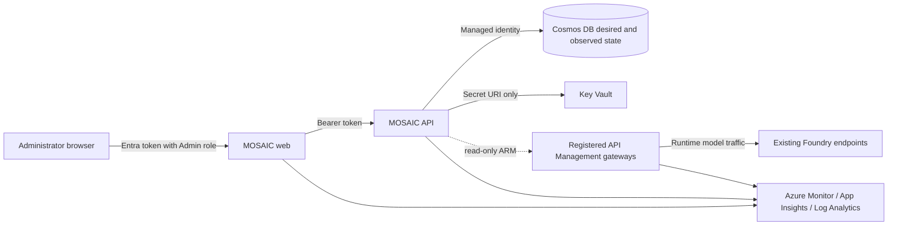

# MOSAIC

**Model Orchestration, Stewardship, Allocation, Insights, and Chargeback**

MOSAIC is a self-service control plane and administrator/developer experience for Azure API
Management's AI gateway capabilities. It stores desired governance state, plans how that state
should map to APIM, and presents telemetry from Azure Monitor. It does **not** proxy model traffic
or replace APIM.

This release adds gateway onboarding on top of the identity foundation: administrators register
Entra principals and MOSAIC access groups, bring an existing API Management service under MOSAIC,
and see its APIs, endpoints, products, subscriptions, and policies described in plain language —
without ever reading policy XML or opening the Azure portal.

## Architecture and trust boundaries



| Concern | Source of truth | MOSAIC responsibility |
| --- | --- | --- |
| Governance intent | Cosmos DB | Store tenant-scoped desired state and audit mutations |
| Runtime traffic and enforcement | APIM | Observe and explain now; plan and apply in later phases |
| Identity objects and authentication | Microsoft Entra ID | Store object IDs only; validate tokens and `Admin` role |
| Credentials | Key Vault | Store secret URIs only, never secret values |
| Foundry deployments | Existing Azure AI/Foundry resources | Model a bring-your-own connection boundary |
| Traffic/token telemetry | Azure Monitor stack | Emit application telemetry; query/chargeback is deferred |

MOSAIC never silently substitutes in-memory data or local authentication in Azure. Both are
explicit local/test modes and application startup rejects them when `MOSAIC_ENVIRONMENT=azure`.

## What is implemented

- Python 3.12 FastAPI API with OpenAPI, structured JSON logging, Azure Monitor OpenTelemetry,
  correlation IDs, anonymous `/healthz` and dependency-aware `/readyz`
- Entra issuer, audience, signature, tenant, expiry, algorithm, and `Admin` app-role validation
- Principal, group, and membership CRUD with validation, stable errors, and audit events
- Multi-gateway onboarding: register any existing API Management service by resource ID, verify
  access, and mirror its APIs, endpoints, products, subscriptions, users, groups, backends, and
  named value metadata into Cosmos
- Plain-language policy view: policy XML is parsed in memory and reduced to a digest plus redacted
  semantic facets, so administrators never see markup and MOSAIC never stores it
- AI surface detection that identifies which APIs and backends front large language models, across
  Azure OpenAI, Azure AI Foundry, Azure AI inference, OpenAI, Anthropic, Google Vertex AI, and
  AWS Bedrock
- MCP server discovery, and import of selected model APIs and MCP servers from a synchronised
  gateway into MOSAIC's own desired state
- Async repository abstraction with explicit in-memory and Cosmos implementations
- React/TypeScript/Vite administrator console using Fluent UI, React Router, TanStack Query, and
  MSAL, with responsive navigation and persisted light/dark/system themes
- Runtime browser configuration; Azure IDs and service URLs are not baked into the web image
- Typed read-only APIM, Foundry import, reconciliation, and deterministic policy-preview boundaries
- Separate non-root frontend/backend containers
- ACR remote builds for both images, so deployment does not depend on a local Docker daemon
- `azd` and modular Bicep for two Linux Web Apps on one plan, ACR, Cosmos, Key Vault, APIM,
  Log Analytics, Application Insights, diagnostics, managed identities, and narrow RBAC
- Idempotent Entra application/service-principal setup through `azd` hooks

The Gateways workspace, the Identity workspace, gateway import on the Models and MCPs workspaces,
and the deterministic policy preview use live API contracts. The Foundry connection and deployment
sections of Models, entitlements, analytics, policy metadata, and other future operational
experiences are interactive frontend previews labeled **Sample data** or **Local preview**. They
never claim to mutate Azure, query Azure Monitor, or substitute sample data for a failed API
request.

## Prerequisites

- Azure subscription where the deployer can create resources and role assignments
- Microsoft Entra role capable of managing app registrations and service principals (Application
  Administrator or broader) and assigning the initial app role
- [Azure CLI](https://learn.microsoft.com/cli/azure/install-azure-cli)
- [Azure Developer CLI](https://learn.microsoft.com/azure/developer/azure-developer-cli/install-azd)
- Python 3.12 and [uv](https://docs.astral.sh/uv/)
- Node.js 24 and npm
- Docker for local container validation

The reference development target is region `eastus2` with environment name `mosaic-dev`. Supply
your own subscription when deploying.

## Local development

Install dependencies:

```powershell
uv sync --all-packages --group dev
Set-Location apps\web
npm ci
```

Run the API with the opt-in local modes:

```powershell
$env:MOSAIC_ENVIRONMENT = "local"
$env:MOSAIC_AUTH_MODE = "local"
$env:MOSAIC_REPOSITORY_BACKEND = "memory"
$env:MOSAIC_TENANT_ID = "local-development"
uv run mosaic-api
```

In a second terminal:

```powershell
Set-Location apps\web
npm run dev
```

`apps/web/public/config.js` selects local auth and `http://localhost:8000`. Do not deploy that file
as configuration: the web container regenerates it from App Service environment variables on
startup.

## Quality checks

```powershell
uv run ruff check apps/api
uv run mypy apps/api/src
uv run pytest apps/api/tests

Set-Location apps\web
npm run typecheck
npm run lint
npm run test
npm run build

az bicep build --file infra\main.bicep
python -m unittest scripts.tests.test_mosaic_entra
```

## Deploy with `azd`

Sign in and create the normal development environment:

```powershell
az login
azd auth login
az account set --subscription <your-subscription-id>
azd env new mosaic-dev
azd env set AZURE_SUBSCRIPTION_ID <your-subscription-id>
azd env set AZURE_LOCATION eastus2
azd env set MOSAIC_APIM_PUBLISHER_NAME "MOSAIC administrator"
azd env set MOSAIC_APIM_PUBLISHER_EMAIL "your-admin-address@example.com"
azd env set MOSAIC_PYTHON_INDEX_URL "https://pypi.org/simple"
azd up
```

The preprovision hook idempotently creates two single-tenant Entra registrations:

- `mosaic-dev-api`: `access_as_user` delegated scope and `Admin` app role
- `mosaic-dev-spa`: SPA redirects and delegated permission to the API

It assigns the deploying user the initial `Admin` role. The postprovision hook adds the deployed web
redirect. A directory authorization failure stops deployment and identifies the failed operation;
identity setup is never skipped.

APIM Developer is the dominant cost (currently roughly USD 51/month at continuous use) and can take
30–60 minutes or longer to provision. The shared B1 Linux plan is roughly USD 13–15/month; Basic ACR
is roughly USD 5/month. Cosmos serverless, Key Vault, and monitoring are consumption-based. Expect
an idle baseline near USD 70/month before meaningful telemetry volume.

Remove the environment when not in use:

```powershell
azd down --purge
```

## Data model and Cosmos layout

Every entity contains `tenantId`; this initial deployment is single-tenant but the data contract is
not. The domain distinguishes:

- `FoundryConnection`: connection to an existing provider/Foundry resource
- `CatalogModel`: provider model identity/version
- `ModelDeployment`: callable deployed endpoint
- `Principal`, `Group`, `GroupMembership`
- `Gateway`: a registered API Management service, its verified access, and its inventory summary
- `GatewaySyncRun`: the outcome of one inventory synchronisation
- `ModelApi`: an API Management API an administrator adopted as a governed model endpoint
- `McpServer`: an API Management MCP server an administrator adopted
- `Entitlement`: group-to-deployment grant plus token enforcement configuration
- `CredentialReference`: Key Vault secret URI only
- `PolicyRevision`, `SyncOperation`, `AuditEvent`

Cosmos uses:

| Container | Partition key | Purpose |
| --- | --- | --- |
| `desired-state` | `/tenantId` | Control-plane entities, tenant-local queries, and transactional audit outbox |
| `sync-operations` | `/tenantId` | Reconciliation plans, gateway sync runs, and outcomes |
| `observed-state` | `/tenantId` | What MOSAIC observed in each registered gateway |
| `audit-events` | `/tenantId` | Append-only administrator mutation history |

`observed-state` is deliberately separate from `desired-state`. It is disposable, rebuilt on every
sync, and churns far more than administrator-authored governance intent. Observed documents use
deterministic IDs so a re-sync upserts in place; anything absent from the new snapshot is swept.

Directory mutations and their audit records commit atomically to `desired-state`. The repository then
projects each outbox record into `audit-events`; a projection failure leaves the durable outbox record
for readiness-driven retry and is emitted to structured logs rather than failing an already-committed
administrator request.

The initial strategy prioritizes tenant-local operations. Hierarchical or sharded keys should follow
measured scale, not speculation.

## Security model

- Only health endpoints are anonymous.
- Browser authentication uses authorization code + PKCE through MSAL.
- The API accepts RS256 tokens from the configured tenant only, validates OIDC discovery/JWKS,
  issuer, client-ID audience, signature, time claims, tenant, and `Admin` role.
- Production uses system-assigned managed identities. Local Azure SDK access uses
  `DefaultAzureCredential`; Azure uses `ManagedIdentityCredential`.
- Cosmos local/key authentication and ACR admin credentials are disabled.
- Key Vault uses RBAC, soft delete, and purge protection.
- Backend access is scoped to Cosmos data contributor, Key Vault Secrets User, APIM reader,
  Log Analytics Reader, and Monitoring Reader. It has no APIM policy-write role.
- MOSAIC never reads subscription keys or named value secret values, and never persists or renders
  policy XML. Policy documents are reduced to a digest plus redacted facets in memory.
- Frontend and backend pull from ACR through their managed identities.

## Gateways

A gateway is an existing Azure API Management service that an administrator registers with MOSAIC by
resource ID. MOSAIC supports several across subscriptions and environments; the APIM that `azd`
deploys is registered automatically on first startup and also appears as a one-click suggestion.

Onboarding runs a preflight against Azure Resource Manager with MOSAIC's managed identity. It reads
effective permissions at the resource scope, and when they are missing it reports the exact role,
scope, and `az role assignment create` command an operator needs. MOSAIC cannot grant itself that
role, so it explains rather than fails silently.

The needed roles are:

| Purpose | Role | Role definition ID |
| --- | --- | --- |
| Observing a gateway (today) | API Management Service Reader Role | `71522526-b88f-4d52-b57f-d31fc3546d0d` |
| Enrollment and policy apply (later) | API Management Service Contributor | `312a565d-c81f-4fd8-895a-4e21e48d571c` |

Write capability is reported so the UI can explain what enrollment will require, but this release
performs no write against API Management and is granted no write role.

Synchronisation collects APIs and their operations, MCP servers and their tools, products,
subscriptions, gateway users and groups, backends, named value metadata, and policies at the
service, product, and API scopes. Operation-scope policies are read on demand rather than during a
full sync. A failure reading one collection degrades the run to `partial` and is recorded, rather
than discarding the whole snapshot — and the entity types it could not read are exempt from the
stale-document sweep, so a transient failure never looks like a deletion.

### MCP servers

API Management models an MCP server as an API of type `mcp`, visible only on management API version
`2025-09-01-preview` or later. MOSAIC keeps its inventory on the stable `2024-05-01` contract and
uses the preview version for MCP discovery alone, so a preview API that changes cannot break the
sync administrators depend on.

A service that rejects the preview version is not a failure. MOSAIC records
`capabilities.mcpServers` as `unavailable`, the run still succeeds, and the MCPs workspace explains
why the gateway has nothing to offer. Any other read failure is reported as an error and exempts
MCP servers from the sweep, keeping "MOSAIC could not read this" distinct from "there are none".

### Importing models and MCP servers

Observed state is disposable and rebuilt on every sync. Importing promotes a selection of it into
`desired-state` as `ModelApi` and `McpServer` records: MOSAIC now governs these, and the records
survive the sweep.

Importing is a Cosmos write and nothing else. No API Management resource is created, changed, or
deleted, no policy is written, and no Azure write API is called. ADR 0001 is unaffected and the
contributor role stays ungranted.

Detection decides which rows arrive pre-checked, not which imports are allowed. Every observed API
is offered, an administrator can adopt one MOSAIC did not recognise or skip one it did, and the
record keeps whether the choice was `detected` or `manual`. A name absent from the gateway's most
recent snapshot is rejected outright rather than skipped, because importing four of five selected
APIs and reporting success would leave an administrator believing they had governed something they
had not.

Record IDs are deterministic, so re-importing after a sync refreshes a record in place instead of
duplicating it. Deleting a gateway deletes what was imported from it.

### Policies without markup

MOSAIC parses API Management policy XML in memory and keeps only a SHA-256 digest and redacted
semantic facets. Administrators see sentences:

> Limits model usage to 10,000 tokens per minute, counted per subscription.
>
> The gateway authenticates to `https://cognitiveservices.azure.com` with its own managed identity.

Rules MOSAIC does not interpret are labelled **externally authored** and counted by name. They are
never hidden, and never shown as markup. Policy documents routinely carry inline credentials, so not
storing the source is a security property as well as a product decision. URLs lose their query string
before they are stored or displayed, because backend URLs commonly carry Azure Functions keys and
storage SAS tokens there.

When MOSAIC begins writing, it will author named `mosaic-*` policy fragments that customer policies
include, rather than rewriting whole policy documents. Fragments are inventoried now so that
ownership boundary already exists.

## Reconciliation boundary

The API contains a deterministic policy preview using current documented policies:

- `authentication-managed-identity`
- `llm-token-limit`

The preview returns the same plain-language facets used for observed policy, plus a content digest.
The generated XML stays in process for a future apply phase and is never serialised to a caller.

The future lifecycle is explicit: load Cosmos desired state, observe APIM, create a deterministic
plan, require apply authorization, execute, record outcome, and audit failures. This release does
not publish policies or report reconciliation success.

## Roadmap

1. **Foundation:** secure deployment, domain, directory CRUD, runtime configuration, observability
   wiring, typed APIM/Foundry/reconciliation boundaries.
2. **Gateway onboarding (this release):** multi-gateway registry, access verification with guided
   remediation, full inventory synchronisation, AI surface detection, and plain-language policy.
3. **Model onboarding (this release):** discover MCP servers, detect model-fronting APIs across
   Azure and third-party providers, and import a chosen selection into MOSAIC's desired state.
4. **Entitlements and enrollment:** group grants, APIM products/subscriptions or identity access,
   MOSAIC-owned policy fragments, plan/apply/rollback, drift and failure UX.
5. **Insights and chargeback:** Azure Monitor queries, token/traffic/cost allocation, budgets and
   administrator/developer dashboards.
6. **Catalog ecosystem:** API Center experiences, MCP tool-level governance, broader self-service
   workflows.
7. **Production hardening:** private networking, multi-region/production APIM tiers, CMK where
   required, measured partition scaling, retention and operational SLOs.

See [the architecture decisions](docs/adr) for the durable rationale behind this foundation.
