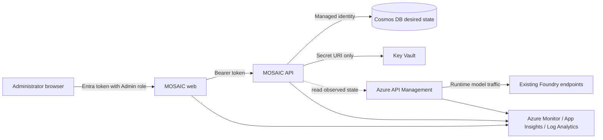

# MOSAIC

**Model Orchestration, Stewardship, Allocation, Insights, and Chargeback**

MOSAIC is a self-service control plane and administrator/developer experience for Azure API
Management's AI gateway capabilities. It stores desired governance state, plans how that state
should map to APIM, and presents telemetry from Azure Monitor. It does **not** proxy model traffic
or replace APIM.

This foundation release delivers a secure, deployable platform and one real vertical slice:
administrators can register Entra principals, create MOSAIC access groups, and manage memberships
through a React application backed by FastAPI and Cosmos DB.

## Architecture and trust boundaries



| Concern | Source of truth | MOSAIC responsibility |
| --- | --- | --- |
| Governance intent | Cosmos DB | Store tenant-scoped desired state and audit mutations |
| Runtime traffic and enforcement | APIM | Observe now; plan and apply in later phases |
| Identity objects and authentication | Microsoft Entra ID | Store object IDs only; validate tokens and `Admin` role |
| Credentials | Key Vault | Store secret URIs only, never secret values |
| Foundry deployments | Existing Azure AI/Foundry resources | Model a bring-your-own connection boundary |
| Traffic/token telemetry | Azure Monitor stack | Emit application telemetry; query/chargeback is deferred |

MOSAIC never silently substitutes in-memory data or local authentication in Azure. Both are
explicit local/test modes and application startup rejects them when `MOSAIC_ENVIRONMENT=azure`.

## What is implemented

- Python 3.12 FastAPI API with OpenAPI, structured JSON logging, Azure Monitor OpenTelemetry,
  correlation IDs, anonymous `/healthz` and dependency-aware `/readyz`
- Entra issuer, audience, signature, tenant, expiry, algorithm, and `Admin` app-role validation
- Principal, group, and membership CRUD with validation, stable errors, and audit events
- Async repository abstraction with explicit in-memory and Cosmos implementations
- React/TypeScript/Vite administrator console using Fluent UI, React Router, TanStack Query, and
  MSAL, with responsive navigation and persisted light/dark/system themes
- Runtime browser configuration; Azure IDs and service URLs are not baked into the web image
- Typed read-only APIM, Foundry import, reconciliation, and deterministic policy-preview boundaries
- Separate non-root frontend/backend containers
- ACR remote builds for both images, so deployment does not depend on a local Docker daemon
- `azd` and modular Bicep for two Linux Web Apps on one plan, ACR, Cosmos, Key Vault, APIM,
  Log Analytics, Application Insights, diagnostics, managed identities, and narrow RBAC
- Idempotent Entra application/service-principal setup through `azd` hooks

The Identity workspace and deterministic policy preview use live API contracts. Model Foundry,
entitlements, analytics, policy metadata, and other future operational experiences are interactive
frontend previews labeled **Sample data** or **Local preview**. They never claim to mutate Azure,
query Azure Monitor, or substitute sample data for a failed API request.

## Prerequisites

- Azure subscription where the deployer can create resources and role assignments
- Microsoft Entra role capable of managing app registrations and service principals (Application
  Administrator or broader) and assigning the initial app role
- [Azure CLI](https://learn.microsoft.com/cli/azure/install-azure-cli)
- [Azure Developer CLI](https://learn.microsoft.com/azure/developer/azure-developer-cli/install-azd)
- Python 3.12 and [uv](https://docs.astral.sh/uv/)
- Node.js 24 and npm
- Docker for local container validation

The first development target is subscription
`9698dd71-9367-49c2-bede-fd0deecfad62`, region `eastus2`, environment `mosaic-dev`.

## Local development

Install dependencies:

```powershell
uv sync --all-packages --group dev
Set-Location apps\web
npm ci
```

Run the API with the opt-in local modes:

```powershell
$env:MOSAIC_ENVIRONMENT = "local"
$env:MOSAIC_AUTH_MODE = "local"
$env:MOSAIC_REPOSITORY_BACKEND = "memory"
$env:MOSAIC_TENANT_ID = "local-development"
uv run mosaic-api
```

In a second terminal:

```powershell
Set-Location apps\web
npm run dev
```

`apps/web/public/config.js` selects local auth and `http://localhost:8000`. Do not deploy that file
as configuration: the web container regenerates it from App Service environment variables on
startup.

## Quality checks

```powershell
uv run ruff check apps/api
uv run mypy apps/api/src
uv run pytest apps/api/tests

Set-Location apps\web
npm run typecheck
npm run lint
npm run test
npm run build

az bicep build --file infra\main.bicep
python -m unittest scripts.tests.test_mosaic_entra
```

## Deploy with `azd`

Sign in and create the normal development environment:

```powershell
az login
azd auth login
az account set --subscription 9698dd71-9367-49c2-bede-fd0deecfad62
azd env new mosaic-dev
azd env set AZURE_SUBSCRIPTION_ID 9698dd71-9367-49c2-bede-fd0deecfad62
azd env set AZURE_LOCATION eastus2
azd env set MOSAIC_APIM_PUBLISHER_NAME "MOSAIC administrator"
azd env set MOSAIC_APIM_PUBLISHER_EMAIL "your-admin-address@example.com"
azd env set MOSAIC_PYTHON_INDEX_URL "https://pypi.org/simple"
azd up
```

The preprovision hook idempotently creates two single-tenant Entra registrations:

- `mosaic-dev-api`: `access_as_user` delegated scope and `Admin` app role
- `mosaic-dev-spa`: SPA redirects and delegated permission to the API

It assigns the deploying user the initial `Admin` role. The postprovision hook adds the deployed web
redirect. A directory authorization failure stops deployment and identifies the failed operation;
identity setup is never skipped.

APIM Developer is the dominant cost (currently roughly USD 51/month at continuous use) and can take
30–60 minutes or longer to provision. The shared B1 Linux plan is roughly USD 13–15/month; Basic ACR
is roughly USD 5/month. Cosmos serverless, Key Vault, and monitoring are consumption-based. Expect
an idle baseline near USD 70/month before meaningful telemetry volume.

Remove the environment when not in use:

```powershell
azd down --purge
```

## Data model and Cosmos layout

Every entity contains `tenantId`; this initial deployment is single-tenant but the data contract is
not. The domain distinguishes:

- `FoundryConnection`: connection to an existing provider/Foundry resource
- `CatalogModel`: provider model identity/version
- `ModelDeployment`: callable deployed endpoint
- `Principal`, `Group`, `GroupMembership`
- `Entitlement`: group-to-deployment grant plus token enforcement configuration
- `CredentialReference`: Key Vault secret URI only
- `PolicyRevision`, `SyncOperation`, `AuditEvent`

Cosmos uses:

| Container | Partition key | Purpose |
| --- | --- | --- |
| `desired-state` | `/tenantId` | Control-plane entities, tenant-local queries, and transactional audit outbox |
| `sync-operations` | `/tenantId` | Reconciliation plans and outcomes |
| `audit-events` | `/tenantId` | Append-only administrator mutation history |

Directory mutations and their audit records commit atomically to `desired-state`. The repository then
projects each outbox record into `audit-events`; a projection failure leaves the durable outbox record
for readiness-driven retry and is emitted to structured logs rather than failing an already-committed
administrator request.

The initial strategy prioritizes tenant-local operations. Hierarchical or sharded keys should follow
measured scale, not speculation.

## Security model

- Only health endpoints are anonymous.
- Browser authentication uses authorization code + PKCE through MSAL.
- The API accepts RS256 tokens from the configured tenant only, validates OIDC discovery/JWKS,
  issuer, client-ID audience, signature, time claims, tenant, and `Admin` role.
- Production uses system-assigned managed identities. Local Azure SDK access uses
  `DefaultAzureCredential`; Azure uses `ManagedIdentityCredential`.
- Cosmos local/key authentication and ACR admin credentials are disabled.
- Key Vault uses RBAC, soft delete, and purge protection.
- Backend access is scoped to Cosmos data contributor, Key Vault Secrets User, APIM reader,
  Log Analytics Reader, and Monitoring Reader. It has no APIM policy-write role.
- Frontend and backend pull from ACR through their managed identities.

## APIM and reconciliation boundary

The API contains a read-only APIM management observer and deterministic policy preview using current
documented policies:

- `authentication-managed-identity`
- `llm-token-limit`

The future lifecycle is explicit: load Cosmos desired state, observe APIM, create a deterministic
plan, require apply authorization, execute, record outcome, and audit failures. This release does
not publish policies, claim live discovery, or report reconciliation success.

## Roadmap

1. **Foundation (this release):** secure deployment, domain, directory CRUD, runtime configuration,
   observability wiring, typed APIM/Foundry/reconciliation boundaries.
2. **Model onboarding:** validate existing Foundry connections and import catalog/deployment state.
3. **Entitlements and reconciliation:** group grants, APIM products/subscriptions or identity access,
   policy plan/apply/rollback, drift and failure UX.
4. **Insights and chargeback:** Azure Monitor queries, token/traffic/cost allocation, budgets and
   administrator/developer dashboards.
5. **Catalog ecosystem:** MCP and API Center experiences, broader self-service workflows.
6. **Production hardening:** private networking, multi-region/production APIM tiers, CMK where
   required, measured partition scaling, retention and operational SLOs.

See [the architecture decisions](docs/adr) for the durable rationale behind this foundation.
