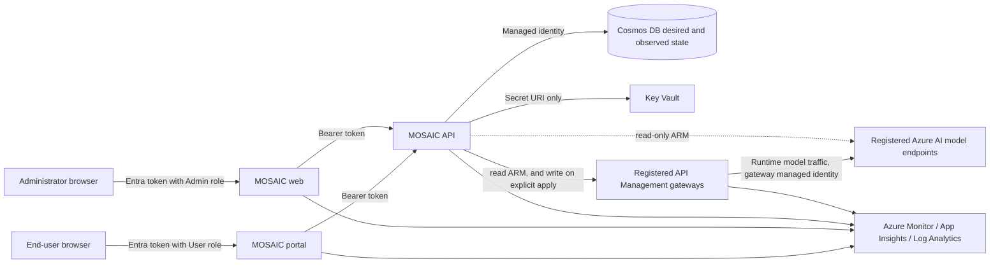

# MOSAIC

**Model Orchestration, Stewardship, Allocation, Insights, and Chargeback**

MOSAIC is a self-service control plane and administrator/developer experience for Azure API
Management's AI gateway capabilities. It stores desired governance state, plans how that state
should map to APIM, and presents telemetry from Azure Monitor. It does **not** proxy model traffic
or replace APIM.

This release connects direct model access grants to API Management enforcement. Administrators
publish a model, grant an existing user or application access, review and apply the changes, and
later revoke access. Governed models accept a dedicated APIM subscription key or an Entra access
token, with independently configurable methods and shared per-grant limits. Authorized callers
can retrieve their current subscription key on demand; MOSAIC does not store a duplicate.

Publishing and governed access write only through a reviewed,
deterministic plan and an explicit apply, only to a gateway an administrator has switched to
`manage`. Existing publications remain unchanged until explicitly opted into governed access.
See [ADR 0010](docs/adr/0010-publishing-models-into-apim.md) and
[ADR 0011](docs/adr/0011-governed-model-access.md) for the write and credential-disclosure boundaries.

## Architecture and trust boundaries


```mermaid
flowchart LR
    Admin[Administrator browser] -->|Entra token with Admin role| Web[MOSAIC web]
    User[End-user browser] -->|Entra token with User role| Portal[MOSAIC portal]
    Web -->|Bearer token| API[MOSAIC API]
    Portal -->|Bearer token| API
    API -->|Managed identity| Cosmos[(Cosmos DB desired and observed state)]
    API -->|Secret URI only| KV[Key Vault]
    API -. read-only ARM .-> Foundry[Registered Azure AI model endpoints]
    API -->|read ARM, and write on explicit apply| APIM[Registered API Management gateways]
    APIM -->|Runtime model traffic, gateway managed identity| Foundry
    APIM --> Monitor[Azure Monitor / App Insights / Log Analytics]
    API --> Monitor
    Web --> Monitor
    Portal --> Monitor
```

The administrator console and the end-user portal are separate applications with separate
Entra registrations and separate app roles, so they are independently governable. The portal
reaches only `/api/v1/portal/*` and the current-user `/api/v1/me/*` routes. Every one of them is
scoped to the caller's own token, and none accepts a subject or requester parameter. See
[ADR 0008](docs/adr/0008-portal-identity-and-role-separation.md).

| Concern | Source of truth | MOSAIC responsibility |
| --- | --- | --- |
| Governance intent | Cosmos DB | Store tenant-scoped desired state and audit mutations |
| Runtime traffic and enforcement | APIM | Observe and explain; write only through a reviewed plan and an explicit apply |
| Identity objects and authentication | Microsoft Entra ID | Store object IDs only; validate tokens and app roles |
| Backend credential references | Key Vault | Store secret URIs only, never secret values |
| APIM subscription keys | APIM | Retrieve only for an explicitly authorized reveal; never persist or cache a copy |
| Foundry deployments | Existing Azure AI/Foundry resources | Enumerate deployed models read-only; report, never grant, the gateway's runtime access |
| Traffic/token telemetry | Azure Monitor stack | Emit application telemetry; query/chargeback is deferred |

MOSAIC never silently substitutes in-memory data or local authentication in Azure. Both are
explicit local/test modes and application startup rejects them when `MOSAIC_ENVIRONMENT=azure`.

## What is implemented

- Python 3.12 FastAPI API with OpenAPI, structured JSON logging, Azure Monitor OpenTelemetry,
  correlation IDs, anonymous `/healthz` and dependency-aware `/readyz`
- Entra issuer, audience, signature, tenant, expiry, and algorithm validation, with app-role
  authorization decided per route: `Admin` for every administrative route, `User` for the
  end-user portal surface
- Principal, group, and membership CRUD with validation, stable errors, and audit events
- Multi-gateway onboarding: register any existing API Management service by resource ID, verify
  access, and mirror its APIs, endpoints, products, subscriptions, users, groups, backends, and
  named value metadata into Cosmos
- Entitlements as desired state: grants to a user, group, or application over a model API, MCP
  server, product, or model deployment; token and request limits; catalog visibility; access
  requests, whose approval creates and links the requester's grant intent; and effective-access
  resolution that reports whether a grant arrived directly or through a group
- Governed access for direct user/application grants to MOSAIC-published model APIs: reviewed
  APIM deployment, key or Entra authentication, shared token/request limits, revocation, and
  distinct desired versus applied state
- Current-user entitlement and connection APIs, plus audited on-demand key retrieval, which the
  portal's My access page uses to show connection details and reveal keys for applied direct
  model grants
- Model endpoint onboarding: register Azure OpenAI and Azure AI Foundry resources, verify MOSAIC's
  control-plane access, discover the deployments and available models on them, and report — per
  registered gateway — whether that gateway's managed identity can actually call them, judged by
  the data actions its roles grant on the resource the published API calls and by whether the
  gateway has a network path to it
- MCP server registration: register a Model Context Protocol server by URL, connect to it as a
  read-only client, and record the tools it declares — including the input schemas, output schemas,
  and behaviour annotations that API Management's management plane does not expose
- MCP servers already present in a registered gateway are detected and counted
- Plain-language policy view: policy XML is parsed in memory and reduced to a digest plus redacted
  semantic facets, so administrators never see markup and MOSAIC never stores it
- AI surface detection that identifies which APIs and backends front large language models, across
  Azure OpenAI, Azure AI Foundry, Azure AI inference, OpenAI, Anthropic, Google Vertex AI, and
  AWS Bedrock
- MCP server discovery, and import of selected model APIs and MCP servers from a synchronised
  gateway into MOSAIC's own desired state
- Model publishing: expose an observed deployment through a gateway by creating its backend, policy
  fragment, API, operations, API policy, product, product link, and subscription — through a
  persisted deterministic plan, an explicit apply, per-step results, and a rollback that deletes
  only the resources that apply created
- Async repository abstraction with explicit in-memory and Cosmos implementations
- React/TypeScript/Vite administrator console using Fluent UI, React Router, TanStack Query, and
  MSAL, with responsive navigation and persisted light/dark/system themes
- Runtime browser configuration; Azure IDs and service URLs are not baked into the web image
- Typed APIM read and write boundaries kept in separate classes, plus Foundry import and
  deterministic policy authoring that never returns markup
- Separate non-root frontend/backend containers
- End-user portal: a separate SPA on its own Entra registration and the `User` app role, where
  a non-administrator sees what they are entitled to, how each grant reached them, the catalog
  of governed resources, and can request access to something they cannot yet use. For an applied
  direct model grant, the portal also shows the endpoint, operations, accepted credentials, limits,
  and placeholder code samples, and reveals a key on request
- ACR remote builds for every image, so deployment does not depend on a local Docker daemon
- `azd` and modular Bicep for three Linux Web Apps on one plan, ACR, Cosmos, Key Vault, APIM,
  Log Analytics, Application Insights, diagnostics, managed identities, and narrow RBAC
- Idempotent Entra application/service-principal setup through `azd` hooks

The Gateways workspace, the Identity workspace, the Models and MCPs workspaces, the Entitlements
workspace, model publishing, the end-user portal, and the deterministic policy preview use live
API contracts. Analytics, policy metadata, and other future operational experiences are
interactive frontend previews labeled
**Sample data** or **Local preview**. They never claim to mutate Azure, query Azure Monitor, or
substitute sample data for a failed API request.

Existing deployments need `azd provision` (or a manual role grant) before publishing works: the
API's identity moves from the API Management reader role to contributor. Until it is granted,
preflight reports the missing write permissions precisely rather than failing during an apply.

## Prerequisites

- Azure subscription where the deployer can create resources and role assignments
- Microsoft Entra role capable of managing app registrations and service principals (Application
  Administrator or broader), assigning the initial app role, and granting the model client's
  tenant-wide consent
- [Azure CLI](https://learn.microsoft.com/cli/azure/install-azure-cli)
- [Azure Developer CLI](https://learn.microsoft.com/azure/developer/azure-developer-cli/install-azd)
- Python 3.12 and [uv](https://docs.astral.sh/uv/)
- Node.js 24 and npm
- Docker for local container validation

The reference development target is region `eastus2` with environment name `mosaic-dev`. Supply
your own subscription when deploying.

## Local development

Install dependencies:

```powershell
uv sync --all-packages --group dev
Set-Location apps\web
npm ci
```

Run the API with the opt-in local modes:

```powershell
$env:MOSAIC_ENVIRONMENT = "local"
$env:MOSAIC_AUTH_MODE = "local"
$env:MOSAIC_REPOSITORY_BACKEND = "memory"
$env:MOSAIC_TENANT_ID = "local-development"
uv run mosaic-api
```

Local authentication grants both the `Admin` and `User` app roles by default. Set
`MOSAIC_LOCAL_ROLES` to narrow it — `'["User"]'` simulates an end user who must not reach an
administrative route. The setting is rejected outside local and test environments.

In a second terminal:

```powershell
Set-Location apps\web
npm run dev
```

`apps/web/public/config.js` selects local auth and `http://localhost:8000`. Do not deploy that file
as configuration: the web container regenerates it from App Service environment variables on
startup.

## Quality checks

```powershell
uv run ruff check apps/api
uv run mypy apps/api/src
uv run pytest apps/api/tests

Set-Location apps\web
npm run typecheck
npm run lint
npm run test
npm run build

az bicep build --file infra\main.bicep
python -m unittest scripts.tests.test_mosaic_entra
```

## Deploy with `azd`

Sign in and create the normal development environment:

```powershell
az login
azd auth login
az account set --subscription <your-subscription-id>
azd env new mosaic-dev
azd env set AZURE_SUBSCRIPTION_ID <your-subscription-id>
azd env set AZURE_LOCATION eastus2
azd env set MOSAIC_APIM_PUBLISHER_NAME "MOSAIC administrator"
azd env set MOSAIC_APIM_PUBLISHER_EMAIL "your-admin-address@example.com"
azd env set MOSAIC_PYTHON_INDEX_URL "https://pypi.org/simple"
azd up
```

The preprovision hook idempotently creates separate single-tenant Entra registrations:

- `mosaic-dev-api`: `access_as_user` delegated scope, plus an `Admin` and a `User` app role
- `mosaic-dev-spa`: administrator console SPA redirects and delegated permission to the API
- `mosaic-dev-portal`: end-user portal SPA redirects and delegated permission to the API
- `mosaic-dev-model-runtime`: the separate audience for APIM model calls, with the
  `Models.Invoke` delegated scope and `Models.Invoke.Application` application permission
- `mosaic-dev-model-client`: a public client people sign in with to get model-runtime tokens. It
  has no secrets, certificates or app roles, and its only permission is delegated
  `Models.Invoke`, with tenant-wide admin consent. Interactive (`http://localhost`) and device
  code sign-in both work.

It assigns the deploying user the initial `Admin` role. The postprovision hook adds the deployed
web redirect and the deployed portal redirect, the latter from the `PORTAL_APP_URL` output of
the portal App Service. A directory authorization failure stops deployment and identifies the
failed operation; identity setup is never skipped. The one exception is the model client's
consent. Granting it needs Cloud Application Administrator, Application Administrator or
Privileged Role Administrator. Without one of those roles the hook prints a warning with the
exact `az ad app permission grant` command for an administrator, and deployment continues.
People can't get tokens with the model client until that consent exists.

To skip the model client, run `azd env set MOSAIC_ENTRA_MODEL_CLIENT false` before provisioning.
The hook then leaves any existing model client registration and consent alone, and keeps
`MOSAIC_MODEL_CLIENT_ID` as set. So you can point it at a client you manage yourself, as long as
that client is consented for `Models.Invoke`. Also set `MOSAIC_ENTRA_MODEL_CLIENT` to `false`
before you revoke the model client's consent, or the next `azd provision` grants it again.

Assign the `User` app role — normally to an Entra group — to everyone who should reach the portal.
Tenant membership alone does not grant it.

People with a user grant sign in with the model client to request
`api://<model-runtime-client-id>/Models.Invoke`. Bootstrap writes its client ID as
`MOSAIC_MODEL_CLIENT_ID`, and connection details show it as `entraClientId`. See
[Call a published model with an Entra token](docs/call-models-with-entra-tokens.md). Any other
delegated client needs its own consent for that scope. Applications use the
`Models.Invoke.Application` permission and request `api://<model-runtime-client-id>/.default`.
Assign these permissions through normal Entra administration. A MOSAIC grant does not silently
consent a client, create an identity, or grant Microsoft Graph permissions. The only consent
bootstrap creates is the model client's `Models.Invoke` grant. Bootstrap exposes
`MOSAIC_MODEL_RUNTIME_CLIENT_ID`; this must not be the MOSAIC control-plane API's client ID.

APIM Developer is the dominant cost (currently roughly USD 51/month at continuous use) and can take
30–60 minutes or longer to provision. The shared B1 Linux plan is roughly USD 13–15/month; Basic ACR
is roughly USD 5/month. Cosmos serverless, Key Vault, and monitoring are consumption-based. Expect
an idle baseline near USD 70/month before meaningful telemetry volume.

Remove the environment when not in use:

```powershell
azd down --purge
```

## Data model and Cosmos layout

Every entity contains `tenantId`; this initial deployment is single-tenant but the data contract is
not. The domain distinguishes:

- `ModelEndpoint`: a registered Azure OpenAI, Azure AI Foundry, or OpenAI-compatible endpoint, its
  verified control-plane access, and per-gateway runtime readiness
- `ModelEndpointSyncRun`: the outcome of one model discovery run
- `CatalogModel`: provider model identity/version
- `ModelDeployment`: callable deployed endpoint
- `Principal`, `Group`, `GroupMembership`
- `Gateway`: a registered API Management service, its verified access, and its inventory summary
- `GatewaySyncRun`: the outcome of one inventory synchronisation
- `ModelApi`: an API Management API an administrator adopted as a governed model endpoint
- `McpServer`: an API Management MCP server an administrator adopted
- `McpEndpoint`: a registered MCP server MOSAIC connects to and reads tools from
- `Publication`: intent to expose one model deployment through one gateway, plus the API Management
  resources an apply created and whether MOSAIC created each one
- `PublishPlan`, `PublishRun`: the reviewed changes and the audited result of applying them
- `Entitlement`: a grant of a governed resource to a user, group, or application, its token and
  request limits, and the API Management product or subscription binding that realizes it
- `AccessRequest`: a portal user's request for a resource they can see but are not entitled to
- `CredentialReference`: Key Vault secret URI only
- `PolicyRevision`, `SyncOperation`, `AuditEvent`
Cosmos uses:

| Container | Partition key | Purpose |
| --- | --- | --- |
| `desired-state` | `/tenantId` | Control-plane entities, tenant-local queries, and transactional audit outbox |
| `sync-operations` | `/tenantId` | Gateway and endpoint sync runs, publish plans, and publish runs |
| `observed-state` | `/tenantId` | What MOSAIC observed in each registered gateway |
| `audit-events` | `/tenantId` | Append-only administrator mutation history |

`observed-state` is deliberately separate from `desired-state`. It is disposable, rebuilt on every
sync, and churns far more than administrator-authored governance intent. Observed documents use
deterministic IDs so a re-sync upserts in place; anything absent from the new snapshot is swept.

Directory mutations and their audit records commit atomically to `desired-state`. The repository then
projects each outbox record into `audit-events`; a projection failure leaves the durable outbox record
for readiness-driven retry and is emitted to structured logs rather than failing an already-committed
administrator request.

The initial strategy prioritizes tenant-local operations. Hierarchical or sharded keys should follow
measured scale, not speculation.

## Security model

- Only health endpoints are anonymous.
- Browser authentication uses authorization code + PKCE through MSAL.
- The API accepts RS256 tokens from the configured tenant only, validates OIDC discovery/JWKS,
  issuer, client-ID audience, signature, time claims, and tenant. A token carrying none of
  MOSAIC's app roles is rejected before any route is reached.
- Authorization is a per-route decision, not part of authentication. `require_admin` demands the
  `Admin` role and guards every administrative route; `require_portal_user` demands the `User`
  role, which `Admin` also satisfies. Neither role is implied by tenant membership, so an operator
  assigns `User` — usually to an Entra group — before anyone can use the portal.
- Production uses system-assigned managed identities. Local Azure SDK access uses
  `DefaultAzureCredential`; Azure uses `ManagedIdentityCredential`.
- Cosmos local/key authentication and ACR admin credentials are disabled.
- Key Vault uses RBAC, soft delete, and purge protection.
- Backend access is scoped to Cosmos data contributor, Key Vault Secrets User, API Management
  contributor, Log Analytics Reader, and Monitoring Reader.
- API Management writes are bounded by two independent conditions rather than one: the role
  assignment, and a gateway an administrator explicitly moved to `manage`. MOSAIC refuses that
  switch until preflight has confirmed write access, and every write runs against a reviewed plan
  whose digest still matches the intent it was produced from.
- The contributor role carries `subscriptions/listSecrets`. Only an explicit credential-reveal
  operation uses it, after checking caller ownership and a trusted, applied grant. Inventory and
  publishing do not read keys. Reveals are audited without their secret values; responses are
  non-cacheable, and neither Cosmos nor Key Vault stores a copy. See
  [ADR 0011](docs/adr/0011-governed-model-access.md).
- Model-runtime Entra tokens have a different audience from MOSAIC control-plane tokens. APIM
  validates the runtime token and authorizes its tenant/object ID against an applied direct grant;
  being signed into MOSAIC or holding its `Admin` role does not itself grant model access.
- The MOSAIC model client is a public client with no secrets, certificates or app roles. Its
  tenant-wide consent covers only delegated `Models.Invoke` on the runtime registration. That
  lets Entra issue a person's token but authorizes no model call by itself: APIM still requires
  an applied direct grant. Administrators can revoke the consent under the client's enterprise
  application permissions (after setting `MOSAIC_ENTRA_MODEL_CLIENT=false`, so provisioning
  doesn't grant it again), and target the client with Conditional Access.
- On model endpoints MOSAIC asks only for `Reader`. It deliberately holds no data-plane inference
  right and no `listKeys` permission on any Azure AI resource, so it cannot call a model or read an
  account key even where it can enumerate deployments.
- MOSAIC never reads named value secret values, and never persists or renders policy XML. Policy
  documents — including the ones MOSAIC authors when publishing — are reduced to a digest plus
  redacted facets in memory.
- Credentials for non-Azure endpoints are stored as Key Vault secret URIs only. MOSAIC resolves a
  secret at call time and never persists, returns, or logs its value.
- Frontend and backend pull from ACR through their managed identities.

## Gateways

A gateway is an existing Azure API Management service that an administrator registers with MOSAIC by
resource ID. MOSAIC supports several across subscriptions and environments; the APIM that `azd`
deploys is registered automatically on first startup and also appears as a one-click suggestion.

Onboarding runs a preflight against Azure Resource Manager with MOSAIC's managed identity. It reads
effective permissions at the resource scope, and when they are missing it reports the exact role,
scope, and `az role assignment create` command an operator needs. MOSAIC cannot grant itself that
role, so it explains rather than fails silently.

The needed roles are:

| Purpose | Role | Role definition ID |
| --- | --- | --- |
| Observing a gateway | API Management Service Reader Role | `71522526-b88f-4d52-b57f-d31fc3546d0d` |
| Publishing models into a gateway | API Management Service Contributor | `312a565d-c81f-4fd8-895a-4e21e48d571c` |

A gateway MOSAIC can only read is fully usable for observation. Writing requires two independent
conditions: the contributor role above, and an administrator switching the gateway from `observe` to
`manage`. MOSAIC refuses the switch until preflight has actually confirmed write access, and refuses
every write to a gateway left in `observe` mode however the role is assigned.

Administrators switch modes with **Management mode** on the gateway's Overview tab, and confirm each
direction. The switch itself changes nothing in API Management; it only records the mode in MOSAIC.
**Manage** stays disabled until the access check confirms write access. Until then, the page shows the
role, scope and identity to grant, and **Check access** runs the preflight again. In `manage`,
MOSAIC writes to the gateway only when an administrator applies a reviewed publish plan, unpublishes
a model, or confirms recovery of an interrupted apply. Switching back to `observe` leaves published
models in API Management, where they keep serving calls. MOSAIC then refuses to plan, apply or
unpublish them, so grant and access changes saved in MOSAIC wait until the gateway is managed again.
Either switch is refused while an apply or unpublish on one of the gateway's publications is still
running, or is awaiting recovery after an interruption.

The contributor role also grants `subscriptions/listSecrets`. MOSAIC uses that capability only
for an authorized, explicitly requested reveal of an applied, owned grant's key. A custom role
that permits writes but excludes that action cannot reveal keys; the API reports the missing
key-read action separately. This is a product authorization boundary, not a claim that MOSAIC's
managed identity is technically unable to read secrets.

Synchronisation collects APIs and their operations, MCP servers and their tools, products,
subscriptions, gateway users and groups, backends, named value metadata, and policies at the
service, product, and API scopes. Operation-scope policies are read on demand rather than during a
full sync. A failure reading one collection degrades the run to `partial` and is recorded, rather
than discarding the whole snapshot — and the entity types it could not read are exempt from the
stale-document sweep, so a transient failure never looks like a deletion.

### MCP servers

API Management models an MCP server as an API of type `mcp`, visible only on management API version
`2025-09-01-preview` or later. MOSAIC keeps its inventory on the stable `2024-05-01` contract and
uses the preview version for MCP discovery alone, so a preview API that changes cannot break the
sync administrators depend on.

A service that rejects the preview version is not a failure. MOSAIC records
`capabilities.mcpServers` as `unavailable`, the run still succeeds, and the MCPs workspace explains
why the gateway has nothing to offer. Any other read failure is reported as an error and exempts
MCP servers from the sweep, keeping "MOSAIC could not read this" distinct from "there are none".

### Importing models and MCP servers

Observed state is disposable and rebuilt on every sync. Importing promotes a selection of it into
`desired-state` as `ModelApi` and `McpServer` records: MOSAIC now governs these, and the records
survive the sweep.

Importing is a Cosmos write and nothing else. No API Management resource is created, changed, or
deleted, no policy is written, and no Azure write API is called. ADR 0001 is unaffected and the
contributor role stays ungranted.

Detection decides which rows arrive pre-checked, not which imports are allowed. Every observed API
is offered, an administrator can adopt one MOSAIC did not recognise or skip one it did, and the
record keeps whether the choice was `detected` or `manual`. A name absent from the gateway's most
recent snapshot is rejected outright rather than skipped, because importing four of five selected
APIs and reporting success would leave an administrator believing they had governed something they
had not.

Record IDs are deterministic, so re-importing after a sync refreshes a record in place instead of
duplicating it. Deleting a gateway deletes what was imported from it.

MCP servers are detected too. API Management models an MCP server as an API with `type: mcp`, which
is only visible from management API version `2025-09-01-preview`, so MOSAIC issues that one call
separately from the stable version it pins everywhere else. A service tier or release channel
without that version is not a fault: MCP visibility is reduced and the sync still succeeds.

### Registering MCP servers

Importing covers servers a gateway already hosts. Registering covers the rest: an administrator
gives MOSAIC a Model Context Protocol server URL, and MOSAIC connects to it directly. That matters
for two reasons — a server can be governed before any gateway fronts it, which is what publishing
into API Management will need, and the management plane cannot describe a tool properly. ARM
returns only a name, display name, description, and backing operation. **Input schemas, output
schemas, and behaviour annotations exist nowhere in it**, and only the server can supply them.

MOSAIC acts as a minimal read-only MCP client. It performs `initialize`, sends
`notifications/initialized`, pages `tools/list`, and ends the session. **It never calls a tool.**

An MCP server has no control plane, so unlike a model endpoint there is no way to ask "may MOSAIC
read this" without connecting. Registration therefore runs the handshake and stops; discovering
tools is a separate, explicitly requested sync.

MOSAIC implements the protocol's *handshake* era. The current revision, `2026-07-28`, is stateless
— it removed the handshake, the session header, and the GET stream — while API Management speaks
the handshake era. MOSAIC offers `2025-11-25` and accepts a counter-offer down to `2024-11-05`. A
server outside that range is recorded as `unsupportedProtocol`, and an SSE-only server as
`unsupportedTransport`. Both are capabilities, not failures: neither is something an operator fixes
by retrying. A server that does not advertise a `tools` capability records zero tools without
`tools/list` ever being called, which stays distinct from a read that failed.

Because this is MOSAIC's first outbound call to a host it did not derive from an Azure resource ID,
the boundary is deliberate. HTTPS is required outside local development; loopback, link-local, and
private addresses are refused, including the instance metadata address; redirects are never
followed; a managed-identity token is attached only to an audience the operator explicitly named;
and responses and page counts are bounded. Only a Key Vault secret *URI* is stored, resolved at
call time. `401` is reported as "needs authorization", with the scope and resource metadata URL the
server asked for, never as "unreachable".

Tool annotations are recorded as the **server's claims**, never as MOSAIC's findings. The
specification defaults `destructiveHint` and `openWorldHint` to *true* and requires clients to
treat annotations as untrusted, so an absent hint is stored and displayed as "not stated" rather
than as its default — a tool that said nothing is never rendered as if it promised to be safe.

### Policies without markup

MOSAIC parses API Management policy XML in memory and keeps only a SHA-256 digest and redacted
semantic facets. Administrators see sentences:

> Limits model usage to 10,000 tokens per minute, counted per subscription.
>
> The gateway authenticates to `https://cognitiveservices.azure.com` with its own managed identity.

Rules MOSAIC does not interpret are labelled **externally authored** and counted by name. They are
never hidden, and never shown as markup. Policy documents routinely carry inline credentials, so not
storing the source is a security property as well as a product decision. URLs lose their query string
before they are stored or displayed, because backend URLs commonly carry Azure Functions keys and
storage SAS tokens there.

When MOSAIC begins writing, it will author named `mosaic-*` policy fragments that customer policies
include, rather than rewriting whole policy documents. Fragments are inventoried now so that
ownership boundary already exists.

## Model endpoints

A model endpoint is an Azure OpenAI or Azure AI Foundry resource that a gateway fronts.
Administrators register one by resource ID, or accept a suggestion. MOSAIC then reads the
deployments on it. It never calls a model, and it never changes the resource.

Every endpoint has **two** access relationships, held by two different identities:

| Relationship | Identity | Plane | What it enables |
| --- | --- | --- | --- |
| Onboarding | MOSAIC's managed identity | Control plane | Listing the deployed models |
| Runtime | **The gateway's** managed identity | Data plane | Actually calling those models |

They are reported separately, because an endpoint MOSAIC reads perfectly well can still be
uncallable through a gateway.

MOSAIC asks only for `Reader`. For the gateway it recommends a built-in role, but it accepts **any**
role whose data actions cover the operations the published API calls:

| Purpose | Recommended role | Role definition ID |
| --- | --- | --- |
| MOSAIC enumerating models | Reader | `acdd72a7-3385-48ef-bd42-f606fba81ae7` |
| Gateway calling an Azure OpenAI resource (`kind: OpenAI`) | Cognitive Services OpenAI User | `5e0bd9bd-7b93-4f28-af87-19fc36ad61bd` |
| Gateway calling an AI Services or Foundry resource, including one registered by Foundry project, and its Claude models | Foundry User | `53ca6127-db72-4b80-b1b0-d745d6d5456d` |
| Gateway calling a resource MOSAIC cannot read yet | Foundry User, which is accepted for either kind | `53ca6127-db72-4b80-b1b0-d745d6d5456d` |

How the gateway's access is judged:

- **The scope is the account the published API calls.** This holds even for an endpoint registered
  by Foundry project, because models are deployed on the parent resource. A grant on the project
  does not reach the account, so it is reported as narrower than what is needed and is not
  counted. Grants on the resource group or subscription do count, and are labelled as inherited.
- **MOSAIC reads each assignment's role definition.** It checks `dataActions` minus
  `notDataActions` against the exact data actions of the operations it publishes. So Cognitive
  Services User, Cognitive Services OpenAI Contributor, or a custom role counts wherever it covers
  them.
- **An AI Services account must cover every API MOSAIC publishes from it.** That includes the
  Anthropic Messages API for Claude, even before a Claude model is deployed. Both of its routes need
  `Microsoft.CognitiveServices/accounts/AIServices/providers/action`.
  - Foundry User and Cognitive Services User grant it.
  - Azure AI Developer doesn't. MOSAIC reports it as missing and names the API that needs the
    action.
  - The `services.ai.azure.com` host and the `https://ai.azure.com` token audience that API uses
    don't change the scope or the roles: it's the same account.
- **Unreadable definitions fall back to a list.** When MOSAIC cannot read a role definition, only
  built-ins already known to be sufficient are trusted.
- **Conditions and deny assignments stop short of "can invoke".** A role assigned under an ABAC
  condition MOSAIC cannot prove holds for those calls is reported as *not confirmed*, never as
  access. A deny assignment covering those calls overrides the role.
- **The network path is part of the verdict.** If public network access is disabled and the gateway
  is not connected to a virtual network, the gateway cannot invoke, whatever roles it holds.
  Private endpoints and firewalls MOSAIC cannot fully evaluate are reported as *not confirmed*, not
  as a denial.
- **Advice matches the check.** Whatever MOSAIC recommends, the check accepts. When the kind is not
  known yet, MOSAIC says so, and granting it `Reader` first lets it recommend the exact role.

[ADR 0013](docs/adr/0013-runtime-readiness-by-data-actions.md) records these rules.

On the Models page, select an endpoint to open its **Access** card.

- **Gateways calling this endpoint** gives each gateway a verdict: *can invoke*, *cannot invoke*,
  or *not confirmed*.
  - When a role satisfies the check, it names the role and the scope where it is assigned.
  - When no role does, it gives the reason for each role the gateway holds: missing data actions, a
    narrower scope, or a condition.
  - When a role is missing, it shows the recommended role and the `az role assignment create`
    command. MOSAIC never runs the command itself.
- **Endpoint settings**, above the gateway verdicts, shows the resource kind, public network access,
  firewall, and key authentication. Those settings decide whether a gateway can reach the endpoint
  at all.

Every role whose name begins `Cognitive Services` or `Foundry` that grants control-plane deployment
read also grants data-plane inference, and most also grant `listKeys`. `Reader` is the only built-in
that grants the read alone. It also covers the role-assignment, role-definition, and
deny-assignment reads that the runtime check needs. MOSAIC also emits a narrower custom role
definition for operators who want one. That role omits the role-assignment read, so runtime access
then reports as *not confirmed* rather than guessing. Roles are compared by GUID rather than name,
because Microsoft renamed the Foundry roles in 2026 (`Azure AI User` became `Foundry User`) without
changing their IDs.

MOSAIC finds endpoints three ways: a pasted resource ID, hosts it already observed as AI backends
inside a registered gateway, and an enumeration of Azure AI accounts across visible subscriptions.
The last needs `Reader` at subscription scope, which MOSAIC does not grant itself — a subscription
it cannot read is reported with the command that would fix it and skipped, so one missing assignment
never blanks the list. When MOSAIC can't see any subscription, or couldn't list them, the Models page
now says so and gives the `Reader` command for the subscription MOSAIC was deployed into and for
each registered gateway's subscription, instead of showing an empty list.

OpenAI-compatible endpoints are registered with a Key Vault secret identifier the operator created.
MOSAIC stores the URI only; discovery for those endpoints is not implemented yet.

## Publishing models

Publishing takes a deployment MOSAIC observed on a registered model endpoint and exposes it through
a registered gateway. It is the first thing MOSAIC writes to API Management, and it completes the
loop [ADR 0001](docs/adr/0001-apim-runtime-boundary.md) described and deliberately stopped one step
short of: desired state, observed state, deterministic plan, explicit apply, audited result.

A `Publication` in `desired-state` records the intent. Saving it changes nothing in Azure. Planning
it produces a persisted, deterministic `PublishPlan`; applying runs against that specific plan and
rejects one whose digest no longer matches, so an administrator cannot approve one set of changes
and have another applied. A `PublishRun` records the outcome of every step.

Applying creates, in dependency order:

| Order | Resource | Purpose |
| --- | --- | --- |
| 1 | Backend | The model endpoint origin, with query and fragment stripped |
| 2 | `mosaic-*` policy fragment | Managed-identity authentication, routing to the backend, and, where the gateway's tier supports them, token limit and token metric |
| 3 | API | The route, created with no `serviceUrl` so removing the fragment fails closed |
| 4 | Operations | A curated, versioned set per API shape |
| 5 | API policy | A thin `<include-fragment>` of the MOSAIC fragment |
| 6 | Product | Carries the API |
| 7 | Product/API link | |
| 8 | Subscription | Only when the publication requires one |

Each resource is created after the resources it names. API Management accepts a policy fragment and
only then checks the backend its `set-backend-service` names, failing the write if that backend does
not exist yet, so the backend comes first. Likewise, the API policy includes the fragment; the
operations and the API policy belong to the API; the product link joins the product and the API;
and the subscription is scoped to the product. A plan saved by an earlier MOSAIC release that put
the fragment first is refused at apply; plan the publication again.

Operation sets are shipped and versioned by MOSAIC rather than fetched from the provider, so a plan
is deterministic and does not couple an APIM write to a third-party document being reachable. Each
publication records the API shape it was created with, chosen from the deployment's model format
and capability ([ADR 0012](docs/adr/0012-format-aware-model-publishing.md)):

| Shape | Deployments | Operations |
| --- | --- | --- |
| Azure OpenAI | Azure OpenAI chat, responses, completion, embeddings, image and transcription models | Chat completions, completions, embeddings, image generations, audio transcriptions and translations, and responses |
| Foundry Models | Foundry (AI Services) chat and embeddings models | The Foundry Models inference routes under `/models` |
| Anthropic Messages | Claude models on Foundry | `/anthropic/v1/messages` and `/anthropic/v1/messages/count_tokens`, served from the resource's `services.ai.azure.com` host |

Deployments no shape can serve, such as realtime, video and text-to-speech models, are listed as not
publishable with a reason, and creating a publication for one is refused. A publication also records
the shape version that produced it. OpenAI-compatible endpoints have no curated shape, and are
refused rather than guessed at.

API Management meters the Anthropic Messages API with `llm-token-limit` and `llm-emit-token-metric`
only on v2 tiers. On a classic tier such as Developer, the publish wizard explains this, and a Claude
publication applies no token limits or token metrics. Governed grants on it can use call limits
instead.

Every step records whether it created the resource or found one already there. A failed step says
why: when Azure explains a failed operation, the step's error carries Azure's error code, message
and most specific detail, such as a validation error naming the policy element, line and column. It
is bounded in length and never includes policy markup. If a step fails, MOSAIC reverses the
completed steps and deletes **only** resources that run created — ownership is recorded at the
moment of the write, never inferred from a name, so a product that merely matches a MOSAIC name is
never destroyed. A resource MOSAIC replaced rather than created is not reverted, because the
previous content was never stored; those are named in the run instead. If the rollback itself
fails, the run reports `rollbackFailed` and lists exactly what was left behind.

Unpublishing runs the same machinery over the tracked resources in reverse, so a fragment is removed
before the backend it routes to. A publication that still owns API Management resources cannot be
deleted, and a gateway with published models cannot be removed, so intent is never dropped while
the resources it created keep running.

## Governed model access

Use **Entitlements** to link a previously published model if necessary, opt it into governed
access, and choose its key/Entra methods. Create a direct user or application grant, then review
and apply the **model-wide** plan. The review includes every grant/settings change it will deploy.
Saving a grant is not an APIM write, and a pending revocation is not yet a runtime revocation.
Use the person's Entra object ID or the application's **service-principal object ID**, not its
application/client ID. Prefer the subscription-key header over putting credentials in URLs.

Opting in deliberately stops the publication's former generic/bootstrap key from authorizing
requests. Each direct grant gets its own API-scoped subscription. Both primary and secondary keys
and the subject's Entra token share that grant's counters. A key is still a transferable bearer
credential, not proof that the named person is using it. Disabling both authentication methods
denies everyone; it never makes the API anonymous.

The reviewed policy explicitly translates the earlier subscription ID/key counter defaults into
shared grant counters, so previously saved grants can be opted in without silently rewriting their
desired state. Other custom counter expressions are rejected instead of weakening enforcement.

Token-governed model access is constrained by APIM's supported chat-completions/response schemas.
Unsupported image, audio, or embedding operations must not be mistaken for metered calls.
For responses, AI Services chat and Anthropic Messages routes that do not include a deployment in
their path, the request body's `model` must exactly match the deployment name shown in connection
information. On an Anthropic publication, governed access permits only the Messages operation.
Publication limits remain safeguards even when a grant has no additional limits. Native rate and
quota enforcement is distributed and gateway-scoped, not an exact global accounting ledger.

Administrators can explicitly reveal/copy an applied grant's key. Portal clients with the MOSAIC
`User` role can use:

| Method | Route under `/api/v1` | Result |
| --- | --- | --- |
| GET | `/me/entitlements` | The caller's own direct grants and deployment state; no keys |
| GET | `/me/entitlements/{id}/connection` | Endpoint, operations, runtime audience/scope, model client ID, and limits |
| POST | `/me/entitlements/{id}/keys/reveal` | The requested key; body `{"slot":"primary"}` or `{"slot":"secondary"}` |

People use the connection's `tenantId`, `entraClientId` and `entraScope` to get a runtime token.
See [Call a published model with an Entra token](docs/call-models-with-entra-tokens.md).
`entraClientId` is set only for user grants whose applied audience is the current runtime
registration, because that is the only one the model client is consented for. Applications
sign in as themselves.

The administrator equivalents omit `/me` and require `Admin`. Knowing another entitlement or
application ID does not authorize a reveal. Application-owner delegation remains future work.
A current-user route always uses the token's identity, never a caller-supplied user ID.

In the portal, each model grant on **My access** has a **Connection details** button. The
connection loads only when it is expanded, and it shows the endpoint, full operation URLs,
deployment, key header, accepted methods, Entra tenant, client ID, scope and audience, limits, and
whether the grant is applied to APIM. When the connection has an `entraClientId`, a **Get a token
(Python)** sample signs the person in with the model client using a device code. Without one, the
panel asks them to get the client ID from an administrator. **Show primary key** and **Show
secondary key** reveal one key for 60 seconds. The key is also hidden by **Hide key**, when the
panel closes, and when the user navigates or leaves the page. The key is held only in component
state, never in the query cache, browser storage, the URL, or logs. Code samples use
`$MOSAIC_API_KEY` or `$MOSAIC_ACCESS_TOKEN` placeholders and never include a revealed key. For a
Claude model, the samples call `/anthropic/v1/messages` without an `api-version`, and the panel
gives the Anthropic SDK base URL. A grant that arrives through a group shows a notice instead,
because credentials are issued for direct grants only.

### Recovering an interrupted operation

Write locks do not expire automatically: a timeout or a new API instance does not prove an old
worker or its submitted ARM operations have stopped. **Check recovery status** performs diagnostics
only. It first reads `GET /api/v1/publications/{id}/lock`, so it also works for a retained metadata
mutation without a publish-run record. A missing lock does not itself prove runtime access.

An administrator can diagnose the exact returned `ownerId` using:

```text
POST /api/v1/publications/{id}/recover
{"runId":"<exact-owner-id>","confirmQuiesced":false}
```

Before submitting `confirmQuiesced:true`, the operator must stop the original worker and confirm
that **every ARM operation it submitted has reached a terminal state**. Do not infer this from a
restart, elapsed time, or an `interrupted` status. Confirmed recovery establishes denial where
needed, preserves ownership, and releases the lock only after durable recovery results. Refetch
the publication afterward and review a fresh plan; failure to establish safe state remains
unknown/locked. This is not an automatic retry, and the UI never sends that confirmation.

### Verifying a real gateway

Automated unit tests and policy snapshots do not prove that a real gateway accepts a caller's
token or can reach its model. `scripts\verify_model_access.py` is an opt-in verification client:
it calls the actual APIM endpoint and does not proxy through MOSAIC, provision resources, change
grants, or save credentials.

Deploy the feature and bootstrap its runtime registration, then prepare an isolated non-production
published chat model with an applied user grant and an applied application grant. Obtain tokens
using authorized clients and place them in these process environment variables, not source files:

- `MOSAIC_SMOKE_USER_CONTROL_TOKEN`: the entitled user's token for the MOSAIC API, with `User`.
- `MOSAIC_SMOKE_ADMIN_CONTROL_TOKEN`: an administrator's MOSAIC API token for application-key handoff.
- `MOSAIC_SMOKE_USER_RUNTIME_TOKEN`: that user's delegated model-runtime token. The user can get
  one by signing in with the model client, as in
  [Call a published model with an Entra token](docs/call-models-with-entra-tokens.md).
- `MOSAIC_SMOKE_APPLICATION_RUNTIME_TOKEN`: the granted application's model-runtime token.

```powershell
python scripts\verify_model_access.py `
  --api-base-url https://<mosaic-api-host> `
  --gateway-origin https://<approved-apim-host> `
  --user-entitlement <user-grant-id> `
  --application-entitlement <application-grant-id> `
  --api-version <model-api-version> `
  --send-model-requests
```

The explicit flag acknowledges actual inference requests and their consumption. The script
verifies each subject with key-only and token-only calls, rejects anonymous/invalid/mismatched
audience calls, checks cross-subject key denial, and refuses redirects or an unexpected gateway
origin. It prints neither keys, tokens, nor model output. Set `MOSAIC_SMOKE_PAYLOAD` to a bounded
chat request JSON object if the deployment needs a different token-limit parameter.

For the shared-counter check, use fresh isolated grants configured for **2 requests per 300
seconds**, with no other callers, and add `--prove-shared-budget`. Two successful calls using the
primary key and Entra token must exhaust the budget for the secondary key too.

Separately exercise method toggles and revocation through reviewed plans, allowing APIM to
propagate each change before checking both paths. Verify rotation by changing a test subscription
key directly in APIM and revealing it again: no MOSAIC synchronization should be needed. Do not
report these live scenarios as passed when deployment, consent, credentials, or a test gateway
are unavailable.

## Reconciliation boundary

The API contains a deterministic policy preview using current documented policies:

- `authentication-managed-identity`
- `set-backend-service`
- `llm-token-limit`
- `llm-emit-token-metric`
- `validate-azure-ad-token`, explicit grant authorization, `rate-limit-by-key`, and `quota-by-key`
  for opted-in governed access

The preview and the publish plan both return the same plain-language facets used for observed
policy, plus a content digest. Generated XML stays in process and is never serialised to a caller,
so MOSAIC-authored markup never reaches a browser any more than customer-authored markup does.

Nothing detects drift in the background yet. Re-planning a publication shows how API Management has
diverged from it, which is the same gap [ADR 0005](docs/adr/0005-adopting-model-apis-and-mcp-servers.md)
already acknowledged for imported records.

## Roadmap

1. **Foundation:** secure deployment, domain, directory CRUD, runtime configuration, observability
   wiring, typed APIM/Foundry/reconciliation boundaries.
2. **Gateway onboarding:** multi-gateway registry, access verification with guided
   remediation, full inventory synchronisation, AI surface detection, and plain-language policy.
3. **Model and MCP onboarding:** discover MCP servers, detect model-fronting APIs
   across Azure and third-party providers and import a chosen selection into desired state,
   register Azure OpenAI and Foundry endpoints to enumerate their deployed models and verify each
   gateway's runtime access to them, and register MCP servers directly to record the tools they
   declare.
4. **Model publishing:** expose an observed deployment through a gateway by writing
   its backend, policy fragment, API, operations, product and subscription, through a deterministic
   plan, an explicit apply, per-step results, and rollback that removes only what it created. This
   is the orchestration [ADR 0009](docs/adr/0009-entitlement-subjects-resources-and-apim-binding.md)
   defers to, for models.
5. **Governed model access (this release):** direct user/application grants become APIM
   subscriptions and Entra authorization, with shared limits, explicit apply/revoke, trusted
   `orchestrated` bindings, and on-demand key retrieval. Approving an access request creates the
   requester's grant intent but does not apply it. Group/MCP orchestration remains future work.
   The end-user portal now provides My access (including connection details and on-demand key
   reveal for applied direct model grants), catalog, and access-request screens, gated by the
   `User` app role and the `mosaic-<env>-portal` registration; see
   [ADR 0008](docs/adr/0008-portal-identity-and-role-separation.md).
6. **Insights and chargeback:** Azure Monitor queries over `ApiManagementGatewayLogs` and
   `ApiManagementGatewayLlmLog`, consumption measured against each entitlement's own enforcement
   window, per-user attribution, token/traffic/cost allocation, budgets, and portal usage views
   alongside administrator dashboards.
7. **Catalog ecosystem:** API Center experiences, MCP tool-level governance, broader self-service
   workflows.
8. **Production hardening:** private networking, multi-region/production APIM tiers, CMK where
   required, measured partition scaling, retention and operational SLOs.

See [the architecture decisions](docs/adr) for the durable rationale behind this foundation.
