# MOSAIC

**Model Orchestration, Stewardship, Allocation, Insights, and Chargeback**

MOSAIC is a self-service control plane and administrator/developer experience for Azure API
Management's AI gateway capabilities. It stores desired governance state, plans how that state
should map to APIM, and presents telemetry from Azure Monitor. It does **not** proxy model traffic
or replace APIM.

This release connects model and published MCP access grants to API Management enforcement.
Administrators publish a model or MCP server, grant an existing user, application, Entra Agent ID
identity or Entra security group access, review and apply the changes, and later revoke access.
Governed models accept a dedicated APIM subscription key for direct grants or an Entra access
token, with independently configurable methods and shared per-grant limits. Published MCP servers
accept Entra tokens only and use call limits. Authorized direct-grant model callers can retrieve
their current subscription key on demand; MOSAIC does not store a duplicate. Security-group grants
use Entra tokens only and have no key path.

Publishing and governed access write only through a reviewed,
deterministic plan and an explicit apply, only to a gateway an administrator has switched to
`manage`. Existing publications remain unchanged until explicitly opted into governed access.
See [ADR 0010](docs/adr/0010-publishing-models-into-apim.md) and
[ADR 0011](docs/adr/0011-governed-model-access.md) for the write and credential-disclosure
boundaries, and [ADR 0016](docs/adr/0016-agent-identities-and-security-group-grants.md) for agent
identities and security-group grants. [ADR 0017](docs/adr/0017-mcp-gateway-enforcement.md)
documents MCP gateway enforcement, and [ADR 0018](docs/adr/0018-key-authenticated-backends.md)
publishing from an Azure AI resource MOSAIC reaches with an API key held in Key Vault, such as a
Foundry resource in another Microsoft Entra tenant.
[ADR 0021](docs/adr/0021-keys-mosaic-keeps.md) covers the key an administrator gives MOSAIC itself,
which MOSAIC keeps in its own Key Vault.

## Screenshots

These show the administrator console (`apps/web`) and the end-user portal (`apps/portal`) running
against a fictional Contoso estate that [`scripts/screenshots`](scripts/screenshots) seeds
locally, not a real tenant; that is why the console reports **Local mode**. Endpoint URLs, host
and resource names, tenant and object IDs, MOSAIC record IDs, and keys are blurred. When the UI
changes, regenerate them and update their descriptions as described in
[docs/screenshots.md](docs/screenshots.md).

### Light and dark

Both apps follow the operating system's light or dark setting, and the console can pin either
one under **Settings > Appearance**.

<table>
  <tr>
    <th width="50%">Light</th>
    <th width="50%">Dark</th>
  </tr>
  <tr>
    <td>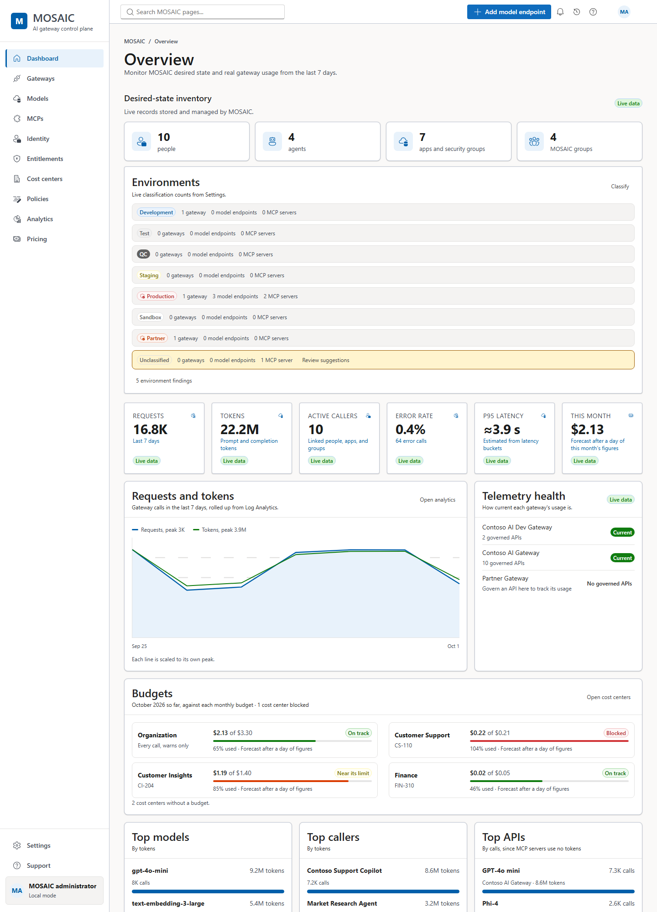</td>
    <td>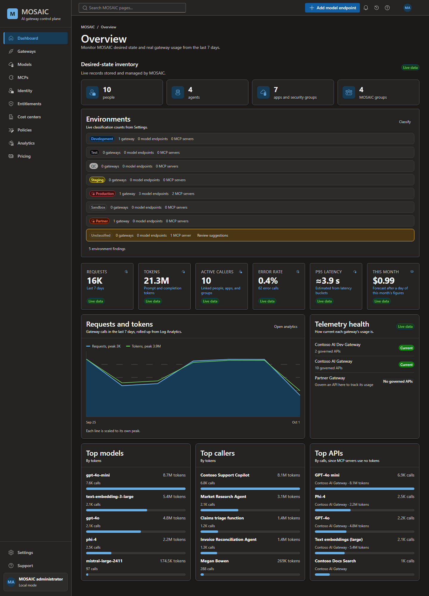</td>
  </tr>
  <tr>
    <td colspan="2"><b>Console overview.</b> Live counts of the people, agents, applications and
    security groups, and MOSAIC groups registered in MOSAIC, each opening its tab under Identity,
    and of the gateways, model endpoints, and MCP servers in each environment. Below them, the last
    7 days of gateway usage rolled up from Log Analytics: requests, tokens, active callers, errors,
    and latency, what this month has cost so far with its month-end forecast, the daily trend, how
    current each gateway's telemetry is, each budget's progress this month with any cost center it
    blocks, and the top models, callers, and APIs.</td>
  </tr>
  <tr>
    <td>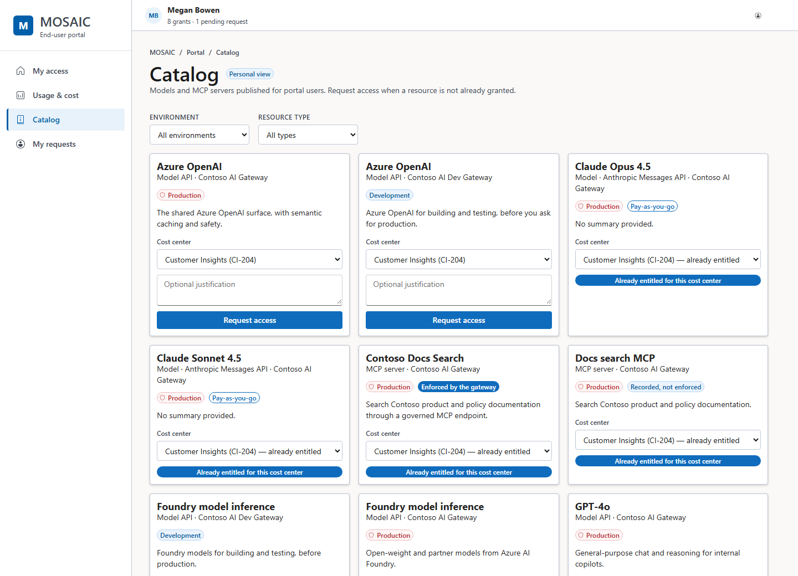</td>
    <td>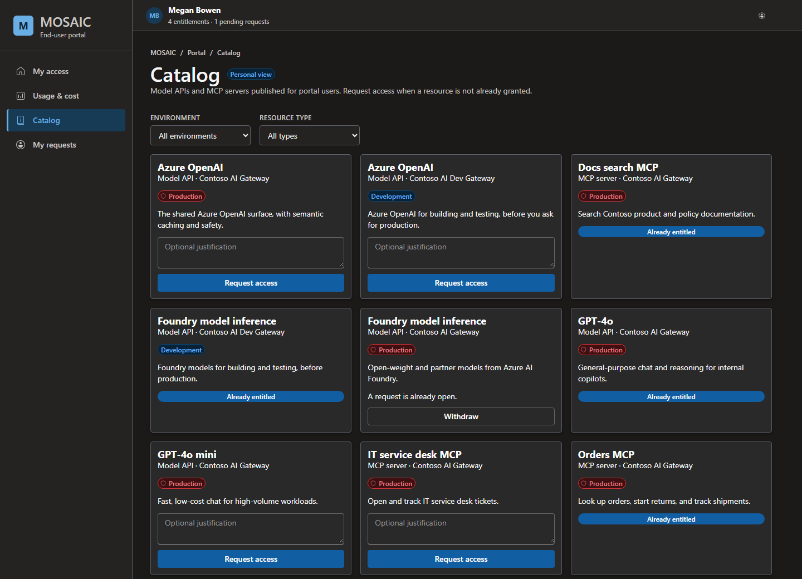</td>
  </tr>
  <tr>
    <td colspan="2"><b>Portal catalog.</b> The model APIs and MCP servers published to portal
    users, each labelled with its environment and, for an MCP server, whether the gateway enforces
    it. People request the development or production copy, charged to one of their cost centers,
    with an optional justification, and can see what they already hold or have asked for under
    each.</td>
  </tr>
</table>

### Administrator console

<table>
  <tr>
    <td width="50%" valign="top">
      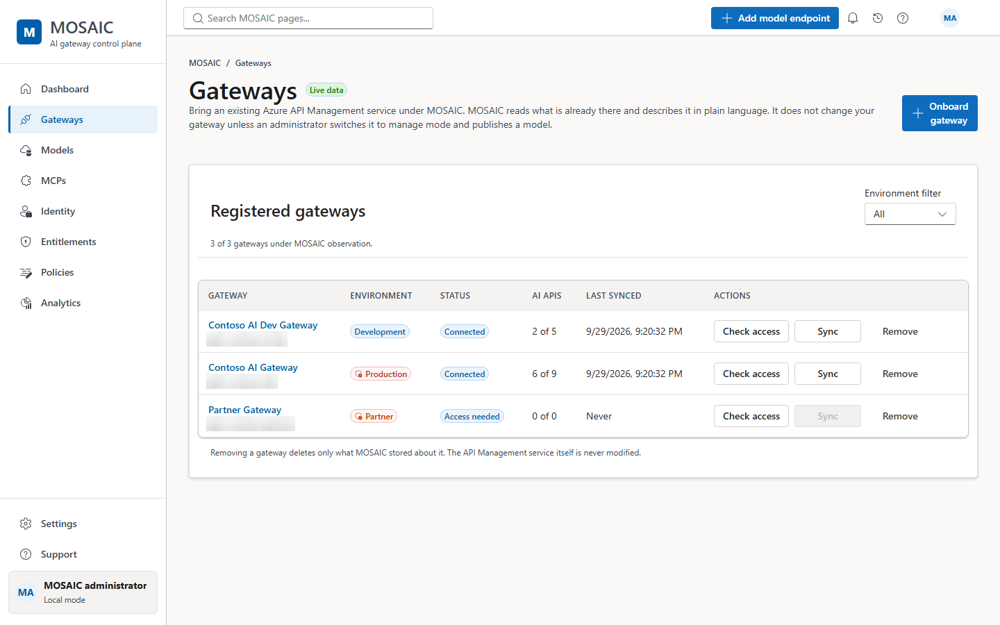
      <p><b>Gateways.</b> Existing API Management services registered by resource ID, each in one
      environment. MOSAIC reports whether it can read each one, how many APIs front Azure AI
      backends, and when it last synced.</p>
    </td>
    <td width="50%" valign="top">
      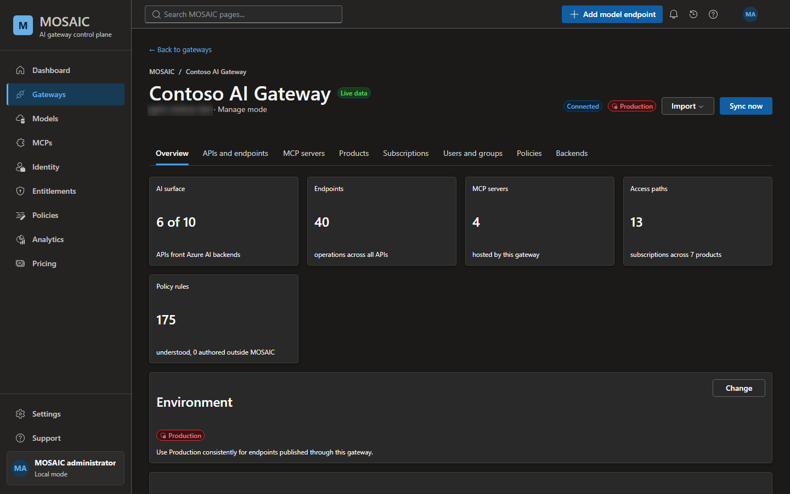
      <p><b>Gateway overview.</b> One gateway at a glance: its AI APIs, operations, MCP servers,
      access paths, and policy rules, with its environment, mode, and service details. Tabs open
      its APIs, MCP servers, products, subscriptions, users and groups, policies, and backends.</p>
    </td>
  </tr>
  <tr>
    <td width="50%" valign="top">
      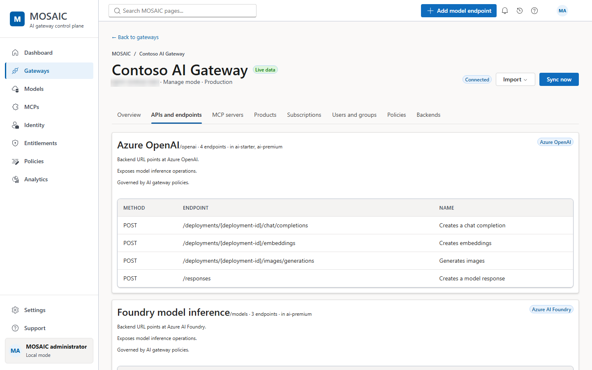
      <p><b>APIs and endpoints.</b> Each API on a gateway described in plain language: the
      backend it points at, what it exposes, the policies that govern it, and its operations.</p>
    </td>
    <td width="50%" valign="top">
      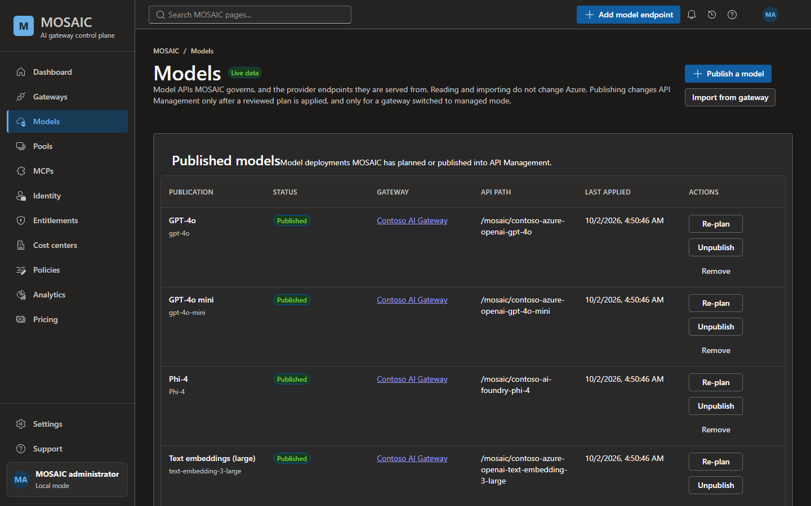
      <p><b>Models.</b> Model deployments MOSAIC has planned or published into API Management,
      with their gateway and API path. Publishing changes APIM only when a reviewed plan is
      applied, and only on a gateway in manage mode.</p>
    </td>
  </tr>
  <tr>
    <td width="50%" valign="top">
      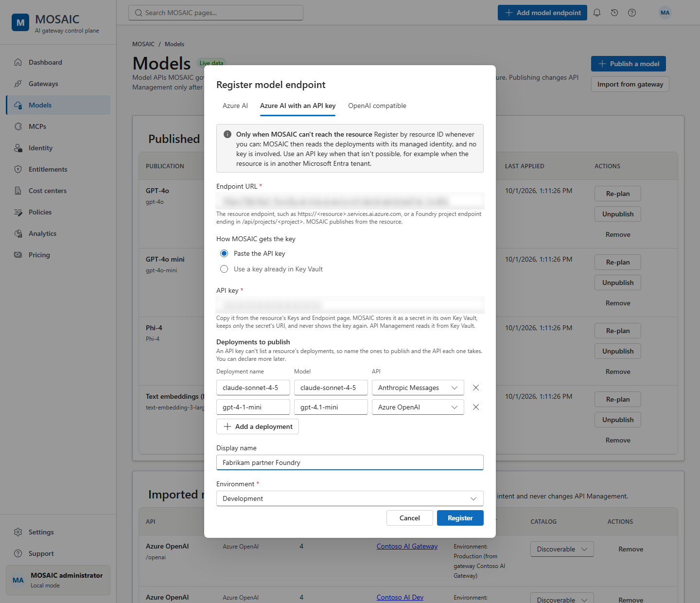
      <p><b>Register with an API key.</b> When MOSAIC can't reach a resource with its managed
      identity, such as a Foundry project in another tenant, an administrator gives its URL and its
      API key, which MOSAIC keeps in its own Key Vault, and declares the deployments to publish with
      the API each one takes.</p>
    </td>
    <td width="50%" valign="top">
      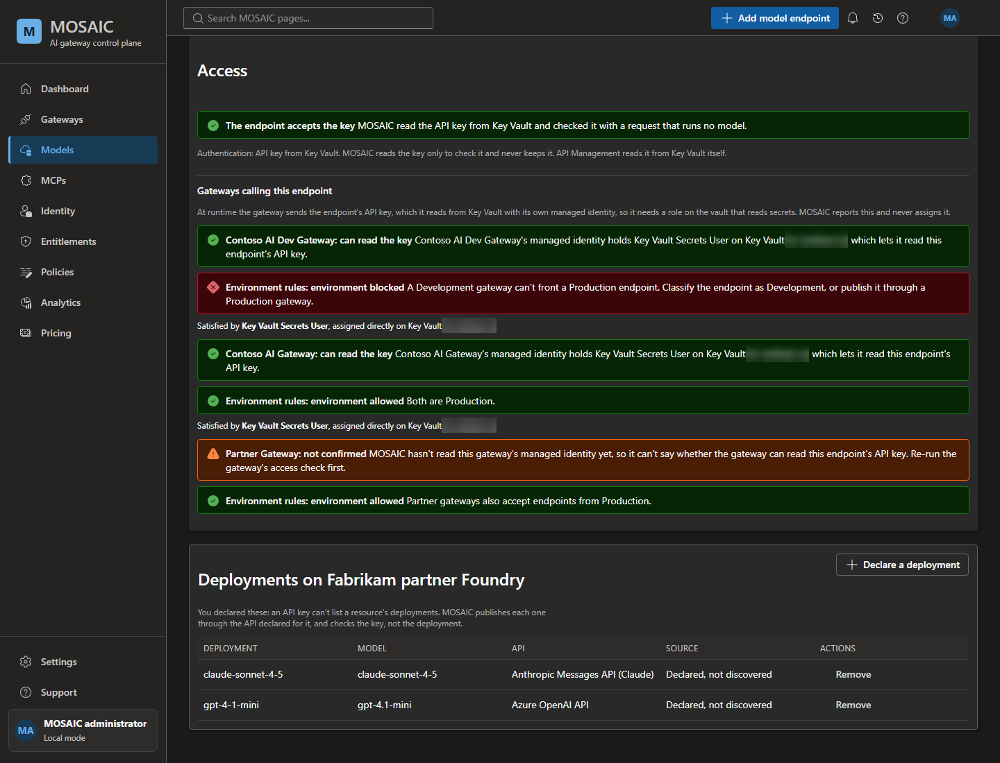
      <p><b>Endpoint reached with an API key.</b> MOSAIC shows that the endpoint accepts the key it
      keeps, whether each gateway can read the key itself, and the deployments declared for
      publishing. An administrator can replace the key without ever seeing it again.</p>
    </td>
  </tr>
  <tr>
    <td width="50%" valign="top">
      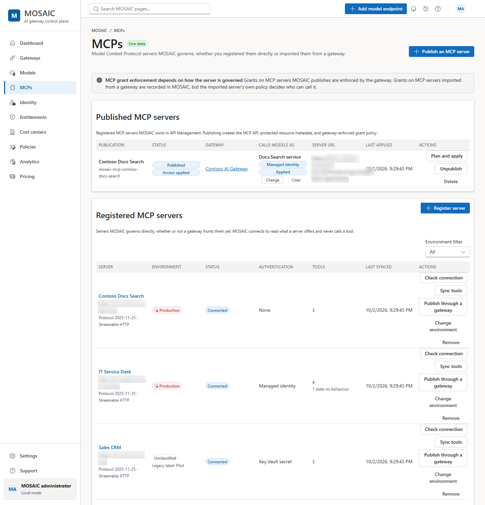
      <p><b>MCP servers.</b> Servers registered directly or imported from a gateway, with their
      environment, connection status, authentication method, and tools, and the servers MOSAIC
      publishes, with their gateway apply state. MOSAIC reads what a server offers and never calls
      a tool.</p>
    </td>
    <td width="50%" valign="top">
      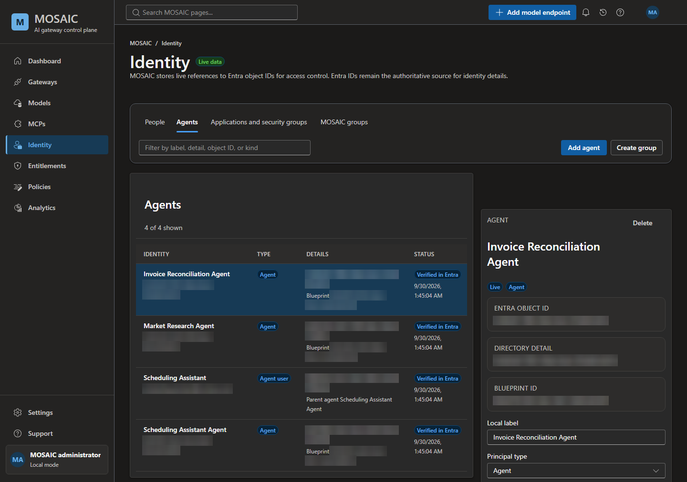
      <p><b>Identity.</b> The people, agents, applications, and security groups MOSAIC references
      by Entra object ID, each on its own tab. The Agents tab shows each agent's blueprint or
      parent agent; Entra stays the source of truth, and MOSAIC keeps only a local label, a type,
      and the default cost center a principal's calls are charged to.</p>
    </td>
  </tr>
  <tr>
    <td width="50%" valign="top">
      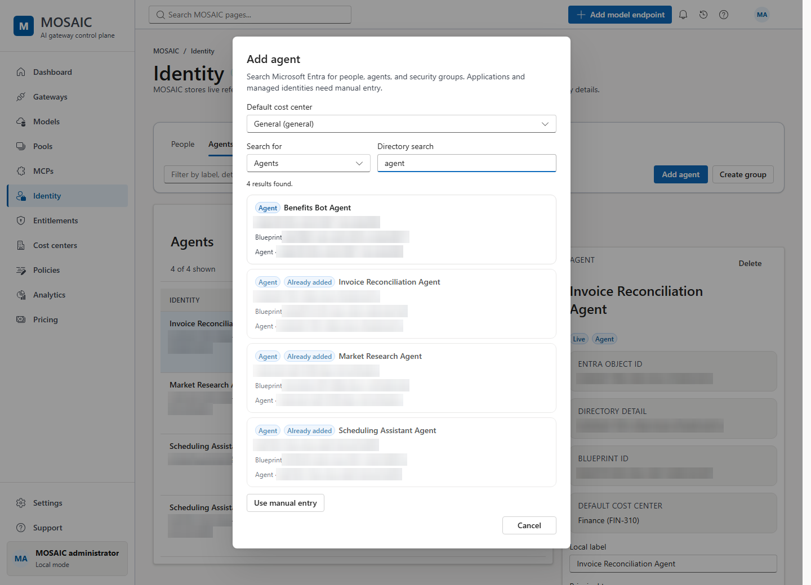
      <p><b>Directory picker.</b> <b>Add agent</b> on the Agents tab searches Microsoft Entra for
      agents, and the same picker finds people and security groups. Results show what is already
      in MOSAIC and what can still be added, and whoever is added gets the default cost center
      chosen above them: the tenant's, unless the administrator picks another.</p>
    </td>
    <td width="50%" valign="top">
      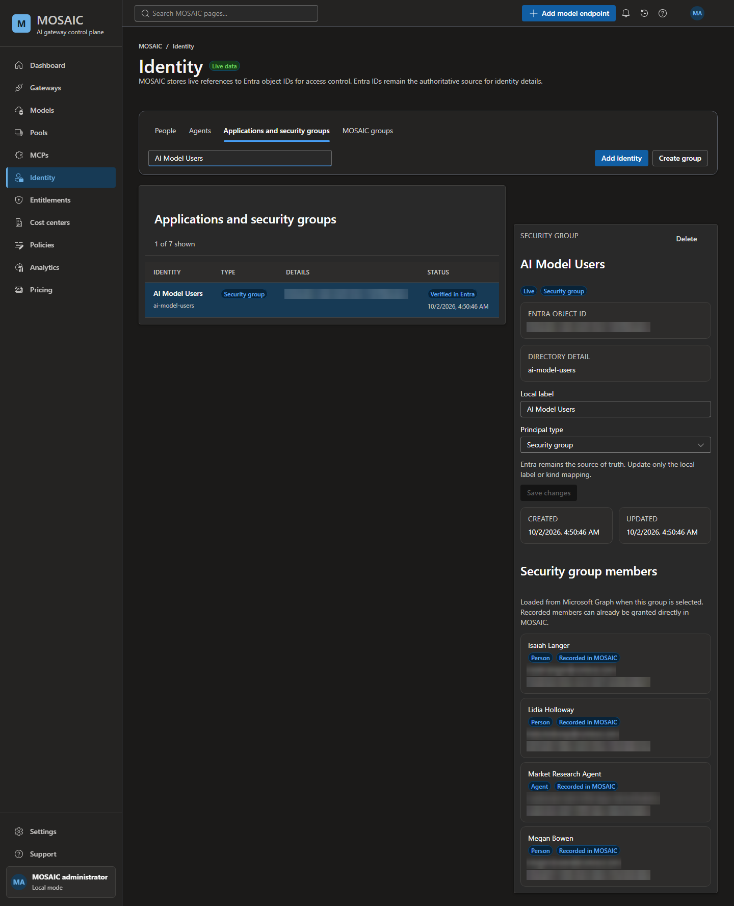
      <p><b>Security group members.</b> A recorded Entra security group shows its read-only
      Microsoft Graph member list. MOSAIC can show which members are also recorded locally for
      direct grants.</p>
    </td>
  </tr>
  <tr>
    <td width="50%" valign="top">
      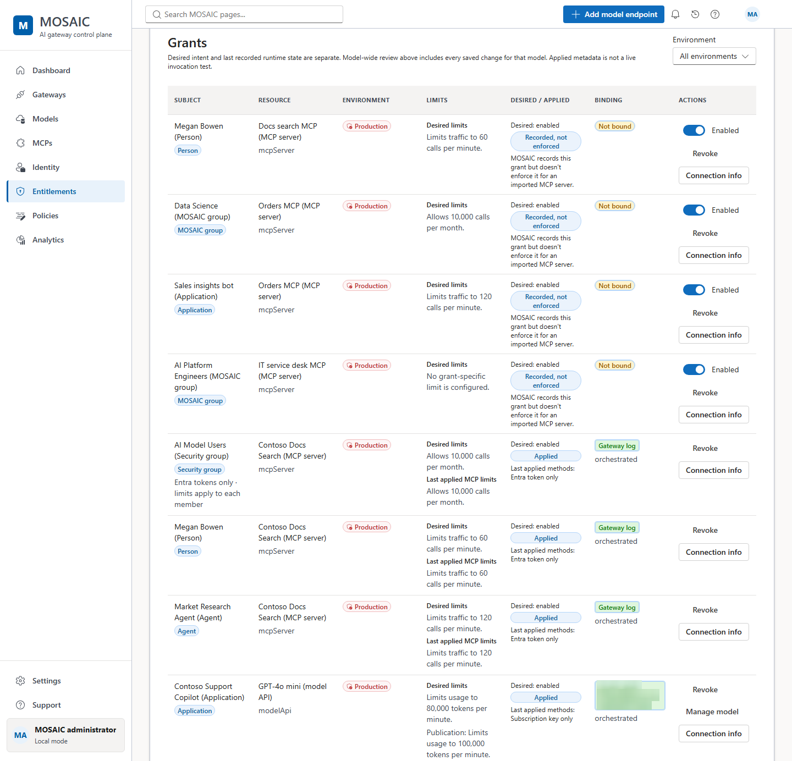
      <p><b>Entitlements.</b> Grants of model APIs and MCP servers to people, agents,
      applications, MOSAIC groups, and Entra security groups, each charged to a cost center, with
      its environment, limits, desired and applied state, and APIM binding, filtered by environment
      and cost center. Gateway enforcement changes only through a reviewed apply.</p>
    </td>
    <td width="50%" valign="top">
      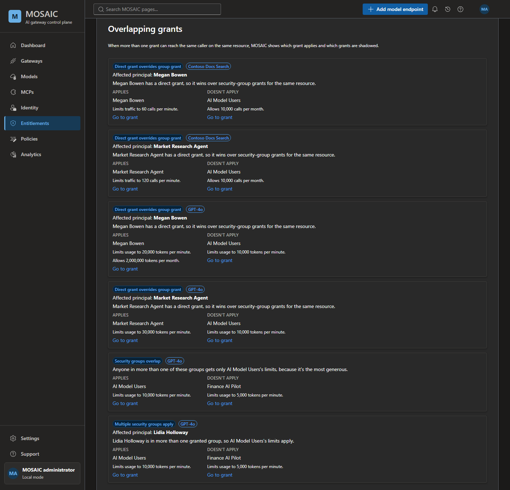
      <p><b>Overlapping grants.</b> MOSAIC explains when multiple grants under one cost center
      can reach the same caller on the same resource, with each grant's limits and a link to it.
      Direct grants win over group grants, and the most generous security-group grant wins among
      groups.</p>
    </td>
  </tr>
  <tr>
    <td width="50%" valign="top">
      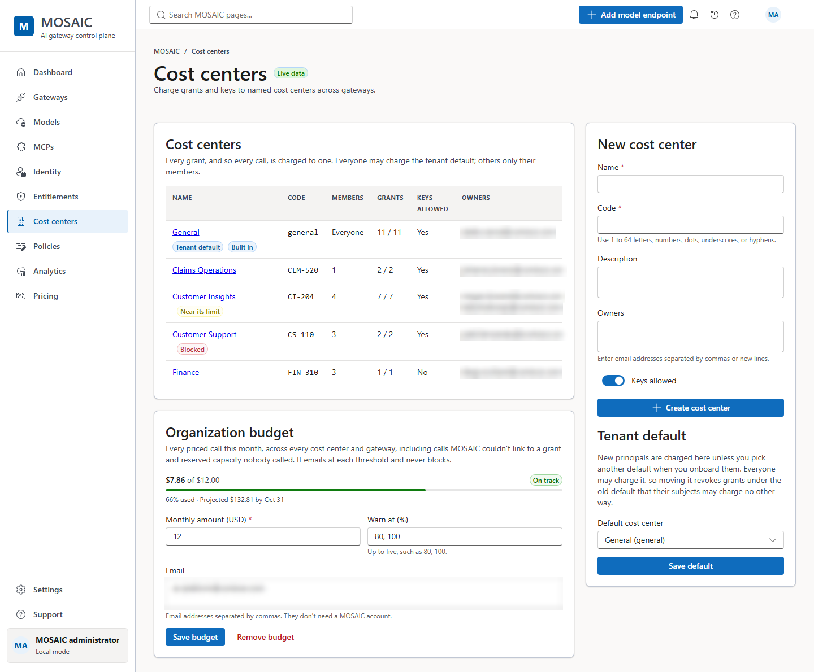
      <p><b>Cost centers.</b> Every grant, and so every call, is charged to a cost center, which
      spans gateways and has a unique code callers can name in a header, owners, members, and a
      switch for whether its grants may use keys. Administrators create them here, choose the
      tenant default that new people are charged to, and set the organization's monthly budget,
      which only warns, while a badge marks each cost center near or past its own.</p>
    </td>
    <td width="50%" valign="top">
      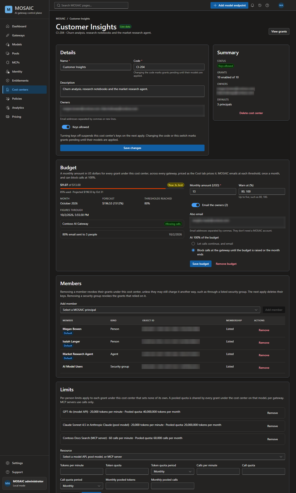
      <p><b>Cost center.</b> One cost center's budget, its people, applications, agents, and
      security groups, and its limits: per-person defaults and pooled monthly quotas for each
      model and MCP server. Removing a member revokes the grants that relied on it and deletes their
      keys on the next apply.</p>
    </td>
  </tr>
  <tr>
    <td width="50%" valign="top">
      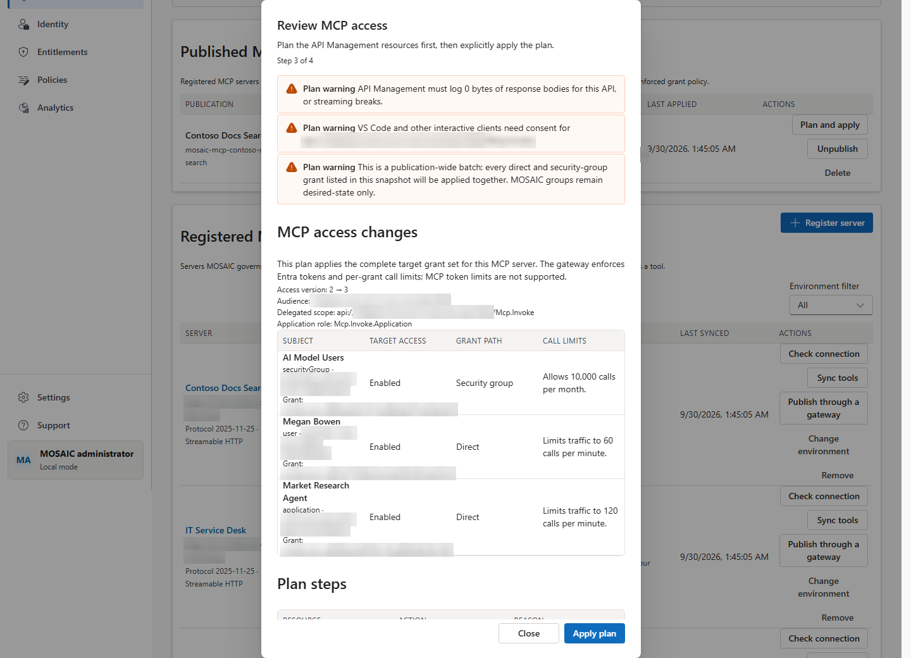
      <p><b>MCP publish review.</b> A MOSAIC-owned MCP server is published through API
      Management only after the administrator reviews the access snapshot and the exact gateway
      resources that will change.</p>
    </td>
    <td width="50%" valign="top">
      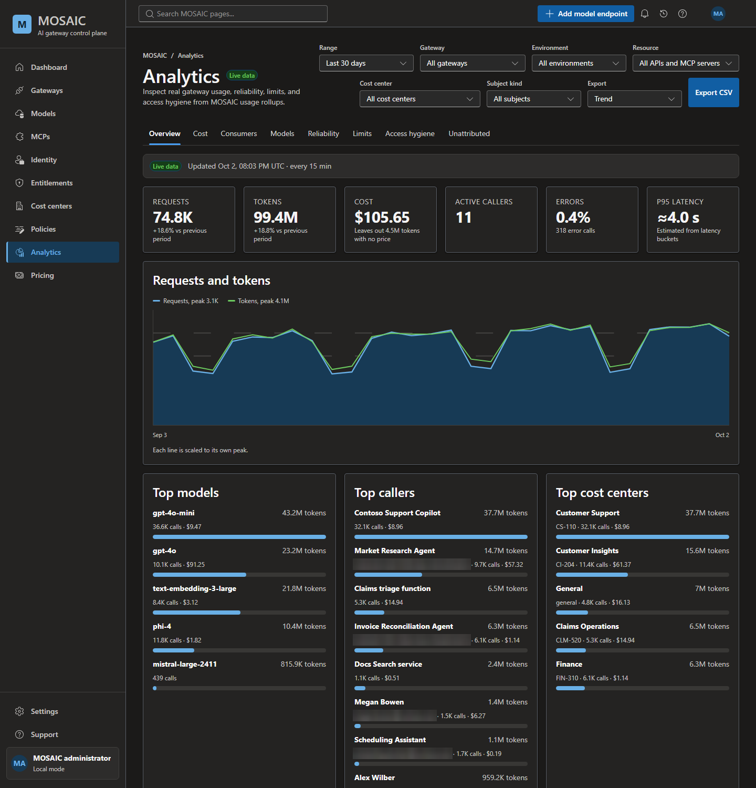
      <p><b>Analytics.</b> Real gateway usage rolled up from Log Analytics, filtered by time range,
      gateway, environment, resource, cost center, and kind of subject. The overview compares the
      headline figures, cost among them, with the previous period and ranks the top models,
      callers, cost centers, and APIs, and every tab exports CSV.</p>
    </td>
  </tr>
  <tr>
    <td width="50%" valign="top">
      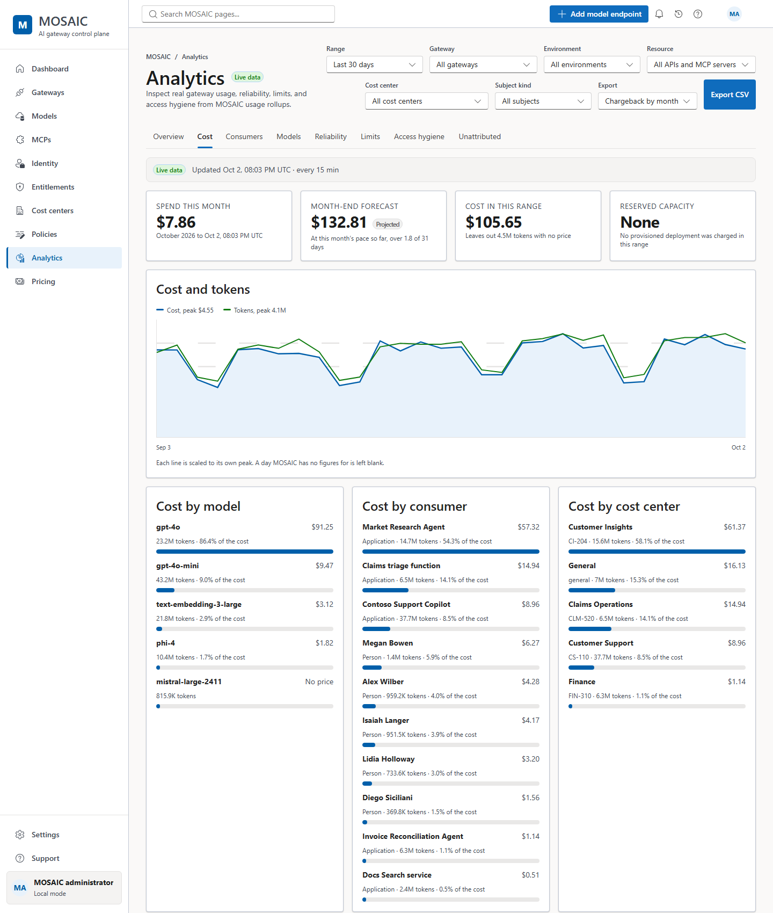
      <p><b>Cost.</b> What measured usage cost at list price: this month's spend and its month-end
      forecast, the range's cost and trend, and cost by model, consumer, cost center, API, and
      deployment, with a chargeback export that names each row's cost center. Usage MOSAIC can't
      price shows <b>No price</b>, never $0.</p>
    </td>
    <td width="50%" valign="top">
      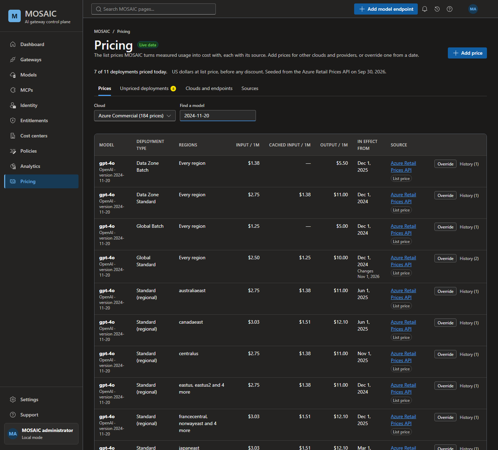
      <p><b>Pricing.</b> The list prices MOSAIC turns usage into cost with, for each cloud, each
      linked to its source. Administrators add prices for other clouds and providers, or override
      one from a date without changing the days before it, and see which deployments have no price
      and why.</p>
    </td>
  </tr>
  <tr>
    <td width="50%" valign="top">
      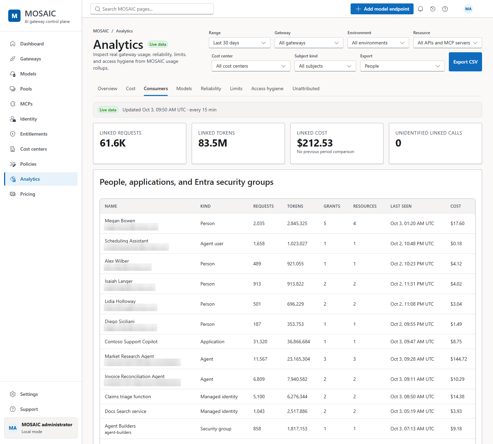
      <p><b>Consumers.</b> Each person, agent, application, and security group that called a
      governed API, with requests, tokens, grants, resources, when they were last seen, and what
      their calls cost. Below it, the same usage by grant, by cost center, and by client
      application.</p>
    </td>
    <td width="50%" valign="top">
      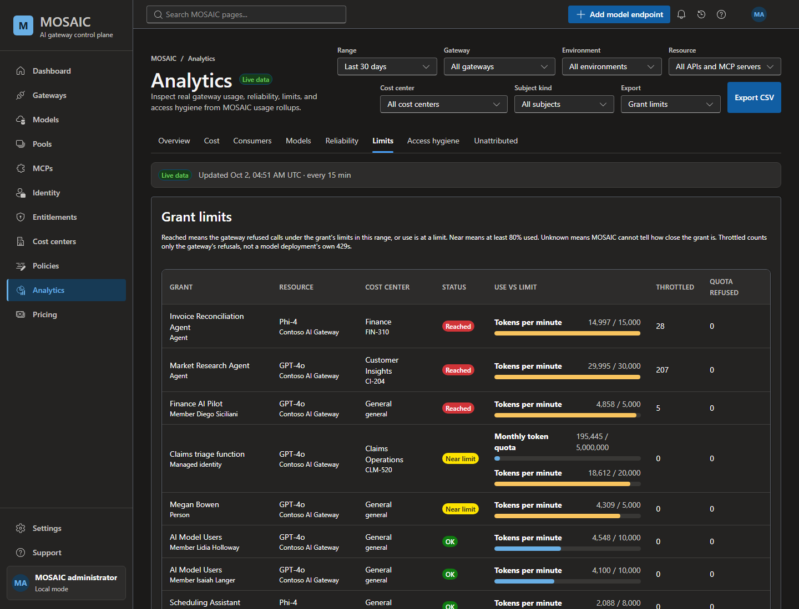
      <p><b>Grant limits.</b> How close each grant is to its quotas and rate limits, busiest first,
      with its cost center and the calls the gateway throttled or refused for quota. A grant is
      near its limit at 80% and has reached it once the gateway refuses its calls.</p>
    </td>
  </tr>
  <tr>
    <td width="50%" valign="top">
      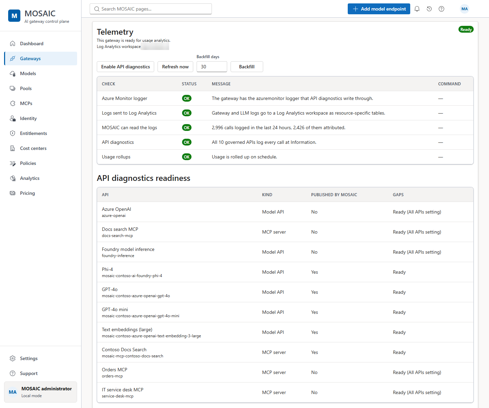
      <p><b>Gateway telemetry.</b> Whether MOSAIC can measure a gateway's usage: its Azure Monitor
      logger, logs sent to Log Analytics, MOSAIC's read access, API diagnostics, and rollups, with
      the command that fixes a failing check. Administrators can enable API diagnostics on what
      MOSAIC published, refresh now, or backfill from the workspace's retention.</p>
    </td>
    <td width="50%" valign="top">
      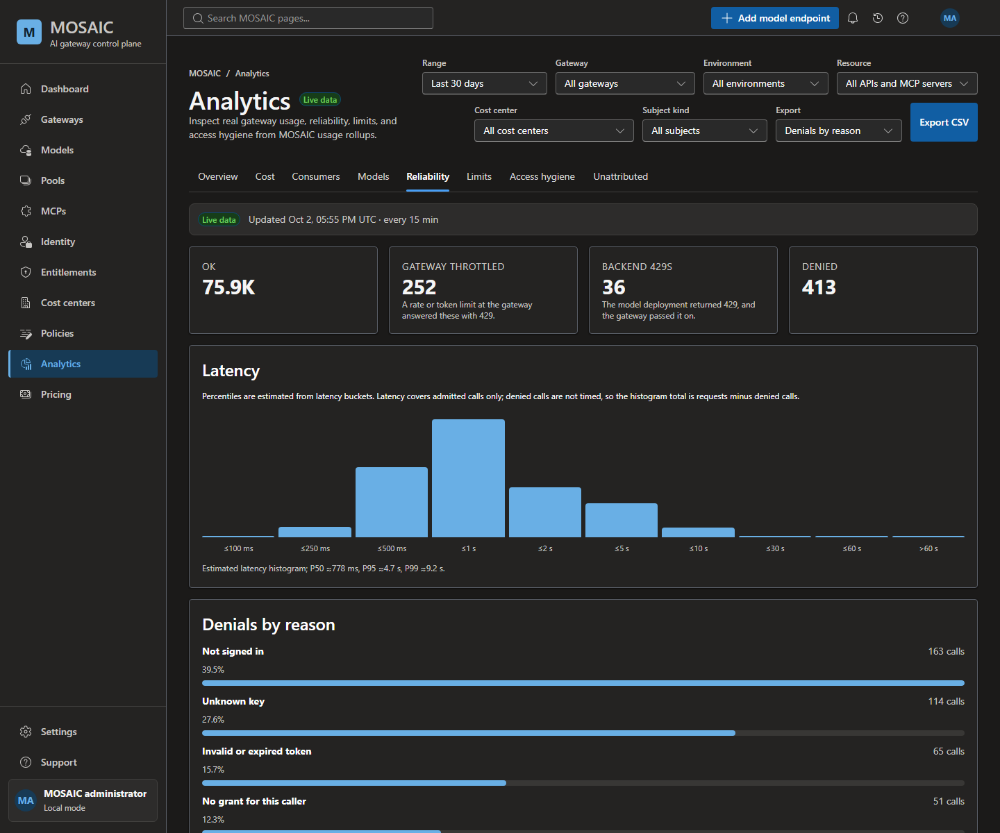
      <p><b>Reliability.</b> Successful calls, calls the gateway throttled, 429s from the model
      deployments, and denied calls, with an estimated latency histogram. Denials are broken down by
      reason, such as a caller who isn't signed in or a key the gateway doesn't know.</p>
    </td>
  </tr>
  <tr>
    <td width="50%" valign="top">
      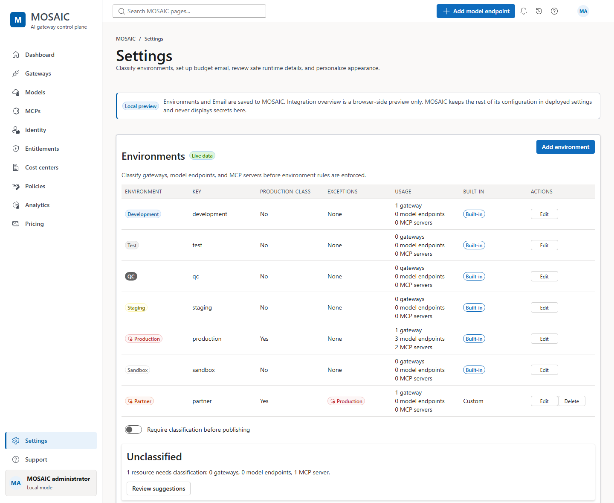
      <p><b>Environments.</b> The catalog administrators define in Settings: the built-in
      environments plus custom ones such as Partner, each with a color and a production-class
      flag. Gateways, model endpoints, and MCP servers are each classified into one, and any not
      yet classified wait below with suggestions to review.</p>
    </td>
    <td width="50%" valign="top">
      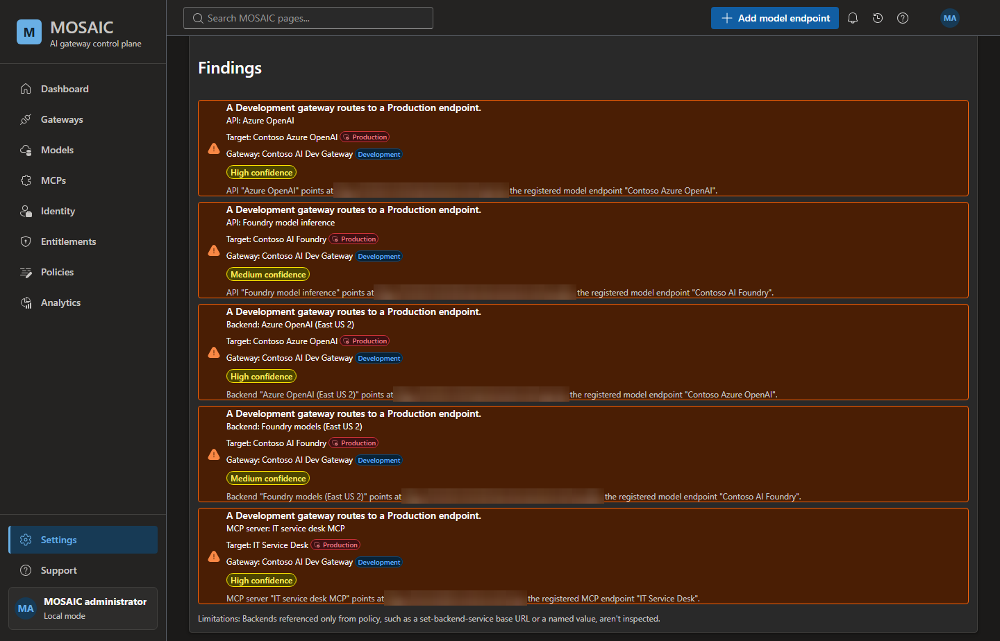
      <p><b>Environment findings.</b> Pairings already in API Management that break the
      environment rules, such as a development gateway routing to production endpoints, with the
      evidence and how confident the match is. Findings are advisory and never block anything.</p>
    </td>
  </tr>
  <tr>
    <td width="50%" valign="top">
      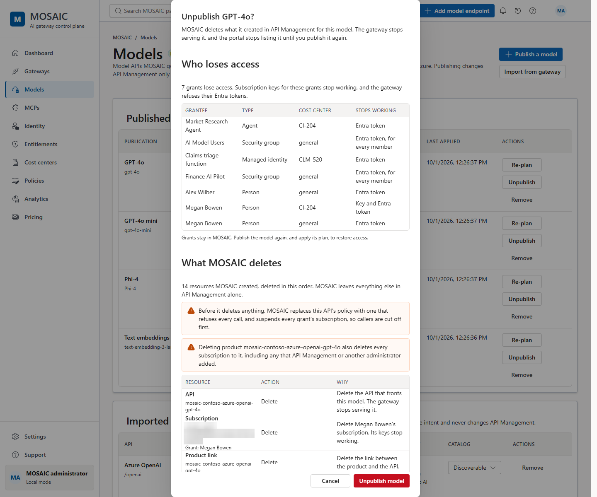
      <p><b>Unpublish review.</b> Before MOSAIC removes a model from API Management, the
      administrator sees which grants lose access, the cost center each charges, what stops working
      for each, and every resource MOSAIC deletes. Only confirming this review unpublishes it.</p>
    </td>
    <td width="50%" valign="top">
      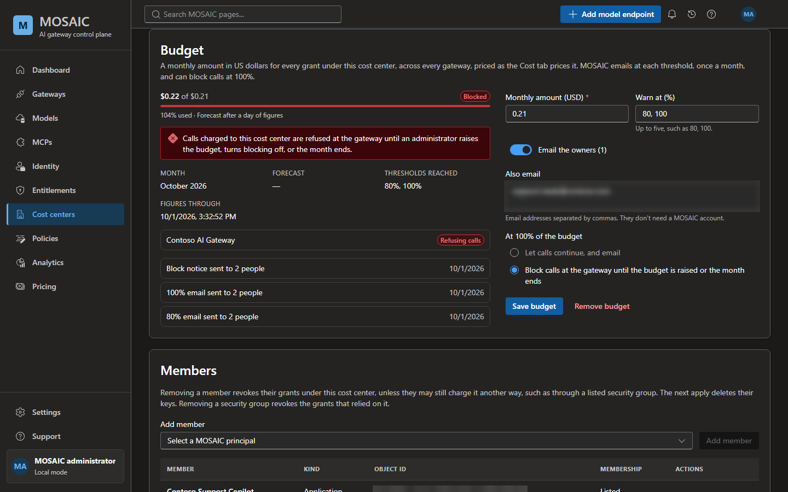
      <p><b>Budgets.</b> Each cost center can have a monthly budget in dollars across every
      gateway, which emails anyone at 80% and 100% and either lets calls continue or blocks them at
      the gateway. A blocked budget shows each gateway refusing its calls and every email sent this
      month.</p>
    </td>
  </tr>
  <tr>
    <td width="50%" valign="top">
      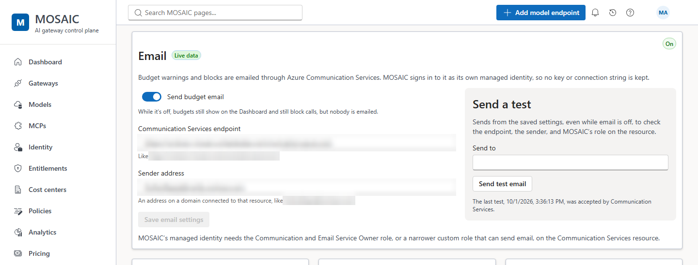
      <p><b>Budget email.</b> Budget email goes through Azure Communication Services, which MOSAIC
      signs in to as its managed identity, so no key is kept. It's off until an administrator saves
      an endpoint and a sender here, and <b>Send test email</b> checks both.</p>
    </td>
    <td width="50%" valign="top"></td>
  </tr>
</table>

### End-user portal

<table>
  <tr>
    <td width="50%" valign="top">
      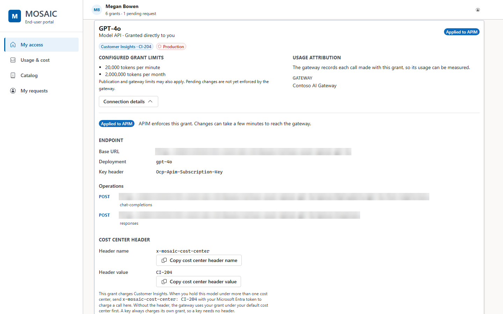
      <p><b>My access.</b> Each grant with the cost center it charges, its environment, limits,
      APIM state, and how its usage is tracked. A direct model grant expands to show its endpoint,
      operations, cost-center header, accepted credentials, and Entra details, with code samples
      and its key below.</p>
    </td>
    <td width="50%" valign="top">
      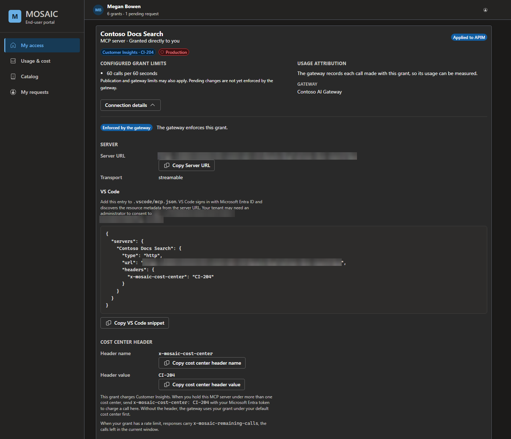
      <p><b>MCP connection.</b> An enforced MCP grant expands to show the server URL, protected
      resource metadata, VS Code <code>mcp.json</code> snippet, Entra authentication values, and
      call limits.</p>
    </td>
  </tr>
  <tr>
    <td width="50%" valign="top">
      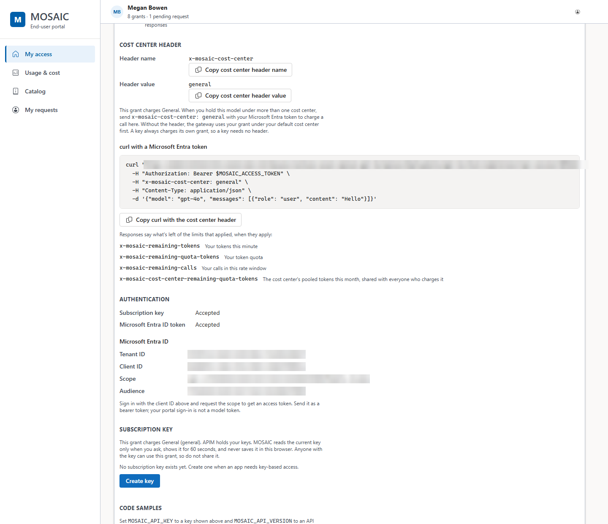
      <p><b>Choosing a cost center.</b> Each grant names the cost center it charges and the
      <code>x-mosaic-cost-center</code> header that picks it on a call, with a copy-ready curl for a
      Microsoft Entra token and the response headers that say what's left of each limit. Keys are
      created on request, so a grant without one offers <b>Create key</b>.</p>
    </td>
    <td width="50%" valign="top">
      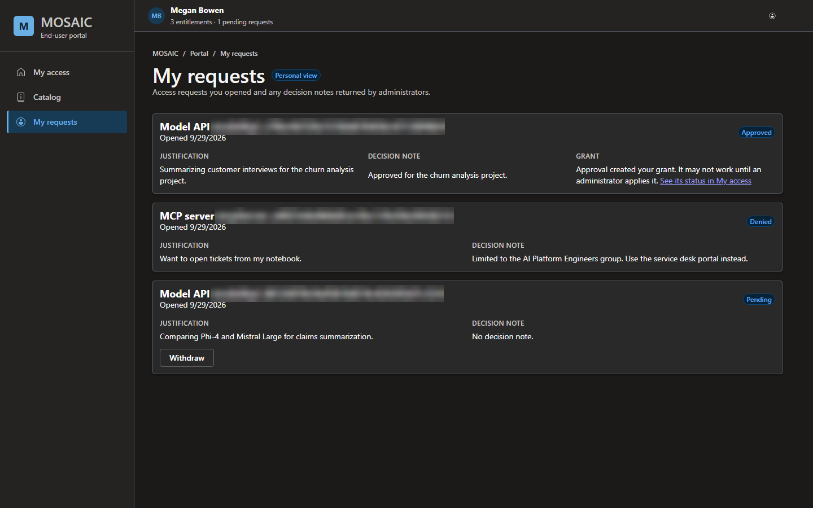
      <p><b>My requests.</b> Access requests with their environment, cost center, justification,
      state, and the administrator's decision note. A pending request can be withdrawn.</p>
    </td>
  </tr>
  <tr>
    <td width="50%" valign="top">
      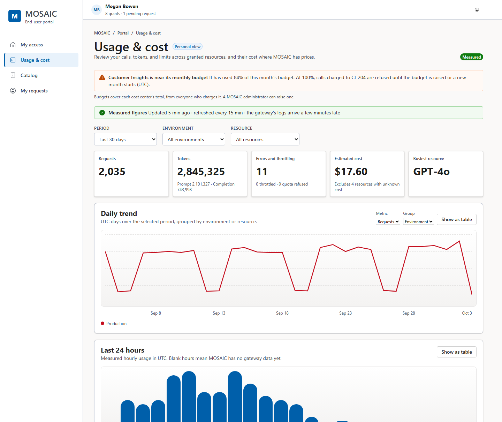
      <p><b>Usage &amp; cost.</b> A person's own requests, tokens, errors and throttling, what they
      cost at list price, and their busiest resource, measured from the gateway's logs across
      everything they hold. A daily trend by environment or resource and the last 24 hours by hour
      show when they used it.</p>
    </td>
    <td width="50%" valign="top">
      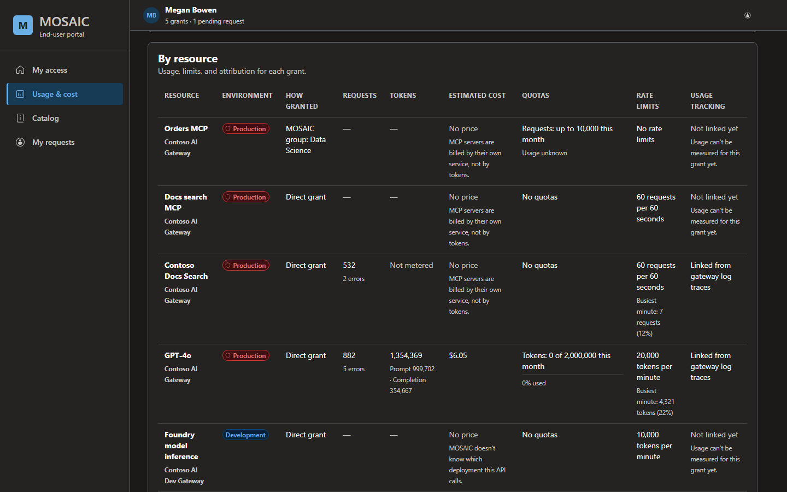
      <p><b>Cost centers and usage by resource.</b> Each cost center the person charges, with this
      month's total from everyone who charges it, and each pooled resource they hold there against
      its quota: totals only, never who used them. Below, their own figures by granted resource,
      with each one's estimated cost, or <b>No price</b> and why, each quota's use, the busiest
      minute against each rate limit, and how its calls are linked.</p>
    </td>
  </tr>
  <tr>
    <td width="50%" valign="top">
      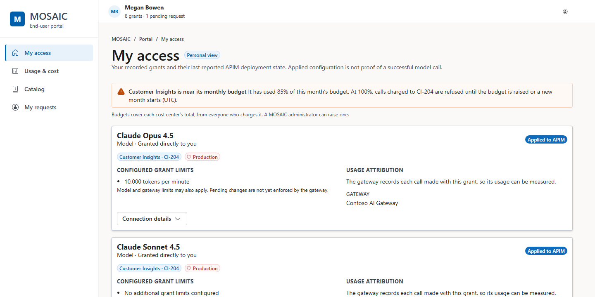
      <p><b>Budget banner.</b> When a cost center the person charges nears, passes, or is blocked
      at its monthly budget, My access and Usage &amp; cost say so, and what happens at 100%. It
      shows the cost center's total against its budget, never anyone's own share.</p>
    </td>
    <td width="50%" valign="top"></td>
  </tr>
</table>

## Architecture and trust boundaries

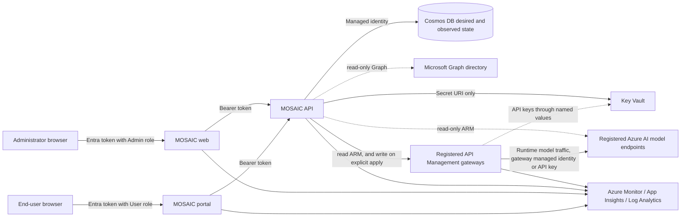
```mermaid
flowchart LR
    Admin[Administrator browser] -->|Entra token with Admin role| Web[MOSAIC web]
    User[End-user browser] -->|Entra token with User role| Portal[MOSAIC portal]
    Web -->|Bearer token| API[MOSAIC API]
    Portal -->|Bearer token| API
    API -->|Managed identity| Cosmos[(Cosmos DB desired and observed state)]
    API -. read-only Graph .-> Graph[Microsoft Graph directory]
    API -->|Secret URI only| KV[Key Vault]
    API -. read-only ARM .-> Foundry[Registered Azure AI model endpoints]
    API -->|read ARM, and write on explicit apply| APIM[Registered API Management gateways]
    APIM -->|Runtime model traffic, gateway managed identity or API key| Foundry
    APIM -. API keys through named values .-> KV
    APIM --> Monitor[Azure Monitor / App Insights / Log Analytics]
    API --> Monitor
    Web --> Monitor
    Portal --> Monitor
```

The administrator console and the end-user portal are separate applications with separate
Entra registrations and separate app roles, so they are independently governable. The portal
reaches only `/api/v1/portal/*` and the current-user `/api/v1/me/*` routes. Every one of them is
scoped to the caller's own token, and none accepts a subject or requester parameter. The console
first asks `GET /api/v1/console/me` which MOSAIC role the caller holds, and renders only for
`Admin`; anyone else sees a single page that says what their account has and what to ask for. See
[ADR 0008](docs/adr/0008-portal-identity-and-role-separation.md).

| Concern | Source of truth | MOSAIC responsibility |
| --- | --- | --- |
| Governance intent | Cosmos DB | Store tenant-scoped desired state and audit mutations |
| Runtime traffic and enforcement | APIM | Observe and explain; write only through a reviewed plan and an explicit apply |
| Identity objects and authentication | Microsoft Entra ID | Store object IDs only; validate tokens and app roles; read directory metadata through Graph for lookup and verification |
| Backend credential references | Key Vault | Store secret URIs only, never secret values |
| APIM subscription keys | APIM | Retrieve only for an explicitly authorized reveal; never persist or cache a copy |
| Foundry deployments | Existing Azure AI/Foundry resources | Enumerate deployed models read-only; report, never grant, the gateway's runtime access |
| Traffic/token telemetry | Azure Monitor stack | Read API Management's resource logs from Log Analytics and roll them up into Cosmos; set API diagnostics only on APIs MOSAIC published on managed gateways |

MOSAIC never silently substitutes in-memory data or local authentication in Azure. Both are
explicit local/test modes and application startup rejects them when `MOSAIC_ENVIRONMENT=azure`.

## What is implemented

- Python 3.12 FastAPI API with OpenAPI, structured JSON logging, Azure Monitor OpenTelemetry,
  correlation IDs, anonymous `/healthz` and dependency-aware `/readyz`
- Entra issuer, audience, signature, tenant, expiry, and algorithm validation, with app-role
  authorization decided per route: `Admin` for every administrative route, `User` for the
  end-user portal surface
- Principal, group, and membership CRUD with validation, stable errors, and audit events,
  including read-only Microsoft Graph lookup for users, agent identities, agent users and Entra
  security groups
- Multi-gateway onboarding: register any existing API Management service by resource ID, verify
  access, and mirror its APIs, endpoints, products, subscriptions, users, groups, backends, and
  named value metadata into Cosmos
- Entitlements as desired state: grants to a user, MOSAIC group, Entra security group, application
  or agent over a model API, MCP server, product, or model deployment; token and request limits;
  catalog visibility; access requests, whose approval creates and links the requester's grant
  intent; and effective-access resolution that reports whether a grant arrived directly or through
  a group
- Governed access for direct user/application/agent grants and Entra security-group grants to
  MOSAIC-published model APIs: reviewed APIM deployment, key or Entra authentication for direct
  grants, Entra-only group grants, shared token/request limits, revocation, and distinct desired
  versus applied state
- MCP publishing and governed access for MOSAIC-registered servers: reviewed APIM deployment of a
  passthrough MCP API, per-publication resource metadata, Entra-only direct and security-group
  grants, call limits, credential stripping, backend managed identity and fail-closed recovery
- Current-user entitlement and connection APIs, plus audited on-demand key retrieval, which the
  portal's My access page uses to show connection details and reveal keys for applied direct
  model grants
- Model endpoint onboarding: register Azure OpenAI and Azure AI Foundry resources, verify MOSAIC's
  control-plane access, discover the deployments and available models on them, and report — per
  registered gateway — whether that gateway's managed identity can actually call them, judged by
  the data actions its roles grant on the resource the published API calls and by whether the
  gateway has a network path to it. A resource MOSAIC can't reach, such as one in another tenant,
  can be registered by URL with an API key held in Key Vault, with its deployments declared and
  published through a Key Vault-backed named value
- MCP server registration: register a Model Context Protocol server by URL, connect to it as a
  read-only client, and record the tools it declares — including the input schemas, output schemas,
  and behaviour annotations that API Management's management plane does not expose
- MCP servers already present in a registered gateway are detected and counted
- Plain-language policy view: policy XML is parsed in memory and reduced to a digest plus redacted
  semantic facets, so administrators never see markup and MOSAIC never stores it
- AI surface detection that identifies which APIs and backends front large language models, across
  Azure OpenAI, Azure AI Foundry, Azure AI inference, OpenAI, Anthropic, Google Vertex AI, and
  AWS Bedrock
- MCP server discovery, and import of selected model APIs and MCP servers from a synchronised
  gateway into MOSAIC's own desired state
- Model publishing: expose an observed deployment through a gateway by creating its backend, policy
  fragment, API, operations, API policy, product, product link, and subscription — through a
  persisted deterministic plan, an explicit apply, per-step results, and a rollback that deletes
  only the resources that apply created
- MCP publishing: expose a registered MCP server through a gateway by creating its backend, policy
  fragment, passthrough MCP API, API policy, protected-resource-metadata API, metadata operation
  and metadata policy — through the same reviewed plan and explicit apply model
- Async repository abstraction with explicit in-memory and Cosmos implementations
- React/TypeScript/Vite administrator console using Fluent UI, React Router, TanStack Query, and
  MSAL, with responsive navigation and persisted light/dark/system themes. It confirms the caller
  holds the `Admin` role before it shows any of that; a caller with only `User`, or with no MOSAIC
  role, is told the console isn't for them and what to ask an administrator for
- Runtime browser configuration; Azure IDs and service URLs are not baked into the web image
- Typed APIM read and write boundaries kept in separate classes, plus Foundry import and
  deterministic policy authoring that never returns markup
- Separate non-root frontend/backend containers
- End-user portal: a separate SPA on its own Entra registration and the `User` app role, where
  a non-administrator sees what they are entitled to, how each grant reached them, the catalog
  of governed resources, and can request access to something they cannot yet use. A model or MCP
  server MOSAIC publishes is in the catalog only while it's published into API Management. My access
  and My requests head each grant and request with its resource's name, as the catalog shows it, and
  keep its kind visible, including for a resource since made private. They never show a raw
  resource ID. For an applied direct model grant, the portal also shows the endpoint, operations,
  accepted credentials, limits, and placeholder code samples, and reveals a key on request
- Environments: an administrator-defined catalog (Development, Test, QC, Staging, Production,
  Sandbox, and custom environments) that classifies gateways, model endpoints, and MCP servers.
  Compatibility rules are enforced when models and MCP servers are published, and Azure
  `environment` tags and legacy labels become suggestions an administrator confirms.
  Re-classification is guarded, and advisory findings flag blocked pairings MOSAIC's rules didn't
  stop. The portal shows each catalog entry's and grant's environment, so people request
  development and production access separately
- End-user usage report: a caller-scoped `/me/usage` contract and the portal's **Usage & cost**
  page, measured from the gateway's logs and priced from the price list. Each governed model and
  MCP call is tagged at the gateway with the grant it matched and the calling client, so key,
  token, security-group, and MCP grants are each attributed to the right person. Only local and
  test runs simulate the figures, from the caller's real grants and limits, and they label them
  **Sample figures**
- Usage analytics: a background job rolls API Management's gateway and LLM logs up from Log
  Analytics into Cosmos every 15 minutes, keeping daily and monthly figures after the workspace's
  own retention ends. The console's Dashboard and Analytics pages show requests, tokens, callers,
  errors, latency, quota and rate-limit use, denials, unused grants, and unattributed calls, by
  range, gateway, environment, resource, and kind of subject, with CSV export. Each gateway's
  Telemetry section checks that its usage can be measured and says how to fix what's missing. See
  [Usage analytics](docs/usage-analytics.md) and
  [ADR 0019](docs/adr/0019-usage-telemetry.md)
- Pricing: a sourced, dated price list turns measured usage into cost. MOSAIC ships list prices for
  Azure Commercial and Azure Government from the Azure Retail Prices API, each citing its source.
  Administrators add prices for custom clouds and other providers, or override one from a date, as
  audited versions that never rewrite the days before them. Analytics, the Dashboard, and the
  portal show cost at list price, with this month's spend and a month-end forecast, provisioned
  throughput shared by each caller's share of its tokens, and a chargeback export. Usage MOSAIC
  can't price shows **No price**, never $0. See [Pricing](docs/pricing.md) and
  [ADR 0020](docs/adr/0020-price-list.md)
- Cost centers: every grant, and so every call, is charged to a cost center that spans gateways,
  with owners, members (people, applications, agents, and Entra security groups), a keys allowed
  switch, per-person default limits, and pooled monthly quotas per model. People choose one when
  they ask for access and name one per call with the `x-mosaic-cost-center` header, and keys are
  created on request. Analytics, the chargeback, and the portal report spend and quotas per cost
  center. See [Cost centers](docs/cost-centers.md) and [ADR 0022](docs/adr/0022-cost-centers.md)
- Budgets: a monthly budget per cost center, in dollars across every gateway, emails its owners
  and any other address at 80% and 100%, and either lets calls continue or blocks them at the
  gateway until it's raised or the UTC month ends. An organization budget only warns. Email goes
  through Azure Communication Services as MOSAIC's managed identity, off until it's set up in
  Settings. The Dashboard shows each budget's progress and forecast, and the portal tells people
  when a cost center they charge is near or past its budget. See
  [Budgets and alerts](docs/budgets-and-alerts.md) and
  [ADR 0023](docs/adr/0023-budgets-and-notifications.md)
- ACR remote builds for every image, so deployment does not depend on a local Docker daemon
- `azd` and modular Bicep for three Linux Web Apps on one plan, ACR, Cosmos, Key Vault, APIM,
  Log Analytics, Application Insights, diagnostics, managed identities, and narrow RBAC
- Idempotent Entra application/service-principal setup through `azd` hooks

The Gateways workspace, the Identity workspace, the Models and MCPs workspaces, the Entitlements
workspace, Cost centers and their budgets, Settings → Environments and Email, model publishing,
the Dashboard, Analytics, Pricing, the end-user portal, and the deterministic policy preview use
live API contracts. Usage figures in
Azure are measured from gateway logs; only local and test runs simulate the portal's, labeled
**Sample figures**. Policy metadata and other future operational experiences are interactive
frontend previews labeled **Sample data** or **Local preview**. They never claim to mutate Azure
or substitute sample data for a failed API request.

Existing deployments need `azd provision` (or a manual role grant) before publishing works: the
API's identity moves from the API Management reader role to contributor. Until it is granted,
preflight reports the missing write permissions precisely rather than failing during an apply.
Measured usage also needs `azd provision`, which adds the `usage-rollups` container, the
gateway's `azuremonitor` logger, and Monitoring Reader on the gateway for the API's identity.
Publications applied before budgets existed don't check them until they're applied again, which
also creates each gateway's `mosaic-blocked-cost-centers` named value. Budget email needs Azure
Communication Services: set `MOSAIC_DEPLOY_EMAIL` to `true` before `azd provision` to create it,
then turn email on in **Settings > Email**. See [Budgets and alerts](docs/budgets-and-alerts.md).

## Prerequisites

- Azure subscription where the deployer can create resources and role assignments
- Microsoft Entra role capable of managing app registrations and service principals (Application
  Administrator or broader), assigning the initial app role, and granting the model client's
  tenant-wide consent. Agent identity and security-group lookup also need a privileged
  administrator to consent the API managed identity's Microsoft Graph application permissions:
  `User.ReadBasic.All`, `GroupMember.Read.All` and `AgentIdentity.Read.All`.
- [Azure CLI](https://learn.microsoft.com/cli/azure/install-azure-cli)
- [Azure Developer CLI](https://learn.microsoft.com/azure/developer/azure-developer-cli/install-azd)
- Python 3.12 and [uv](https://docs.astral.sh/uv/)
- Node.js 24 and npm
- Docker for local container validation

The reference development target is region `eastus2` with environment name `mosaic-dev`. Supply
your own subscription when deploying.

## Local development

Install dependencies:

```powershell
uv sync --all-packages --group dev
Set-Location apps\web
npm ci
```

Run the API with the opt-in local modes:

```powershell
$env:MOSAIC_ENVIRONMENT = "local"
$env:MOSAIC_AUTH_MODE = "local"
$env:MOSAIC_REPOSITORY_BACKEND = "memory"
$env:MOSAIC_TENANT_ID = "local-development"
uv run mosaic-api
```

Local authentication grants both the `Admin` and `User` app roles by default. Set
`MOSAIC_LOCAL_ROLES` to narrow it — `'["User"]'` simulates an end user who must not reach an
administrative route. The setting is rejected outside local and test environments.

Directory lookup and group-claim enforcement have explicit switches:

| Setting | Default | Purpose |
| --- | --- | --- |
| `MOSAIC_ENTRA_DIRECTORY_LOOKUP` | `true` | Enables read-only Microsoft Graph lookup and verification for users, agent identities, agent users and Entra security groups. Set to `false` to require administrators to type object IDs. |
| `MOSAIC_ENTRA_GROUP_CLAIMS` | `true` | Records whether bootstrap configures `groupMembershipClaims: SecurityGroup` on the runtime/API registrations. Set to `false` only when group grants should be stored but not matched at the gateway. |

Usage figures have their own settings. See [Usage analytics](docs/usage-analytics.md).

| Setting | Default | Purpose |
| --- | --- | --- |
| `MOSAIC_USAGE_SOURCE` | `auto` | `rollups` reads usage rolled up from gateway logs. `simulated` makes the portal's figures up from the caller's real grants, and Azure refuses it. `auto` means `rollups` in Azure and `simulated` elsewhere. |
| `MOSAIC_USAGE_ROLLUP_ENABLED` | `true` | Runs the job that rolls gateway logs up into Cosmos. |
| `MOSAIC_USAGE_ROLLUP_INTERVAL_SECONDS` | `900` | How often the job runs, from 60 to 86,400 seconds. |
| `MOSAIC_USAGE_ROLLUP_RETENTION_DAYS` | `400` | How long daily figures are kept, from 62 to 3,650 days. Monthly figures are kept for good. |
| `MOSAIC_USAGE_ROLLUP_BACKFILL_MAX_DAYS` | `90` | How far back a gateway's first rollup, a catch-up after downtime, and a backfill without `days` read, from 1 to 730 days. |
| `MOSAIC_LOG_ANALYTICS_ENDPOINT` | `https://api.loganalytics.azure.com` | The Log Analytics query endpoint. `azd` sets the one for its cloud, such as `https://api.loganalytics.us` for Azure Government. |

Budgets and their email have these. See [Budgets and alerts](docs/budgets-and-alerts.md#settings).

| Setting | Default | Purpose |
| --- | --- | --- |
| `MOSAIC_BUDGETS_ENABLED` | `true` | Runs the background check that judges budgets, emails at thresholds, and blocks cost centers. It runs only where usage comes from rollups. Off, budgets are kept but never judged. |
| `MOSAIC_BUDGET_INTERVAL_SECONDS` | `900` | How often every budget is checked, from 60 to 86,400 seconds. |
| `MOSAIC_BUDGET_FAST_INTERVAL_SECONDS` | `300` | How often a budget at 90% or more, with a threshold or a block to come, is checked, from 60 to 3,600 seconds. |
| `MOSAIC_EMAIL_SUGGESTED_ENDPOINT`, `MOSAIC_EMAIL_SUGGESTED_SENDER` | None | The Communication Services endpoint and sender `azd` created. They only fill in **Settings > Email**; email stays off until an administrator saves it there. |

Logging has one setting.

| Setting | Default | Purpose |
| --- | --- | --- |
| `MOSAIC_LOG_LEVEL` | `INFO` | The least severe level the API logs, to stdout and, when `MOSAIC_APPLICATIONINSIGHTS_CONNECTION_STRING` is set as `azd` sets it, to Application Insights. Libraries log at this level too, but the loggers for the Azure SDK's HTTP calls and the Azure Monitor exporter's uploads never go below `WARNING`. |

In a second terminal:

```powershell
Set-Location apps\web
npm run dev
```

`apps/web/public/config.js` selects local auth and `http://localhost:8000`. Do not deploy that file
as configuration: the web container regenerates it from App Service environment variables on
startup.

## Quality checks

```powershell
uv run ruff check apps/api
uv run mypy apps/api/src
uv run pytest apps/api/tests

Set-Location apps\web
npm run typecheck
npm run lint
npm run test
npm run build

Set-Location ..\portal
npm run typecheck
npm run lint
npm run test
npm run build

Set-Location ..\..\e2e
npm run test:unit
npm run typecheck
npm run lint
Set-Location ..

az bicep build --file infra\main.bicep
uv run python -m unittest discover -s scripts/tests -t .
```

[CI](.github/workflows/ci.yml) runs these checks on every pull request to `main` and every push to
it.

### Merging into `main`

Changes reach `main` only through a pull request. Two rulesets protect the branch:

- **Protect main** applies to everyone, administrators included. A pull request must pass the
  `CI result` check and the Microsoft CLA check (`license/cla`), be up to date with `main`, and
  have every review conversation resolved. It merges by squash or rebase, so the history stays
  linear. Nobody can force-push to `main` or delete it. Copilot reviews each new pull request.
- **Require review on main** adds one approval from someone with write access other than the last
  person to push. A new push dismisses earlier approvals. [Code owners](.github/CODEOWNERS) are
  asked to review each pull request. Repository administrators can bypass this ruleset, and only
  this one, when merging a pull request. That lets a sole maintainer merge their own work, and
  GitHub records each bypass.

CodeQL scans `main` on every push and weekly, and also scans pull requests opened from branches in
this repository. It doesn't gate merging, because it doesn't scan pull requests from forks.

## Deploy with `azd`

Sign in and create the normal development environment:

```powershell
az login
azd auth login
az account set --subscription <your-subscription-id>
azd env new mosaic-dev
azd env set AZURE_SUBSCRIPTION_ID <your-subscription-id>
azd env set AZURE_LOCATION eastus2
azd env set MOSAIC_APIM_PUBLISHER_NAME "MOSAIC administrator"
azd env set MOSAIC_APIM_PUBLISHER_EMAIL "your-admin-address@example.com"
azd env set MOSAIC_PYTHON_INDEX_URL "https://pypi.org/simple"
azd up
```

The preprovision hook idempotently creates separate single-tenant Entra registrations:

- `mosaic-dev-api`: `access_as_user` delegated scope, plus an `Admin` and a `User` app role
- `mosaic-dev-spa`: administrator console SPA redirects and delegated permission to the API
- `mosaic-dev-portal`: end-user portal SPA redirects and delegated permission to the API
- `mosaic-dev-model-runtime`: the separate audience for APIM model calls, with the
  `Models.Invoke` delegated scope, `Models.Invoke.Application` application permission,
  `Mcp.Invoke` delegated scope and `Mcp.Invoke.Application` application permission. Bootstrap
  configures `groupMembershipClaims: SecurityGroup` so user, application and agent runtime tokens
  can carry Entra security-group object IDs.
- `mosaic-dev-model-client`: a public client people sign in with to get model-runtime tokens. It
  has no secrets, certificates or app roles, and its only permission is delegated
  `Models.Invoke` and `Mcp.Invoke`, with tenant-wide admin consent. Interactive
  (`http://localhost`) and device code sign-in both work.

It assigns the deploying user the initial `Admin` role. The postprovision hook adds the deployed
web redirect and the deployed portal redirect, the latter from the `PORTAL_APP_URL` output of
the portal App Service. A directory authorization failure stops deployment and identifies the
failed operation; identity setup is never skipped. Graph directory lookup needs admin consent for
`User.ReadBasic.All`, `GroupMember.Read.All` and `AgentIdentity.Read.All` on the API managed
identity. The model client's delegated consent also needs Cloud Application Administrator,
Application Administrator or Privileged Role Administrator. Without one of those roles the hook
prints warnings with exact commands for an administrator, and deployment continues. People can't
get tokens with the model client until its consent exists, and directory lookup stays degraded
until the Graph consent exists.

To skip the model client, run `azd env set MOSAIC_ENTRA_MODEL_CLIENT false` before provisioning.
The hook then leaves any existing model client registration and consent alone, and keeps
`MOSAIC_MODEL_CLIENT_ID` as set. So you can point it at a client you manage yourself, as long as
that client is consented for `Models.Invoke` and `Mcp.Invoke` when it is used for both models and
MCP. Also set `MOSAIC_ENTRA_MODEL_CLIENT` to `false` before you revoke the model client's consent,
or the next `azd provision` grants it again.

Assign the `User` app role — normally to an Entra group — to everyone who should reach the portal.
Tenant membership alone does not grant it.

People with a user grant sign in with the model client to request
`api://<model-runtime-client-id>/Models.Invoke`. Bootstrap writes its client ID as
`MOSAIC_MODEL_CLIENT_ID`, and connection details show it as `entraClientId`. See
[Call a published model with an Entra token](docs/call-models-with-entra-tokens.md). Any other
delegated client needs its own consent for that scope. Applications use the
`Models.Invoke.Application` permission and request `api://<model-runtime-client-id>/.default`.
Agent identities use the same `.default` runtime scope through the Agent ID token flow, and agent
users use the delegated scope through their parent agent identity. See
[Call a published model with Microsoft Entra Agent ID](docs/call-models-with-agent-identities.md).
For published MCP servers, people and agent users request
`api://<model-runtime-client-id>/Mcp.Invoke`; applications and agent identities request
`api://<model-runtime-client-id>/.default` and need `Mcp.Invoke.Application`. See
[Connect to MCP servers published through MOSAIC](docs/connect-to-mcp-servers.md).
Assign these permissions through normal Entra administration. A MOSAIC grant does not silently
consent a client, create an identity, assign app roles, or grant Microsoft Graph permissions. The
only delegated runtime consent bootstrap creates is for the model client's `Models.Invoke` and
`Mcp.Invoke` grant. Bootstrap exposes
`MOSAIC_MODEL_RUNTIME_CLIENT_ID`; this must not be the MOSAIC control-plane API's client ID.

The console and portal containers serve `index.html` and every SPA route with
`Cache-Control: no-cache`, `/config.js` with `no-store`, and the content-hashed files under
`/assets/` with `public, max-age=31536000, immutable`. After a redeploy, the next page load
revalidates `index.html` and picks up the new bundle and runtime configuration. The policy is in
`apps/web/nginx.conf` and `apps/portal/nginx.conf`, which are kept identical.

APIM Developer is the dominant cost (currently roughly USD 51/month at continuous use) and can take
30–60 minutes or longer to provision. The shared B1 Linux plan is roughly USD 13–15/month; Basic ACR
is roughly USD 5/month. Cosmos serverless, Key Vault, and monitoring are consumption-based. Expect
an idle baseline near USD 70/month before meaningful telemetry volume.

Remove the environment when not in use:

```powershell
azd down --purge
```

## Data model and Cosmos layout

Every entity contains `tenantId`; this initial deployment is single-tenant but the data contract is
not. The domain distinguishes:

- `ModelEndpoint`: a registered Azure OpenAI, Azure AI Foundry, or OpenAI-compatible endpoint, its
  verified control-plane access, per-gateway runtime readiness, and, for an Azure endpoint reached
  with an API key, the deployments an administrator declared on it
- `ModelEndpointSyncRun`: the outcome of one model discovery run
- `CatalogModel`: provider model identity/version
- `ModelDeployment`: callable deployed endpoint
- `Principal` (users, applications, managed identities, agent identities, agent users and Entra
  security groups), `Group`, `GroupMembership`
- `EnvironmentCatalog`: the tenant's environments, which are production-class, which other
  environments each one's gateways also accept endpoints from, and whether classification is
  required
- `Gateway`: a registered API Management service, its verified access, and its inventory summary
- `GatewaySyncRun`: the outcome of one inventory synchronisation
- `ModelApi`: an API Management API an administrator adopted as a governed model endpoint
- `McpServer`: an API Management MCP server an administrator adopted
- `McpEndpoint`: a registered MCP server MOSAIC connects to and reads tools from
- `Publication`: intent to expose one model deployment through one gateway, plus the API Management
  resources an apply created and whether MOSAIC created each one
- `PublishPlan`, `PublishRun`: the reviewed changes and the audited result of applying them
- `Entitlement`: a grant of a governed resource to a user, group, or application, charged to one
  cost center, its token and request limits, and the binding that realizes it in API Management: a
  product or subscription, or the grant tag an applied publication emits at the gateway
- `AccessRequest`: a portal user's request for a resource they can see but are not entitled to,
  and the cost center they chose
- `CostCenter`: who grants and calls are charged to, with its code, owners, members, keys switch,
  per-person defaults and pooled quotas; `CostCenterSettings` names the tenant's default
  ([ADR 0022](docs/adr/0022-cost-centers.md))
- `Budget`: a cost center's or the organization's monthly amount, thresholds, recipients, and
  whether it blocks at 100%; `EmailSettings`: the Communication Services endpoint and sender, and
  whether email is on ([ADR 0023](docs/adr/0023-budgets-and-notifications.md))
- `CredentialReference`: Key Vault secret URI only
- `PriceVersion`: a price an administrator added, or a new version of a listed one, with the day it
  takes effect, its source, and a note; never edited or deleted
- `EndpointPricing`: an administrator's cloud and region for a model endpoint, and the deployment
  type and PTUs of deployments MOSAIC can't read
- `PolicyRevision`, `SyncOperation`, `AuditEvent`
Cosmos uses:

| Container | Partition key | Purpose |
| --- | --- | --- |
| `desired-state` | `/tenantId` | Control-plane entities, tenant-local queries, and transactional audit outbox |
| `sync-operations` | `/tenantId` | Gateway and endpoint sync runs, publish plans, and publish runs |
| `observed-state` | `/tenantId` | What MOSAIC observed in each registered gateway |
| `audit-events` | `/tenantId` | Append-only administrator mutation history |
| `usage-rollups` | `/tenantId` | Gateway usage rolled up from Log Analytics, per day and per month ([ADR 0019](docs/adr/0019-usage-telemetry.md)), and each budget's state this month and what each gateway's blocked list holds ([ADR 0023](docs/adr/0023-budgets-and-notifications.md)) |

`observed-state` is deliberately separate from `desired-state`. It is disposable, rebuilt on every
sync, and churns far more than administrator-authored governance intent. Observed documents use
deterministic IDs so a re-sync upserts in place; anything absent from the new snapshot is swept.

Directory mutations and their audit records commit atomically to `desired-state`. The repository then
projects each outbox record into `audit-events`; a projection failure leaves the durable outbox record
for readiness-driven retry and is emitted to structured logs rather than failing an already-committed
administrator request.

The initial strategy prioritizes tenant-local operations. Hierarchical or sharded keys should follow
measured scale, not speculation.

## Security model

- Only health endpoints are anonymous.
- Browser authentication uses authorization code + PKCE through MSAL.
- The API accepts RS256 tokens from the configured tenant only, validates OIDC discovery/JWKS,
  issuer, client-ID audience, signature, time claims, and tenant. A token carrying none of
  MOSAIC's app roles is rejected before any route is reached.
- Authorization is a per-route decision, not part of authentication. `require_admin` demands the
  `Admin` role and guards every administrative route; `require_portal_user` demands the `User`
  role, which `Admin` also satisfies. Neither role is implied by tenant membership, so an operator
  assigns `User` — usually to an Entra group — before anyone can use the portal.
- `require_mosaic_role` admits either role and guards only `GET /api/v1/console/me`, which reports
  the caller's MOSAIC roles from their validated token. The console uses it to decide what to show:
  the console for `Admin`; for `User` alone, a page saying the console is for MOSAIC
  administrators and that `User` opens the end-user portal; with no MOSAIC role, a page saying an
  administrator must grant one. That page is presentation, not a boundary — the administrative
  routes still refuse those callers.
- Production uses system-assigned managed identities. Local Azure SDK access uses
  `DefaultAzureCredential`; Azure uses `ManagedIdentityCredential`.
- MOSAIC reads Microsoft Graph only through its managed identity and only for directory lookup,
  principal verification, security-group members, group-based access explanation and overlapping
  grant detection. It needs `User.ReadBasic.All`, `GroupMember.Read.All` and
  `AgentIdentity.Read.All`, and never writes to Entra. API Management never calls Graph.
- Cosmos local/key authentication and ACR admin credentials are disabled.
- Key Vault uses RBAC, soft delete, and purge protection.
- Backend access is scoped to Cosmos data contributor, Key Vault Secrets User, Key Vault Secrets
  Officer and Reader on MOSAIC's Key Vault, API Management contributor, Log Analytics Reader, and
  Monitoring Reader, and, when `azd` deploys Communication Services for budget email,
  Communication and Email Service Owner on that resource. Secrets Officer on that one vault lets
  MOSAIC write an API key an administrator gives it, replace it, and delete it with its endpoint
  ([ADR 0021](docs/adr/0021-keys-mosaic-keeps.md)).
  Monitoring Reader on each API Management service lets MOSAIC read that gateway's logs for usage
  and check its diagnostic settings; MOSAIC never changes a diagnostic setting. The deployed API
  Management's identity holds Key Vault Secrets User on the same vault, so it can read the key of
  an endpoint reached with an API key.
- API Management writes are bounded by two independent conditions rather than one: the role
  assignment, and a gateway an administrator explicitly moved to `manage`. MOSAIC refuses that
  switch until preflight has confirmed write access, and every write runs against a reviewed plan
  whose digest still matches the intent it was produced from. There are two exceptions. On a
  managed gateway, MOSAIC creates the `azuremonitor` logger when an administrator enables API
  diagnostics, and sets the `azuremonitor` diagnostic only on APIs it published. That diagnostic
  logs no client IP addresses, headers, bodies, prompts, or completions, and each write is
  audited. And the budget check writes one named value, `mosaic-blocked-cost-centers`, on managed
  gateways that carry MOSAIC's publications, listing the cost centers whose budgets block their
  calls; each write is audited ([ADR 0023](docs/adr/0023-budgets-and-notifications.md)).
- MOSAIC sends email only through Azure Communication Services, as its managed identity, so it
  keeps no email credential. Email is off until an administrator saves an endpoint and a sender,
  and budget emails carry a cost center's totals, never who spent them.
- The contributor role carries `subscriptions/listSecrets`. Only an explicit credential-reveal
  operation uses it, after checking caller ownership and a trusted, applied grant. Inventory and
  publishing do not read keys. Reveals are audited without their secret values; responses are
  non-cacheable, and neither Cosmos nor Key Vault stores a copy. See
  [ADR 0011](docs/adr/0011-governed-model-access.md).
- Model-runtime Entra tokens have a different audience from MOSAIC control-plane tokens. APIM
  validates the runtime token and authorizes its tenant/object ID against an applied direct grant,
  or its `groups` claim against an applied security-group grant; being signed into MOSAIC or
  holding its `Admin` role does not itself grant model access.
- Entra security-group grants are authorized only from the runtime token's `groups` claim. Removing
  a member takes effect when that member gets a new token, and callers whose tokens contain group
  overage markers need direct grants because the gateway cannot resolve group membership through
  Graph.
- Agent identities are service principals. Direct agent grants and app-only group-member calls need
  the `Models.Invoke.Application` app role, assigned directly to the agent identity or inherited
  through a configured Agent ID blueprint. App roles assigned to a group do not flow to service
  principals in access tokens.
- The MOSAIC model client is a public client with no secrets, certificates or app roles. Its
  tenant-wide consent covers only delegated `Models.Invoke` on the runtime registration. That
  lets Entra issue a person's token but authorizes no model call by itself: APIM still requires
  an applied grant to the person or to a security group in their token. Administrators can
  revoke the consent under the client's enterprise application permissions (after setting
  `MOSAIC_ENTRA_MODEL_CLIENT=false`, so provisioning doesn't grant it again), and target the
  client with Conditional Access.
- On model endpoints MOSAIC asks only for `Reader`. It deliberately holds no data-plane inference
  right and no `listKeys` permission on any Azure AI resource, so it cannot call a model or read an
  account key even where it can enumerate deployments. The exception is one an administrator opts
  into: for an endpoint registered with an API key, MOSAIC can read that key from Key Vault. It
  reads it only to check it, with a request that runs no model, and keeps nothing. When the
  administrator gives MOSAIC the key itself, MOSAIC also writes it into its own Key Vault.
- MOSAIC never reads named value secret values, and never persists or renders policy XML. Policy
  documents — including the ones MOSAIC authors when publishing — are reduced to a digest plus
  redacted facets in memory.
- Credentials for endpoints reached with an API key are stored as Key Vault secret URIs only.
  MOSAIC resolves a secret at call time and never persists, returns, or logs its value, or puts it
  in an error. A key an administrator pastes into MOSAIC passes through its API once, over TLS,
  into a new secret in MOSAIC's Key Vault. The field is write-only, a refused request never repeats
  what it sent, and a logged traceback carries no local variables. A published endpoint's key never
  passes through MOSAIC: API Management reads it from Key Vault itself, through a Key Vault-backed
  named value, and MOSAIC never calls `listValue`.
  Anyone who can edit API Management policies can read any named value through a policy, and a
  request trace shows one to whoever may trace; subscriptions MOSAIC creates never allow tracing.
  See [ADR 0018](docs/adr/0018-key-authenticated-backends.md) and
  [ADR 0021](docs/adr/0021-keys-mosaic-keeps.md).
- Frontend and backend pull from ACR through their managed identities.

## Gateways

A gateway is an existing Azure API Management service that an administrator registers with MOSAIC by
resource ID. MOSAIC supports several across subscriptions and environments; the APIM that `azd`
deploys is registered automatically on first startup and also appears as a one-click suggestion.
Each gateway belongs to one environment, or is Unclassified; see [Environments](#environments).

Onboarding runs a preflight against Azure Resource Manager with MOSAIC's managed identity. It reads
effective permissions at the resource scope, and when they are missing it reports the exact role,
scope, and `az role assignment create` command an operator needs. MOSAIC cannot grant itself that
role, so it explains rather than fails silently.

The needed roles are:

| Purpose | Role | Role definition ID |
| --- | --- | --- |
| Observing a gateway | API Management Service Reader Role | `71522526-b88f-4d52-b57f-d31fc3546d0d` |
| Publishing models into a gateway | API Management Service Contributor | `312a565d-c81f-4fd8-895a-4e21e48d571c` |

A gateway MOSAIC can only read is fully usable for observation. Writing requires two independent
conditions: the contributor role above, and an administrator switching the gateway from `observe` to
`manage`. MOSAIC refuses the switch until preflight has actually confirmed write access, and refuses
every write to a gateway left in `observe` mode however the role is assigned.

Administrators switch modes with **Management mode** on the gateway's Overview tab, and confirm each
direction. The switch itself changes nothing in API Management; it only records the mode in MOSAIC.
**Manage** stays disabled until the access check confirms write access. Until then, the page shows the
role, scope and identity to grant, and **Check access** runs the preflight again. In `manage`,
MOSAIC writes to the gateway only when an administrator applies a reviewed publish or unpublish
plan, or confirms recovery of an interrupted apply. Switching back to `observe` leaves published
models in API Management, where they keep serving calls. MOSAIC then refuses to plan, apply or
unpublish them, so grant and access changes saved in MOSAIC wait until the gateway is managed again.
Either switch is refused while an apply or unpublish on one of the gateway's publications is still
running, or is awaiting recovery after an interruption.

The contributor role also grants `subscriptions/listSecrets`. MOSAIC uses that capability only
for an authorized, explicitly requested reveal of an applied, owned grant's key. A custom role
that permits writes but excludes that action cannot reveal keys; the API reports the missing
key-read action separately. This is a product authorization boundary, not a claim that MOSAIC's
managed identity is technically unable to read secrets.

Synchronisation collects APIs and their operations, MCP servers and their tools, products,
subscriptions, gateway users and groups, backends, named value metadata, and policies at the
service, product, and API scopes. Operation-scope policies are read on demand rather than during a
full sync. A failure reading one collection degrades the run to `partial` and is recorded, rather
than discarding the whole snapshot — and the entity types it could not read are exempt from the
stale-document sweep, so a transient failure never looks like a deletion.

### MCP servers

API Management models an MCP server as an API of type `mcp`, visible only on management API version
`2025-09-01-preview` or later. MOSAIC keeps its inventory on the stable `2024-05-01` contract and
uses the preview version for MCP discovery alone, so a preview API that changes cannot break the
sync administrators depend on.

A service that rejects the preview version is not a failure. MOSAIC records
`capabilities.mcpServers` as `unavailable`, the run still succeeds, and the MCPs workspace explains
why the gateway has nothing to offer. Any other read failure is reported as an error and exempts
MCP servers from the sweep, keeping "MOSAIC could not read this" distinct from "there are none".

### Importing models and MCP servers

Observed state is disposable and rebuilt on every sync. Importing promotes a selection of it into
`desired-state` as `ModelApi` and `McpServer` records: MOSAIC now governs these, and the records
survive the sweep.

Importing is a Cosmos write and nothing else. No API Management resource is created, changed, or
deleted, no policy is written, and no Azure write API is called. ADR 0001 is unaffected and the
contributor role stays ungranted.

Detection decides which rows arrive pre-checked, not which imports are allowed. Every observed API
is offered, an administrator can adopt one MOSAIC did not recognise or skip one it did, and the
record keeps whether the choice was `detected` or `manual`. A name absent from the gateway's most
recent snapshot is rejected outright rather than skipped, because importing four of five selected
APIs and reporting success would leave an administrator believing they had governed something they
had not.

Record IDs are deterministic, so re-importing after a sync refreshes a record in place instead of
duplicating it. Deleting a gateway deletes what was imported from it.

MCP servers are detected too. API Management models an MCP server as an API with `type: mcp`, which
is only visible from management API version `2025-09-01-preview`, so MOSAIC issues that one call
separately from the stable version it pins everywhere else. A service tier or release channel
without that version is not a fault: MCP visibility is reduced and the sync still succeeds.

### Registering MCP servers

Importing covers servers a gateway already hosts. Registering covers the rest: an administrator
gives MOSAIC a Model Context Protocol server URL, and MOSAIC connects to it directly. That matters
for two reasons — a server can be governed before any gateway fronts it, which is what publishing
into API Management will need, and the management plane cannot describe a tool properly. ARM
returns only a name, display name, description, and backing operation. **Input schemas, output
schemas, and behaviour annotations exist nowhere in it**, and only the server can supply them.

MOSAIC acts as a minimal read-only MCP client. It performs `initialize`, sends
`notifications/initialized`, pages `tools/list`, and ends the session. **It never calls a tool.**

An MCP server has no control plane, so unlike a model endpoint there is no way to ask "may MOSAIC
read this" without connecting. Registration therefore runs the handshake and stops; discovering
tools is a separate, explicitly requested sync.

MOSAIC implements the protocol's *handshake* era. The current revision, `2026-07-28`, is stateless
— it removed the handshake, the session header, and the GET stream — while API Management speaks
the handshake era. MOSAIC offers `2025-11-25` and accepts a counter-offer down to `2024-11-05`. A
server outside that range is recorded as `unsupportedProtocol`, and an SSE-only server as
`unsupportedTransport`. Both are capabilities, not failures: neither is something an operator fixes
by retrying. A server that does not advertise a `tools` capability records zero tools without
`tools/list` ever being called, which stays distinct from a read that failed.

Because this is MOSAIC's first outbound call to a host it did not derive from an Azure resource ID,
the boundary is deliberate. HTTPS is required outside local development; loopback, link-local, and
private addresses are refused, including the instance metadata address; redirects are never
followed; a managed-identity token is attached only to an audience the operator explicitly named;
and responses and page counts are bounded. Only a Key Vault secret *URI* is stored, resolved at
call time. `401` is reported as "needs authorization", with the scope and resource metadata URL the
server asked for, never as "unreachable".

Tool annotations are recorded as the **server's claims**, never as MOSAIC's findings. The
specification defaults `destructiveHint` and `openWorldHint` to *true* and requires clients to
treat annotations as untrusted, so an absent hint is stored and displayed as "not stated" rather
than as its default — a tool that said nothing is never rendered as if it promised to be safe.

### Policies without markup

MOSAIC parses API Management policy XML in memory and keeps only a SHA-256 digest and redacted
semantic facets. Administrators see sentences:

> Limits model usage to 10,000 tokens per minute, counted per subscription.
>
> The gateway authenticates to `https://cognitiveservices.azure.com` with its own managed identity.

Rules MOSAIC does not interpret are labelled **externally authored** and counted by name. They are
never hidden, and never shown as markup. Policy documents routinely carry inline credentials, so not
storing the source is a security property as well as a product decision. URLs lose their query string
before they are stored or displayed, because backend URLs commonly carry Azure Functions keys and
storage SAS tokens there.

When MOSAIC begins writing, it will author named `mosaic-*` policy fragments that customer policies
include, rather than rewriting whole policy documents. Fragments are inventoried now so that
ownership boundary already exists.

## Model endpoints

A model endpoint is an Azure OpenAI or Azure AI Foundry resource that a gateway fronts.
Administrators register one by resource ID, or accept a suggestion. MOSAIC then reads the
deployments on it. It never calls a model, and it never changes the resource. A resource MOSAIC's
managed identity can't reach, such as one in another Microsoft Entra tenant, can instead be
registered by URL with an API key held in Key Vault; see
[Endpoints reached with an API key](#endpoints-reached-with-an-api-key).

Every endpoint has **two** access relationships, held by two different identities:

| Relationship | Identity | Plane | What it enables |
| --- | --- | --- | --- |
| Onboarding | MOSAIC's managed identity | Control plane | Listing the deployed models |
| Runtime | **The gateway's** managed identity | Data plane | Actually calling those models |

They are reported separately, because an endpoint MOSAIC reads perfectly well can still be
uncallable through a gateway.

MOSAIC asks only for `Reader`. For the gateway it recommends a built-in role, but it accepts **any**
role whose data actions cover the operations the published API calls:

| Purpose | Recommended role | Role definition ID |
| --- | --- | --- |
| MOSAIC enumerating models | Reader | `acdd72a7-3385-48ef-bd42-f606fba81ae7` |
| Gateway calling an Azure OpenAI resource (`kind: OpenAI`) | Cognitive Services OpenAI User | `5e0bd9bd-7b93-4f28-af87-19fc36ad61bd` |
| Gateway calling an AI Services or Foundry resource, including one registered by Foundry project, and its Claude models | Foundry User | `53ca6127-db72-4b80-b1b0-d745d6d5456d` |
| Gateway calling a resource MOSAIC cannot read yet | Foundry User, which is accepted for either kind | `53ca6127-db72-4b80-b1b0-d745d6d5456d` |

How the gateway's access is judged:

- **The scope is the account the published API calls.** This holds even for an endpoint registered
  by Foundry project, because models are deployed on the parent resource. A grant on the project
  does not reach the account, so it is reported as narrower than what is needed and is not
  counted. Grants on the resource group or subscription do count, and are labelled as inherited.
- **MOSAIC reads each assignment's role definition.** It checks `dataActions` minus
  `notDataActions` against the exact data actions of the operations it publishes. So Cognitive
  Services User, Cognitive Services OpenAI Contributor, or a custom role counts wherever it covers
  them.
- **An AI Services account must cover every API MOSAIC publishes from it.** That includes the
  Anthropic Messages API for Claude, even before a Claude model is deployed. Both of its routes need
  `Microsoft.CognitiveServices/accounts/AIServices/providers/action`.
  - Foundry User and Cognitive Services User grant it.
  - Azure AI Developer doesn't. MOSAIC reports it as missing and names the API that needs the
    action.
  - The `services.ai.azure.com` host and the `https://ai.azure.com` token audience that API uses
    don't change the scope or the roles: it's the same account.
- **Unreadable definitions fall back to a list.** When MOSAIC cannot read a role definition, only
  built-ins already known to be sufficient are trusted.
- **Conditions and deny assignments stop short of "can invoke".** A role assigned under an ABAC
  condition MOSAIC cannot prove holds for those calls is reported as *not confirmed*, never as
  access. A deny assignment covering those calls overrides the role.
- **The network path is part of the verdict.** If public network access is disabled and the gateway
  is not connected to a virtual network, the gateway cannot invoke, whatever roles it holds.
  Private endpoints and firewalls MOSAIC cannot fully evaluate are reported as *not confirmed*, not
  as a denial.
- **Advice matches the check.** Whatever MOSAIC recommends, the check accepts. When the kind is not
  known yet, MOSAIC says so, and granting it `Reader` first lets it recommend the exact role.

[ADR 0013](docs/adr/0013-runtime-readiness-by-data-actions.md) records these rules.

On the Models page, select an endpoint to open its **Access** card.

- **Gateways calling this endpoint** gives each gateway a verdict: *can invoke*, *cannot invoke*,
  or *not confirmed*.
  - When a role satisfies the check, it names the role and the scope where it is assigned.
  - When no role does, it gives the reason for each role the gateway holds: missing data actions, a
    narrower scope, or a condition.
  - When a role is missing, it shows the recommended role and the `az role assignment create`
    command. MOSAIC never runs the command itself.
- **Endpoint settings**, above the gateway verdicts, shows the resource kind, public network access,
  firewall, and key authentication. Those settings decide whether a gateway can reach the endpoint
  at all. Azure omits `disableLocalAuth` from accounts where it was never set, and its default is
  `false`, so MOSAIC shows an unset value as key authentication *Enabled*.

Every role whose name begins `Cognitive Services` or `Foundry` that grants control-plane deployment
read also grants data-plane inference, and most also grant `listKeys`. `Reader` is the only built-in
that grants the read alone. It also covers the role-assignment, role-definition, and
deny-assignment reads that the runtime check needs. MOSAIC also emits a narrower custom role
definition for operators who want one. That role omits the role-assignment read, so runtime access
then reports as *not confirmed* rather than guessing. Roles are compared by GUID rather than name,
because Microsoft renamed the Foundry roles in 2026 (`Azure AI User` became `Foundry User`) without
changing their IDs.

MOSAIC finds endpoints three ways: a pasted resource ID, hosts it already observed as AI backends
inside a registered gateway, and an enumeration of Azure AI accounts across visible subscriptions.
The last needs `Reader` at subscription scope, which MOSAIC does not grant itself — a subscription
it cannot read is reported with the command that would fix it and skipped, so one missing assignment
never blanks the list. When MOSAIC can't see any subscription, or couldn't list them, the Models page
now says so and gives the `Reader` command for the subscription MOSAIC was deployed into and for
each registered gateway's subscription, instead of showing an empty list.

A subscription MOSAIC can list is not necessarily one it can read in full: Azure answers a
subscription-wide list with only the resources the caller can read, and doesn't say anything was
left out. So MOSAIC also checks the permissions it holds at each subscription itself. When those
don't let it read every Azure AI resource there, typically because its roles are on a resource
group or on individual resources, the Models page says MOSAIC can read only part of that
subscription, still offers what it found, and gives the subscription-scope `Reader` command instead
of reporting nothing new to register. If MOSAIC can't read its own permissions, it makes no claim
either way.

Azure can take several minutes, and occasionally longer, to apply a new role. So when MOSAIC asks
for `Reader` on its own identity to read an endpoint or to scan subscriptions, it says so: if
**Check access** or the scan still fails right after the grant, wait a few minutes and try again.

OpenAI-compatible endpoints are registered with a Key Vault secret identifier the operator created.
MOSAIC stores the URI only; discovery for those endpoints is not implemented yet. An Azure OpenAI or
Foundry URL isn't registered as OpenAI-compatible: it takes the key path below.

### Endpoints reached with an API key

Register an Azure OpenAI or Foundry resource by resource ID whenever MOSAIC can reach it: MOSAIC
then reads its deployments with its managed identity, and no key is involved. When it can't, most
often because the resource is in another Microsoft Entra tenant and its answer is "Token tenant ...
does not match resource tenant", register the resource by URL with its API key, or with the Key
Vault secret that holds it. [ADR 0018](docs/adr/0018-key-authenticated-backends.md) records the
design, and [ADR 0021](docs/adr/0021-keys-mosaic-keeps.md) how MOSAIC keeps a key it's given.

1. **Give MOSAIC the key, or the secret that holds it.**
   - **Paste the key**, the console's default. MOSAIC writes it into a new secret in the Key Vault
     deployed with it, named `mosaic-apikey-<resource>-<random>` and tagged with the endpoint, and
     keeps only the secret's URI. It never shows the key again. The environment's API Management
     can already read that vault, so the key is ready to publish. **Replace API key** on the
     endpoint's **Access** card writes a new version of the same secret, and removing the endpoint
     deletes the secret.
   - **Or store the key in Key Vault yourself**, and give MOSAIC only the secret's URI. The Key
     Vault deployed with MOSAIC (`azd env get-value KEY_VAULT_NAME`) already lets MOSAIC's API and
     the environment's API Management read secrets. Add the key as a secret in the Azure portal, or
     with `az keyvault secret set --vault-name <vault> --name <name> --file <file holding the key>`,
     which keeps the key out of your shell history. The file must hold the key alone, with no line
     break at its end: MOSAIC reports a key that starts or ends with one and never sends it. For
     another vault, grant Key Vault Secrets User on it to MOSAIC's API identity and to each gateway
     that publishes from the endpoint. The endpoint's **Access** card gives the exact commands.
2. **Register it.** On the Models page, **Register endpoint** > **Azure AI with an API key**. Give
   the resource endpoint (`https://<resource>.services.ai.azure.com`, `.cognitiveservices.azure.com`
   or `.openai.azure.com`) or a Foundry project endpoint
   (`https://<resource>.services.ai.azure.com/api/projects/<project>`), and the key or the secret URI
   (`https://<vault>.vault.azure.net/secrets/<name>`). The same request is
   `POST /api/v1/model-endpoints` with `endpoint`, `apiKey` or `credentialSecretUri` and,
   optionally, `deployments`.
3. **Declare its deployments.** An API key can't list a resource's deployments: Foundry lists them
   only to a Microsoft Entra token. So name each deployment to publish and the API it takes: the
   Azure OpenAI API, the Foundry Models API, or the Anthropic Messages API for Claude. Declare them
   while registering, or later from the endpoint's **Deployments** card
   (`POST` and `DELETE /api/v1/model-endpoints/{id}/declared-deployments[/{name}]`). The console
   marks them *declared, not discovered*. A declared deployment can't be removed while it's
   published.

What MOSAIC does with it:

- **It stores the URI, not the key, and without its version.** MOSAIC and API Management both read
  the current version, so a rotated key reaches the gateway within four hours without touching
  MOSAIC.
- **It keeps a key it's given only in Key Vault.** `apiKey` is write-only: no response, record, log
  or error repeats it, and a request MOSAIC refuses isn't repeated back either. MOSAIC trims what
  was pasted around a key and refuses anything with a space or line break inside. To replace a key
  MOSAIC keeps, use **Replace API key**, or `PATCH /api/v1/model-endpoints/{id}` with only
  `apiKey`. After Key Vault accepts it, MOSAIC records the replacement with writes that can't
  conflict. If that record still fails, MOSAIC says the new key is in use, and **Check access**
  refreshes the status. API Management picks up the new version within four hours, so paste the
  resource's other key and regenerate the old one afterwards. A key MOSAIC keeps can't be swapped
  for a secret URI, or the reverse: remove the endpoint and register it again.
- **It checks the key and keeps nothing.** Registration and **Check access** read the secret with
  MOSAIC's identity and send one request that runs no model (`GET /openai/models`) with the key in
  `api-key`. MOSAIC reads only the status code and drops the key. It never logs, stores or returns
  a key, or puts one in an error. **Sync models** doesn't apply to these endpoints.
- **It registers a resource once, whatever host names it.** A resource answers on three hostnames
  that share its subdomain. A second registration of it by key, or by resource ID when it's
  already reached by key, or the reverse, is refused with a `409` that names the existing one.
- **It reports the two relationships these endpoints have.**
  - **MOSAIC**: whether it read the key and whether the endpoint accepted it. If it can't read the
    secret, the card gives the `az role assignment create` command for Key Vault Secrets User on
    the vault.
  - **Each gateway**: whether its managed identity can read the key from Key Vault. Any role whose
    data actions include `Microsoft.KeyVault/vaults/secrets/getSecret/action` counts, whether it's
    on the secret, the vault or above. An access-policy vault counts Get. A firewall that doesn't
    admit trusted Microsoft services is *not confirmed*. A missing role comes with its command.
    MOSAIC needs Reader on a vault to read who holds roles there. Without it, or when MOSAIC
    can't find the vault in the subscriptions it can read, the verdict is *not confirmed*, never a
    denial, and the command resolves the vault with `az keyvault show`.

**One registration per Azure AI resource.** Deployments live on the resource (the account), never
on a Foundry project, so a project and its parent resource list the same models. MOSAIC treats every
registration as covering its resource:

- Registering a resource whose project is already registered, a project whose resource is, or a
  second project on the same resource is refused with a `409`. The message names the endpoint that
  already lists those models, and `details` carries its `id` and `name`.
- Discovery doesn't suggest a resource that a registered project already covers.
- Registering the exact same resource ID again is refused as before.

Overlapping records registered before this check are left as they are. Remove one of them to stop
the duplicate listing.

**Removing an endpoint.** Remove on the Models page asks first. The dialog says what goes: MOSAIC's
record of the endpoint, its synced models and its sync history. Nothing changes in Azure. The API
(`DELETE /api/v1/model-endpoints/{id}`) refuses with a `409` while any publication from the endpoint
may still own resources in API Management, because without the endpoint that publication could
never be planned, applied or unpublished again, and its API would keep serving traffic. A
publication blocks when it:

- recorded resources it created, including a failed apply that left some behind;
- is applying, or its access change is applying or was interrupted (`accessState` unknown);
- still has an enabled grant applied at the gateway;
- is locked by a run in progress.

The refusal lists the blocking publications (id, display name, status) in `details`, and the dialog
shows them. Unpublish those models first. Publication records that own nothing — drafts, planned or
rolled-back publications, and unpublished ones — are deleted with the endpoint and audited as
`publication.removed`, because they could never be planned again without it.

## Publishing models

Publishing takes a deployment MOSAIC observed on a registered model endpoint, or one an
administrator declared on an endpoint reached with an API key, and exposes it through a registered
gateway. It is the first thing MOSAIC writes to API Management, and it completes the loop
[ADR 0001](docs/adr/0001-apim-runtime-boundary.md) described and deliberately stopped one step
short of: desired state, observed state, deterministic plan, explicit apply, audited result.

A `Publication` in `desired-state` records the intent. Saving it changes nothing in Azure. Planning
it produces a persisted, deterministic `PublishPlan`; applying runs against that specific plan and
rejects one whose digest no longer matches, so an administrator cannot approve one set of changes
and have another applied. A `PublishRun` records the outcome of every step.

The admin console applies a plan only from its review, which lists the plan's steps and policy
facets, and for governed access every target grant. In the Published models table, **Re-plan** makes
a fresh plan and opens that review; it is also how a failed or rolled-back publication is retried.
If MOSAIC refuses the reviewed plan, for example because the publication changed after it was
planned, the review says why and shows a fresh plan in its place.

Applying creates, in dependency order:

| Order | Resource | Purpose |
| --- | --- | --- |
| 1 | Named value | Only for an endpoint reached with an API key: a Key Vault reference API Management reads the key through with its own identity |
| 2 | Backend | The model endpoint origin, with query and fragment stripped |
| 3 | `mosaic-*` policy fragment | Backend authentication (the gateway's managed identity, or the endpoint's key from the named value), routing to the backend, and, where the gateway's tier supports them, token limit and token metric |
| 4 | API | The route, created with no `serviceUrl` so removing the fragment fails closed |
| 5 | Operations | A curated, versioned set per API shape |
| 6 | API policy | A thin `<include-fragment>` of the MOSAIC fragment |
| 7 | Product | Carries the API |
| 8 | Product/API link | |
| 9 | Subscription | Only when the publication requires one |

Each resource is created after the resources it names. API Management accepts a policy fragment and
only then checks the backend its `set-backend-service` names, failing the write if that backend does
not exist yet, so the backend comes first. A fragment that sets a key from a named value names that
too, so the named value comes before both. Likewise, the API policy includes the fragment; the
operations and the API policy belong to the API; the product link joins the product and the API;
and the subscription is scoped to the product. A plan saved by an earlier MOSAIC release that put
the fragment first is refused at apply; plan the publication again.

A publication from an endpoint reached with an API key owns its named value, `<backend>-key`. MOSAIC
gives API Management the secret's versionless identifier and never the key, and never calls
`listValue`. After writing it, MOSAIC reads it back and removes it again if API Management reports
that it couldn't read the secret, saying what to grant. Its fragment first removes every credential
a caller could send (`api-key`, `x-api-key`, `Authorization`, `Ocp-Apim-Subscription-Key`, and the
`api-key` and `subscription-key` query parameters), then sets the backend's key header from the
named value: `api-key` for the Azure OpenAI and Foundry Models APIs, `x-api-key` for the Anthropic
Messages API. A caller can neither supply nor override the key, and none of their credentials reach
the backend. The plan's digest covers the secret, so pointing the endpoint at another secret needs a
new review.

Operation sets are shipped and versioned by MOSAIC rather than fetched from the provider, so a plan
is deterministic and does not couple an APIM write to a third-party document being reachable. Each
publication records the API shape it was created with, chosen from the deployment's model format
and capability ([ADR 0012](docs/adr/0012-format-aware-model-publishing.md)):

| Shape | Deployments | Operations |
| --- | --- | --- |
| Azure OpenAI | Azure OpenAI chat, responses, completion, embeddings, image and transcription models | Chat completions, completions, embeddings, image generations, audio transcriptions and translations, and responses |
| Foundry Models | Foundry (AI Services) chat and embeddings models | The Foundry Models inference routes under `/models` |
| Anthropic Messages | Claude models on Foundry | `/anthropic/v1/messages` and `/anthropic/v1/messages/count_tokens`, served from the resource's `services.ai.azure.com` host |

Deployments no shape can serve, such as realtime, video and text-to-speech models, are listed as not
publishable with a reason, and creating a publication for one is refused. A publication also records
the shape version that produced it. OpenAI-compatible endpoints have no curated shape, and are
refused rather than guessed at.

API Management meters the Anthropic Messages API with `llm-token-limit` and `llm-emit-token-metric`
only on v2 tiers. On a classic tier such as Developer, the publish wizard explains this, and a Claude
publication applies no token limits or token metrics. Governed grants on it can use call limits
instead.

Every step records whether it created the resource or found one already there. A step succeeds only
once Azure has finished its write: API Management finishes a policy fragment or an API write
asynchronously, on an update as well as a create, so MOSAIC waits for any write Azure answers with
`Azure-AsyncOperation` or `Location`, whatever its status code. A failed step says why: when Azure
explains a failed operation, or refuses a request outright, the step's error carries Azure's error
code, message and most specific detail, such as a validation error naming the policy element, line
and column. It is bounded in length and never includes policy markup. An update API Management
rejects after accepting it leaves the previous content in place and fails its step, so it is never
reported as applied: a re-applied publication rolls back, and a failed governed apply denies access,
then restores only the last safe access. If a step fails, MOSAIC reverses the completed steps and
deletes **only** resources that run created — ownership is recorded at the moment of the write,
never inferred from a name, so a product that merely matches a MOSAIC name is never destroyed. A
resource MOSAIC replaced rather than created is not reverted, because the previous content was never
stored; those are named in the run instead. If the rollback itself fails, the run reports
`rollbackFailed` and lists exactly what was left behind.

Unpublishing runs the same machinery over the tracked resources in reverse, so a fragment is removed
before the backend it routes to. A publication that still owns API Management resources cannot be
deleted, and a gateway with published models cannot be removed, so intent is never dropped while
the resources it created keep running.

### Unpublishing

Unpublishing is reviewed like publishing, because it cuts people off. **Unpublish** in the Published
models table asks MOSAIC for an unpublish plan, which deletes nothing, and opens it in a review:

- **Who loses access**: every enabled grant in the access the gateway applied last, with what stops
  working for each. Subscription keys stop working, and the gateway refuses Entra tokens. A model
  without governed access has no such list, so the review says that anyone calling it with a key
  for its product loses access.
- **What MOSAIC deletes**: every resource MOSAIC created, in the order it deletes them. Anything
  MOSAIC found already in API Management stays, and the review names it. Deleting the product
  also deletes every subscription to it, including ones API Management added. A publication from
  an endpoint reached with an API key deletes its named value last, after the fragment that names
  it; the key itself stays in Key Vault.

Only the review's **Unpublish model** runs the plan. MOSAIC runs exactly the reviewed steps and
refuses a plan that no longer matches the publication, for example because access was applied or a
resource recorded since the review. The review then says why and shows a fresh plan in its place.
With governed access, MOSAIC denies every call and suspends each grant's subscription before it
deletes anything, and deletes the API first.

| Method | Route under `/api/v1` | Result |
| --- | --- | --- |
| POST | `/publications/{id}/unpublish-plan` | The unpublish plan to review. Removes nothing and changes nothing on the publication |
| POST | `/publications/{id}/unpublish?plan={planId}` | Runs that plan, `202` with the run. Without a plan, `409` with reason `planRequired`; with a plan the publication has outgrown, `409` with reason `stalePlan` |

Apply runs only publish plans, and unpublish only unpublish plans. Grants stay in MOSAIC, and a
governed grant shows its runtime access as revoked. The Published models table shows the publication
as **Unpublished**, with when, and **Re-plan** publishes it again; applying that plan restores its
grants' access. While a model is
unpublished, the portal leaves it out of the catalog, refuses a new access request for it with a
`409` and reason `notPublished`, marks grants and requests for it as no longer available, and
gives no connection details for it. A model API imported from a gateway MOSAIC didn't publish is
unaffected.

## Governed model access

Use **Entitlements** to link a previously published model if necessary, opt it into governed
access, and choose its key/Entra methods. Create a direct user, application, agent, or Entra
security-group grant, then review and apply the **model-wide** plan. The review includes every
grant/settings change it will deploy. Saving a grant is not an APIM write, and a pending revocation
is not yet a runtime revocation. Use the person's Entra object ID, the application's
**service-principal object ID**, the agent identity's object ID, or the security group's object ID;
application client IDs are not interchangeable except for agent identities, whose app ID and object
ID are the same. Prefer the subscription-key header over putting credentials in URLs.

Opting in deliberately stops the publication's former generic/bootstrap key from authorizing
requests. Each direct grant can have its own API-scoped subscription, created on request rather
than by an apply: the grant's holder creates, rotates, or deletes it in the portal, and an
administrator does so for applications and agents on the Entitlements page. Its name is fixed by
the grant, so the applied policy recognizes it at once. Keys work only when the publication accepts
keys and the grant's [cost center](#cost-centers) allows them. Both primary and secondary keys and
the subject's Entra token share that grant's counters. A key is still a transferable bearer
credential, not proof that the named person is using it. Disabling both authentication methods
denies everyone; it never makes the API anonymous.

Security-group grants are Entra-only. They create no APIM subscription and reveal no keys. APIM
matches them from the validated runtime token's `groups` claim, applies limits per member by the
member's `oid`, and chooses the direct grant first or otherwise the most generous matching group
grant. A disabled grant counts as absent. Group overage in the token means no group grant can match;
the remedy is a direct grant.

The reviewed policy explicitly translates the earlier subscription ID/key counter defaults into
shared grant counters, so previously saved grants can be opted in without silently rewriting their
desired state. Other custom counter expressions are rejected instead of weakening enforcement.

Token-governed model access is constrained by APIM's supported chat-completions/response schemas.
Unsupported image, audio, or embedding operations must not be mistaken for metered calls.
For responses, AI Services chat and Anthropic Messages routes that do not include a deployment in
their path, the request body's `model` must exactly match the deployment name shown in connection
information. On an Anthropic publication, governed access permits only the Messages operation.
Publication limits remain safeguards even when a grant has no additional limits. Native rate and
quota enforcement is distributed and gateway-scoped, not an exact global accounting ledger.

Administrators can explicitly reveal/copy an applied grant's key. Portal clients with the MOSAIC
`User` role can use:

| Method | Route under `/api/v1` | Result |
| --- | --- | --- |
| GET | `/me/entitlements` | The caller's own direct grants and deployment state; no keys |
| GET | `/me/entitlements/{id}/connection` | Endpoint, operations, runtime audience/scope, model client ID, limits, cost center, and the `x-mosaic-cost-center` header |
| POST | `/me/entitlements/{id}/keys` | Create the grant's key; 201 |
| POST | `/me/entitlements/{id}/keys/rotate` | Regenerate one slot; body `{"slot":"primary"}` or `{"slot":"secondary"}` |
| DELETE | `/me/entitlements/{id}/keys` | Delete the grant's key |
| POST | `/me/entitlements/{id}/keys/reveal` | The requested key; body `{"slot":"primary"}` or `{"slot":"secondary"}` |
| GET | `/me/usage?period=30d` | The caller's own usage and limits per grant, measured from gateway logs; see [Usage and cost in the portal](#usage-and-cost-in-the-portal) |

People use the connection's `tenantId`, `entraClientId` and `entraScope` to get a runtime token.
See [Call a published model with an Entra token](docs/call-models-with-entra-tokens.md).
`entraClientId` is set only for user grants whose applied audience is the current runtime
registration, because that is the only one the model client is consented for. Applications
and agent identities sign in as themselves with `.default`; agent users use delegated tokens from
their parent agent identity. See
[Call a published model with Microsoft Entra Agent ID](docs/call-models-with-agent-identities.md).

The administrator equivalents omit `/me` and require `Admin`. Knowing another entitlement or
application ID does not authorize a reveal. Application-owner delegation remains future work.
A current-user route always uses the token's identity, never a caller-supplied user ID.

When an apply fails, the `/me` and `/portal` routes report it through `runtime.status` alone and
return `runtime.error` as null, even to an administrator. That field holds API Management's raw
error, which names MOSAIC's internal resources and is shared by every grant on the model, so only
the administrator routes return it.

In the portal, each model grant on **My access** has a **Connection details** button. The
connection loads only when it is expanded, and it shows the endpoint, full operation URLs,
deployment, key header, accepted methods, Entra tenant, client ID, scope and audience, limits, the
cost center and its `x-mosaic-cost-center` header with a copy-ready curl, and whether the grant is
applied to APIM. If the last apply failed, the panel says so and asks the
person to have an administrator retry it. When the connection has an `entraClientId`, a **Get a token
(Python)** sample signs the person in with the model client using a device code. Without one, the
panel asks them to get the client ID from an administrator. **Show primary key** and **Show
secondary key** reveal one key for 60 seconds. The key is also hidden by **Hide key**, when the
panel closes, and when the user navigates or leaves the page. The key is held only in component
state, never in the query cache, browser storage, the URL, or logs. Code samples use
`$MOSAIC_API_KEY` or `$MOSAIC_ACCESS_TOKEN` placeholders and never include a revealed key. For a
Claude model, the samples call `/anthropic/v1/messages` without an `api-version`, and the panel
gives the Anthropic SDK base URL. A grant that arrives through a group shows a notice instead,
because credentials are issued for direct grants only.

## Published MCP server access

Use **MCP servers** to publish a registered streamable MCP server through a managed API Management
gateway. MOSAIC creates a passthrough MCP API, a backend, an enforcement fragment, an API policy,
and a per-publication protected-resource-metadata API. It owns those resources under the same
reviewed plan, explicit apply boundary, and [environment rules](#environments) as model
publishing. See [Publish MCP servers through API Management](docs/publish-mcp-servers.md).

Published MCP servers accept Entra runtime tokens only. People and agent users request
`api://<model-runtime-client-id>/Mcp.Invoke`. Applications, managed identities and agent identities
request `api://<model-runtime-client-id>/.default` and need `Mcp.Invoke.Application`. The gateway
checks direct grants first, then matching Entra security-group grants from the token's `groups`
claim, and applies call limits per direct caller or per group member. Token limits do not apply to
MCP servers.

The gateway strips caller credentials before forwarding and attaches its own managed identity when
the registered MCP endpoint uses managed identity. It never passes the caller's bearer token or an
APIM subscription key to the upstream server. API-key upstream MCP servers and SSE-only upstreams
are not published in this phase.

Interactive clients discover sign-in through the gateway's `WWW-Authenticate` challenge and the
protected resource metadata document. A VS Code entry is just an HTTP MCP server with the published
URL:

```json
{
  "servers": {
    "mosaic-example": {
      "type": "http",
      "url": "https://<gateway-host>/<api-path>/mcp"
    }
  }
}
```

See [Connect to MCP servers published through MOSAIC](docs/connect-to-mcp-servers.md) for people,
agent identities, agent users, security groups and troubleshooting.

**Unpublish** on the MCP servers page opens the same review as for models, and its routes are
`POST /mcp-publications/{id}/unpublish-plan` and `POST /mcp-publications/{id}/unpublish?plan={planId}`.
The review lists the grants whose Entra tokens the gateway stops accepting. The portal lists a
published MCP server only once its first apply has put its MCP API in API Management, and not after
it is unpublished.

### Recovering an interrupted operation

Write locks do not expire automatically: a timeout or a new API instance does not prove an old
worker or its submitted ARM operations have stopped. **Check recovery status** performs diagnostics
only. It first reads `GET /api/v1/publications/{id}/lock`, so it also works for a retained metadata
mutation without a publish-run record. A missing lock does not itself prove runtime access.

An administrator can diagnose the exact returned `ownerId` using:

```text
POST /api/v1/publications/{id}/recover
{"runId":"<exact-owner-id>","confirmQuiesced":false}
```

Before submitting `confirmQuiesced:true`, the operator must stop the original worker and confirm
that **every ARM operation it submitted has reached a terminal state**. Do not infer this from a
restart, elapsed time, or an `interrupted` status. Confirmed recovery establishes denial where
needed, preserves ownership, and releases the lock only after durable recovery results. Refetch
the publication afterward and review a fresh plan; failure to establish safe state remains
unknown/locked. This is not an automatic retry, and the UI never sends that confirmation.

### Verifying a real gateway

Automated unit tests and policy snapshots do not prove that a real gateway accepts a caller's
token or can reach its model. `scripts\verify_model_access.py` is an opt-in verification client:
it calls the actual APIM endpoint and does not proxy through MOSAIC, provision resources, change
grants, or save credentials.

Deploy the feature and bootstrap its runtime registration. Then publish the models to check, in a
non-production environment, and apply grants for them: any number of user grants held by one
person, and application grants held by one workload. The script reads each grant's connection
details from MOSAIC and calls the operation its publication exposes:

- Azure OpenAI chat completions under `/openai/`, with `--api-version`.
- Foundry Models chat completions under `/models/`, with `--models-api-version`.
- Anthropic Messages at `/anthropic/v1/messages`, which takes no API version.

Credentials come from process environment variables, not source files:

- `MOSAIC_SMOKE_USER_CONTROL_TOKEN`: the granted user's token for the MOSAIC API, with `User`.
  Needed for user grants and for grants held by someone else. For application grants, it also
  lets the script check that the user can't reveal the application's key.
- `MOSAIC_SMOKE_ADMIN_CONTROL_TOKEN`: an administrator's MOSAIC API token for application-key
  handoff. Needed for application, agent identity, and security-group grants, and to confirm whose
  grants the user must not reach.
- `MOSAIC_SMOKE_USER_RUNTIME_TOKEN`: that user's delegated model-runtime token. The user can get
  one by signing in with the model client, as in
  [Call a published model with an Entra token](docs/call-models-with-entra-tokens.md).
- `MOSAIC_SMOKE_APPLICATION_RUNTIME_TOKEN`: the granted application's model-runtime token.
- `MOSAIC_SMOKE_UNGRANTED_USER_RUNTIME_TOKEN`: for `--check-ungranted-user`, a model-runtime token
  for a different user who holds none of the grants.
- `MOSAIC_SMOKE_AGENT_RUNTIME_TOKEN`: for `--agent-entitlement`, an app-only model-runtime token
  for the granted agent identity.
- `MOSAIC_SMOKE_GROUP_MEMBER_RUNTIME_TOKEN`: for `--group-entitlement`, a model-runtime token for a
  user, application or agent that is a member of the granted Entra security group.

The script can sign in instead of reading runtime tokens. With `--user-token-source device-code`
it uses the model client that MOSAIC names in the connection details, and prints a code for the
user to enter at the sign-in page. With `--application-token-source client-credentials` it reads
the workload's `MOSAIC_SMOKE_APPLICATION_CLIENT_ID` and `MOSAIC_SMOKE_APPLICATION_CLIENT_SECRET`.
Use a short-lived secret and delete it afterward.

```powershell
python scripts\verify_model_access.py `
  --api-base-url https://<mosaic-api-host> `
  --gateway-origin https://<approved-apim-host> `
  --user-entitlement <user-grant-id> `
  --user-entitlement <another-user-grant-id> `
  --application-entitlement <application-grant-id> `
  --agent-entitlement <agent-grant-id> `
  --group-entitlement <security-group-grant-id> `
  --api-version <azure-openai-api-version> `
  --models-api-version <foundry-models-api-version> `
  --user-token-source device-code `
  --check-ungranted-user `
  --send-model-requests
```

The explicit flag acknowledges actual inference requests and their consumption; each asks for at
most 8 output tokens. Every sign-in happens before the first model call. For each grant, the
gateway must first reject an anonymous call and an invalid key. Token validation must refuse a
MOSAIC control-plane token, and an invalid token sent with a valid key, with 401. When the run has
a token for the other kind of subject, the gateway must refuse it with the grant's key with 403,
because the two name different grants. With `--check-ungranted-user`, the grant lookup must also
refuse the ungranted user's token with 403. When Entra tokens are off, every token must get 401. A
rejection with the other status came from a different rule, so the check fails. Then the grant
must reach its model with its own key and its own Entra token, whichever methods are applied.

The script refuses redirects or an unexpected gateway origin. Before using a token, it checks the
token's audience, permission and expiry, and that Entra issued it in the version 2.0 format the
gateway accepts. The run fails if the grant subject's own token or the ungranted user's token
doesn't pass, or expires within a minute. A check that only borrows a token, such as the other
subject's token with this grant's key, is skipped with the reason instead, because token
validation would refuse that token before the rule under test. The script prints neither keys,
tokens, nor model output. Sign-in failures show only their error and `AADSTS` codes, which the
[troubleshooting table](docs/call-models-with-entra-tokens.md#troubleshooting) explains. Chat
requests cap output with `max_completion_tokens` on Azure OpenAI routes and `max_tokens` on
Foundry Models routes; `--chat-token-parameter` overrides that for API versions that differ. Set
`MOSAIC_SMOKE_PAYLOAD` to a bounded request JSON object to send instead of the default; the script
still sets its `model` to each grant's deployment.

`--agent-entitlement` and `--group-entitlement` each name a grant to check with the
administrator's token, after the user and application grants. Repeat either flag for each such
grant. An agent identity grant's connection details must name an agent identity, a `.default`
runtime scope, the `Models.Invoke.Application` app role, and Entra tokens applied with nothing
pending. A security-group grant must report that it has no keys, and MOSAIC must refuse to reveal
one with 409. The script warns when the group member's token has no `groups` claim or signals
group overage, because the gateway can't then match the caller to the group. Then each grant must
reach its model with `MOSAIC_SMOKE_AGENT_RUNTIME_TOKEN` or
`MOSAIC_SMOKE_GROUP_MEMBER_RUNTIME_TOKEN`, which the script reads rather than signing in. These
grants don't take part in the rejection checks, the proofs, or `--watch-revocation`.

Each run can add one proof, using fresh isolated grants with no other callers. Only the gateway's
own limit counts: a 429 from the model deployment, or from a different limit, fails the proof as
inconclusive.

- `--prove-shared-budget`: for grants limited to **2 requests per 300 seconds**, with keys and Entra
  tokens applied. Two successful calls using the primary key and Entra token must exhaust the
  budget for the secondary key too, which then gets the gateway's call-limit 429.
- `--prove-token-limit`: for grants limited to at most **100 tokens per minute**, without call
  limits. The model's own token limit for each grant must be higher than the grant's. Further
  calls must reach the gateway's token-limit 429 with `Retry-After`. Classic-tier gateways can't
  limit an Anthropic model's tokens, so this proof doesn't apply to Claude there, and the script
  refuses it before calling the model.

`--watch-revocation <grant-id>` ends the run by waiting while you revoke that grant in the console,
which disables it, and apply its model's access plan. Don't delete the grant: the script follows
its status in MOSAIC. Every apply briefly refuses all calls to the model, so rejections count only
after MOSAIC reports the grant revoked. Then the gateway must reject the grant's key, and its Entra
token with 403 from the grant lookup (401 if the plan also turned Entra tokens off), twice in a
row. The watch polls every `--revocation-interval` seconds (30 by default) and fails after
`--revocation-timeout` seconds (900 by default). The tokens it uses must stay valid for the whole
watch plus a minute; otherwise it stops before waiting.

`--foreign-user-entitlement <grant-id>` checks that the user can't reach a grant someone else
holds. Repeat it for each such grant. With the administrator's token, the script first confirms
that the grant exists and that a different user holds it, so a mistyped ID or one of the user's
own grants can't pass as a refusal. Then, with the user's token, MOSAIC must leave the grant out
of the user's lists, including the portal's **My access**, and out of the user's 90-day usage
report, both its rows and its timeline. It must also refuse the grant's connection details and
its key with 403 or 404. A MOSAIC from before the usage report (ADR 0015) answers its route with
404, and the script says it skipped that part. These checks call only MOSAIC's API, before any
model call, and each refused key request is recorded in MOSAIC's audit log. A run that names only
grants held by someone else sends no model requests, so it doesn't need `--send-model-requests`.

Separately exercise method toggles through reviewed plans, allowing APIM to propagate each change
before rerunning the script. Verify rotation by changing a test subscription key directly in APIM
and revealing it again: no MOSAIC synchronization should be needed. Do not report these live
scenarios as passed when deployment, consent, credentials, or a test gateway are unavailable.

For published MCP servers, `scripts\verify_mcp_access.py` checks the gateway's protected resource
metadata flow and, when supplied, denied and granted runtime tokens. It never calls an MCP tool.
Prepare a non-production published MCP server, then provide any optional tokens through environment
variables:

- `MOSAIC_SMOKE_MCP_DENIED_RUNTIME_TOKEN`: optional, a runtime token that has `Mcp.Invoke` or
  `Mcp.Invoke.Application` but no applied MCP grant.
- `MOSAIC_SMOKE_MCP_GRANTED_RUNTIME_TOKEN`: optional, a runtime token with an applied MCP grant.

```powershell
python scripts\verify_mcp_access.py `
  --server-url https://<approved-apim-host>/<api-path>/mcp `
  --tenant-id <tenant-id> `
  --runtime-client-id <model-runtime-client-id> `
  --check-denied-token `
  --check-granted-token
```

The verifier confirms that an unauthenticated request receives a `401` with `resource_metadata`,
that the metadata JSON names the server URL, tenant authorization server and
`api://<runtime-client-id>/Mcp.Invoke`, that an ungranted token is denied with
`insufficient_scope`, and that a granted token completes MCP `initialize` over streamable HTTP. Do
not report live MCP interoperability as passed when the APIM preview contract, consent, credentials
or a test server are unavailable.

### End-to-end UI testing

[`e2e/`](e2e) holds a live, human-in-the-loop Playwright harness. People sign in their own test
accounts, and the harness drives the web console and portal to:

- Import Azure OpenAI and Foundry endpoints, publish their models, and grant them.
- Check that each end user or workload can call its model, and that others are denied.

The [roadmap](docs/e2e/roadmap.md) tracks the phases and the journey matrix. The
[runbook](docs/e2e/runbook.md) covers setup, personas, flags and secret hygiene. Its `verify`
command runs `scripts\verify_model_access.py` with the personas' own MOSAIC API tokens, and
enters its device codes in their browsers.

## Environments

Every gateway, model endpoint, and registered MCP server belongs to one environment, or is
**Unclassified**. Administrators manage environments in **Settings → Environments**. MOSAIC
seeds Development, Test, QC, Staging, Production, and Sandbox. Administrators can rename or
recolor them and add their own.

Each environment has:
- a key that never changes;
- optionally, the **production-class** flag;
- optionally, a list of other environments whose endpoints its gateways may also front.

A production-class environment may list only other production-class environments.

Whenever a model or MCP server is published, MOSAIC judges the pairing of the gateway with the
model endpoint or MCP server:
- **Allowed:** both are in the same environment, or the gateway's environment lists the
  endpoint's as an exception.
- **Blocked:** two different classified environments without an exception.
- **Blocked:** a production-class resource paired with an unclassified one, in either direction.
- **Warning:** any other pairing that involves an unclassified resource. Once **Require
  classification** is on, these are blocked too.

The publish dialogs disable blocked deployments and MCP servers and say why. Creating, planning,
and applying a publication each check again. A plan also records the verdict it was reviewed
under. If either environment, a production-class flag, the exception, or Require classification
changes before apply, apply asks for a fresh plan.

**Classifying resources**
- Registration asks for an environment.
- To change it later, use **Change environment** on the resource's page. To classify many
  resources at once, use the **Unclassified** card in Settings. Both go through
  `POST /environment-assignments`. The gateway, model endpoint, and MCP server update routes don't
  accept an environment, so every change passes the same checks.
- MOSAIC suggests an environment, but never applies one without confirmation. It suggests from
  either:
  - an Azure `environment` or `env` tag it read during preflight or the subscription scan; or
  - the legacy environment label.
- MCP servers are registered by URL, so they have no Azure tag.

**Changes that are refused**

MOSAIC refuses any change that would leave an applied model or MCP publication blocked:
- re-classifying a gateway, model endpoint, or MCP server;
- editing or deleting an environment;
- turning on Require classification.

The refusal names the publications. Sometimes a gateway must move together with its endpoints or
MCP servers, for example to classify an unclassified pair as Production. The console then submits
them as one batch, which MOSAIC validates as a whole and writes atomically.

**Grants follow their resource.** Moving a resource with enabled grants into or out of a
production-class environment lists the people and applications affected, and requires
confirmation. The audit event records the grants.

**In the portal**
- Every catalog entry and grant shows its environment, and the catalog can be filtered by it.
- People request each environment separately, so development access doesn't imply production
  access.
- A request records the environment it was made for. If the resource has moved since, approval
  asks the administrator to confirm the new environment.

**Findings** point out blocked pairings that MOSAIC's rules didn't stop. They cover:
- an applied model or MCP publication whose pairing is blocked, which only a change made outside
  MOSAIC can cause;
- a gateway backend or API that calls a registered model endpoint in an incompatible environment;
- a gateway MCP server whose URL is a registered MCP endpoint's URL, unless MOSAIC published it.

Findings are advisory, and each shows its evidence and confidence. They appear on the gateway, in
Settings, and in the import dialog. MOSAIC doesn't inspect backends referenced only from policy.

| Method | Route under `/api/v1` | Result |
| --- | --- | --- |
| GET | `/environment-catalog` | Environments with usage counts, the compatibility matrix, and Require classification |
| POST | `/environment-catalog/environments` | Add an environment |
| PATCH, DELETE | `/environment-catalog/environments/{key}` | Edit or delete an environment |
| PATCH | `/environment-catalog/settings` | Turn Require classification on or off |
| GET | `/environment-suggestions` | Unclassified resources and the environment suggested for each |
| POST | `/environment-assignments` | Classify or re-classify resources as one validated batch |
| GET | `/environment-findings?gatewayId=` | Advisory findings, optionally for one gateway |
| GET | `/portal/environments` | The environments, for portal users |

[ADR 0014](docs/adr/0014-environments.md) records these rules.

## Cost centers

Every grant is charged to a cost center, and so is every call it carries. A cost center spans
gateways. It has a name and a unique code, owners, members (people, applications, agents, and Entra
security groups), a **keys allowed** switch, per-person default limits for each model or MCP
server, and optional pooled monthly quotas. **General** is built in, and a tenant setting names the
default cost center for new people; an administrator can pick another when onboarding someone.
[Cost centers](docs/cost-centers.md) is the guide, and [ADR 0022](docs/adr/0022-cost-centers.md)
records the design.

- A grant's identity is its subject, resource, and cost center, so one person can hold a model
  under two cost centers, as two grants with their own limits and keys. People choose a cost
  center from a dropdown when they ask for access, and an approval can charge another they may
  charge.
- A call names its cost center with the `x-mosaic-cost-center: <code>` header. Without it, the
  gateway uses the caller's grant under their default cost center, then their other direct grants,
  oldest first, then group grants. An unknown cost center, or a key sent with another cost center's
  code, is refused with 403, and the header never reaches the backend.
- Per-person defaults apply to grants that set no limits of their own. A pooled quota is a second
  `llm-token-limit`, or a `quota-by-key` for calls, counted per cost center and model. Responses
  report what's left in `x-mosaic-remaining-tokens`, `x-mosaic-remaining-quota-tokens`,
  `x-mosaic-remaining-calls`, and `x-mosaic-cost-center-remaining-quota-tokens`.
- Losing the right to charge a cost center revokes the grants that relied on it: removing a member,
  moving a principal's default or the tenant's default, or turning a grant back on. The next apply
  deletes their keys. A revocation that has to wait for a busy model leaves the cost center
  **Recheck pending**, and applies leave its grants out until it finishes.
- Analytics filters every tab by cost center, the chargeback names each row's cost center, and the
  portal shows each of a person's cost centers' totals against their pooled quotas, never anyone
  else's use.

| Method | Route under `/api/v1` | Result |
| --- | --- | --- |
| GET, POST | `/cost-centers` | List cost centers, or create one; 409 `codeInUse` for a code already taken |
| GET, PATCH, DELETE | `/cost-centers/{id}` | Read, change, or delete one; deleting is refused while it's in use |
| PUT, DELETE | `/cost-centers/{id}/members/{principalId}` | Add a member, or remove one and revoke the grants that relied on it |
| POST | `/cost-centers/{id}/recheck` | Check again the grants its pending rechecks cover |
| PUT | `/cost-centers/{id}/limits` | Replace its per-person defaults and pooled quotas |
| GET, PUT | `/cost-center-settings` | The tenant's default cost center for new people |
| POST, DELETE | `/entitlements/{id}/keys` | Create or delete any direct grant's key, such as an application's |
| POST | `/entitlements/{id}/keys/rotate` | Regenerate one slot of a grant's key |
| GET | `/portal/cost-centers` | The caller's own cost centers, their default marked (`User`) |

The administrator routes need `Admin`. Grants list with `GET /entitlements?costCenter={id}`.

## Budgets and alerts

A cost center can have a monthly budget in US dollars, across every gateway, at the list price the
Cost tab uses. It emails the cost center's owners and up to 20 other addresses, which needn't
belong to MOSAIC users, at 80% and 100% by default, and at 100% either lets calls continue or
blocks them at the gateway. An organization budget counts every priced call and only warns.
[Budgets and alerts](docs/budgets-and-alerts.md) is the guide, and
[ADR 0023](docs/adr/0023-budgets-and-notifications.md) records the design.

- A background job in the API judges budgets every 15 minutes, after each rollup, and every 5
  minutes for any at 90% or more. Each threshold emails once a month, and a block and its lifting
  email once each. Budget state is saved with conditional writes, so API instances can't send an
  email twice.
- A blocked cost center is listed in the `mosaic-blocked-cost-centers` named value MOSAIC keeps on
  each managed gateway. The governed policy refuses its calls with 403 once it has matched the
  grant, and the gateway's trace records `mosaic-deny v=1 r=budget`. The block lifts when the UTC
  month ends or an administrator raises the budget, and it lands about 15 to 30 minutes after the
  spend. It never revokes a grant.
- Email goes through Azure Communication Services as MOSAIC's managed identity. It's off until an
  administrator saves an endpoint and a sender in **Settings > Email**, which can send a test.
  `azd` deploys Communication Services when `MOSAIC_DEPLOY_EMAIL` is `true`.
- Reserved capacity nobody called, and calls MOSAIC couldn't link to a grant, count only toward
  the organization's budget.

| Method | Route under `/api/v1` | Result |
| --- | --- | --- |
| GET | `/budgets` | Every budget, worst first, and whether email is ready |
| POST | `/budgets/check` | Check every budget now, at most once a minute |
| GET, PUT, DELETE | `/budgets/organization` | The organization's budget, which only warns |
| GET, PUT, DELETE | `/cost-centers/{id}/budget` | A cost center's budget |
| GET, PUT | `/settings/email` | Email settings: on or off, the Communication Services endpoint, and the sender |
| POST | `/settings/email/test` | Send a test email |
| GET | `/me/budgets` | The caller's cost centers near, past, or blocked at their budgets (`User`) |

The administrator routes need `Admin`.

## Usage and analytics

MOSAIC measures usage from API Management's own resource logs, so it never sits in the traffic
path. A background job in the API reads each gateway's logs from Log Analytics every 15 minutes
and rolls them up into the `usage-rollups` container. The portal, the Dashboard, and Analytics read
only those rollups, never Log Analytics, and the figures outlive the workspace's retention.
[Usage analytics](docs/usage-analytics.md) covers setup, freshness, retention, privacy, and what
each figure means. [ADR 0019](docs/adr/0019-usage-telemetry.md) records the design.

### Measuring a gateway's usage

MOSAIC can measure a gateway's usage when:
- a diagnostic setting sends the gateway's `GatewayLogs` and `GatewayLlmLogs` categories to a Log
  Analytics workspace as resource-specific tables;
- MOSAIC's managed identity holds Monitoring Reader on the API Management service; and
- each API MOSAIC governs logs every call at Information through the `azuremonitor` logger, with
  LLM logs on for model APIs.

`azd provision` sets up the first two, and the logger, on the gateway it deploys. For every
gateway, the **Telemetry** section of its page checks each condition and shows the `az` command
that fixes what's missing. MOSAIC never creates or changes a diagnostic setting.

On a gateway in manage mode, **Enable API diagnostics** creates the logger and sets the
`azuremonitor` diagnostic on every API MOSAIC published. Once the logger exists, whoever created
it, the rollup job sets the diagnostic on each new publication too. MOSAIC doesn't change adopted
APIs, so their owners set their diagnostics, or the one for All APIs, which an API without its own
inherits. **Refresh now** runs a rollup straight away, at most once a minute. A gateway's first
rollup reads back 90 days by default, and **Backfill** reads older days again from what the
workspace still holds. A re-read never lowers a day's figures, so days the workspace has since
deleted keep what MOSAIC rolled up.

Each call a governed policy authorizes carries a trace naming the grant it matched, the member
for a security-group grant, and the calling client:
`mosaic-attribution v=1 g=<grant> m=<object ID> a=<client ID>`. A call the policy refuses carries
`mosaic-deny v=1 r=<reason>`, plus the caller's object ID and client once its token was validated.
Both are API Management `trace` policies with source `mosaic` at `information` severity, which
`ApiManagementGatewayLogs` records in `TraceRecords`. A call MOSAIC can link neither by its trace
nor by a grant's APIM subscription is reported as unattributed, never dropped. The traces hold
Entra object and client IDs, which are personal data, so apply your retention and access rules to
the workspace. The bootstrap gateway's Application Insights diagnostic logs at Information too, so
each governed call also adds one trace there, whatever the sampling rate. To stop them, set that
diagnostic's verbosity to Error.

### Usage analytics in the console

The **Dashboard** shows the last 7 days: requests, tokens, active callers, error rate, and p95
latency, spend this month and its month-end forecast, the daily trend, how current each gateway's
telemetry is, and the top five models, callers, and APIs. **Analytics** covers the last 24 hours, 7,
30, or 90 days, 12 months, or chosen dates, and filters by gateway, environment, resource, kind of
subject, and [cost center](#cost-centers):

| Tab | What it shows |
| --- | --- |
| Overview | Requests, tokens, active callers, errors, p95 latency, and cost against the previous period, the trend, and the top models, callers, and APIs |
| Cost | What usage cost at list price: the total and trend, spend this month and the month-end forecast, and cost by model, deployment, caller, and API, with each provisioned deployment's monthly cost and utilization |
| Consumers | Each person, agent, application, and Entra security group, with requests, tokens, cost, grants, resources, and when they were last seen; then each grant, and each client application |
| Models | Each model, each deployment's busiest minute against its capacity, and each API and MCP server, with their cost |
| Reliability | Successful, gateway-throttled, backend 429, and denied calls, an estimated latency histogram, denials by reason, and each API's reliability |
| Limits | How close each grant is to each quota and rate limit, and the calls the gateway throttled or refused for quota |
| Access hygiene | Grants nobody used in the last 30 days, keys nobody used because every call brought a token, and grants MOSAIC can't track |
| Unattributed | Calls MOSAIC couldn't link to a grant, such as those made with a publication's shared key, and what they cost |

Every tab exports CSV, and tables that show cost export it too. The Cost tab exports a chargeback by
month, person, application, or group, cost center, and model. These routes need `Admin`:

| Method | Route under `/api/v1` | Result |
| --- | --- | --- |
| GET | `/analytics/status` | Where the figures come from, and how current each gateway's rollup is |
| POST | `/analytics/refresh` | Roll up every gateway now; 202, or 429 within a minute of the last |
| GET | `/analytics/{view}` | `overview`, `cost`, `consumers`, `models`, `reliability`, `limits`, `hygiene`, or `unattributed`, filtered by `range` (`24h`, `7d`, `30d`, `90d`, `12m`, or `custom` with `start` and `end`), `gatewayId`, `environment`, `resourceId`, `subjectKind`, and `costCenterId` |
| GET | `/analytics/export?view=` | One table as CSV, with the same filters; `chargeback` is the chargeback by month, and `costDeployments` the cost of each deployment |
| GET | `/gateways/{id}/telemetry` | The gateway's telemetry checks and each governed API's diagnostic |
| POST | `/gateways/{id}/telemetry/enable` | Create the logger and set API diagnostics on what MOSAIC published; audited |
| POST | `/gateways/{id}/telemetry/refresh` | Roll up this gateway now; 202, or 429 within a minute of the last |
| POST | `/gateways/{id}/telemetry/backfill` | Re-read `days` of older logs, 1 to 730, or `MOSAIC_USAGE_ROLLUP_BACKFILL_MAX_DAYS` when omitted; 202, audited |

### Pricing

MOSAIC prices usage from a sourced, dated price list, at list price, each time a view is read. It
ships list prices for Azure Commercial and Azure Government, read from the public Azure Retail
Prices API, and every price cites its source. On the console's **Pricing** page, administrators add
prices for custom clouds and other providers, such as an OpenAI-compatible endpoint, or override one
from a date. Each is a new version, audited, and never changes the days before it.

A deployment's cloud comes from its endpoint's host, where `.azure.us` means Azure Government, and
an administrator can override it. The most specific price wins, by deployment, model, version,
region, deployment type, and publisher. Provisioned throughput costs its PTUs by the hour, or a
monthly amount, shared among its callers by their share of its tokens. Usage MOSAIC can't price
shows **No price**, never $0, and the **Unpriced deployments** tab says what would price it.
[Pricing](docs/pricing.md) covers sources, matching, overrides, PTUs, chargeback, and refreshing the
seed. [ADR 0020](docs/adr/0020-price-list.md) records the design. These routes need `Admin`:

| Method | Route under `/api/v1` | Result |
| --- | --- | --- |
| GET | `/pricing` | Each cloud, the seed's sources, and how many deployments have a price |
| GET | `/pricing/prices?cloud=` | A cloud's prices, each with the version in effect today, the next one scheduled, and their sources |
| POST | `/pricing/prices` | Add a price, or a new version of one, from a date, with a source URL and a note; audited |
| GET | `/pricing/prices/{lineId}/history` | Every version of a price |
| GET | `/pricing/unpriced` | Deployments with no price today, and adopted model APIs with calls, with why |
| GET | `/pricing/endpoints` | Each endpoint's cloud, region, and deployments, as MOSAIC prices them |
| PATCH | `/pricing/endpoints/{id}` | Override an endpoint's cloud or region, or set a declared deployment's type and PTUs; audited, and refused with 409 if the facts changed since the `version` sent |

### Usage and cost in the portal

The portal's **Usage & cost** page shows people their own requests, tokens, errors, and
throttling for each grant they hold. It breaks them down by day, by hour over the last 24 hours, by
environment, and by resource, and shows each quota's use within that quota's own window and the
busiest minute against each rate limit. It reads `GET /api/v1/me/usage?period=7d|30d|90d`, which
returns only the caller's own usage. A security-group grant's figures count only the caller's own
calls. For each [cost center](#cost-centers) the caller holds an enabled grant under, the page adds
the cost center's total this month, everyone's calls together, and the total on each resource they
hold there that has a pooled quota, against that quota. It never shows who else called or how much.
When one of those cost centers is at 80% of its [budget](#budgets-and-alerts), past 100%, or
blocked, this page and **My access** show a banner with the cost center's share of its budget,
from `GET /api/v1/me/budgets`.

In Azure the figures are measured, and the page says how current they are. The gateway applies
limits as calls arrive, so someone can reach one before the page shows it. A row with nothing to
link its calls has null figures, not zero. Cost is the person's own calls at list price, from the
[price list](#pricing). A resource MOSAIC can't price shows **No price**, and the totals say how
many resources they exclude.

Local and test runs simulate the report instead, from the caller's real grants and limits. The
figures are deterministic and never exceed a quota, costs are illustrative estimates, and the page
is labeled **Sample figures**. An Azure deployment refuses to simulate, and a failure to read the
rollups is reported, never replaced with simulated data. See
[ADR 0015](docs/adr/0015-end-user-usage-report.md).

The **Usage tracking** column says how each grant's calls are found:
- **Linked from gateway log traces:** a model or MCP publication MOSAIC applied tags every call it
  authorizes with the grant it matched. This links Entra-token, security-group, and MCP grants,
  which have no APIM subscription.
- **Linked from the APIM subscription:** the grant's binding names the subscription that carries
  its calls. Imported model APIs, imported MCP servers, products, and model deployments can be
  linked only this way.
- **Not linked yet:** nothing links the grant, so MOSAIC can't measure its usage. A publication
  applied before gateway tagging existed starts tagging on its next apply.

## Reconciliation boundary

The API contains a deterministic policy preview using current documented policies:

- `authentication-managed-identity`
- `set-backend-service`
- `llm-token-limit`
- `llm-emit-token-metric`
- `validate-azure-ad-token`, explicit grant authorization, `rate-limit-by-key`, and `quota-by-key`
  for opted-in governed model and MCP access

The preview and the publish plan both return the same plain-language facets used for observed
policy, plus a content digest. Generated XML stays in process and is never serialised to a caller,
so MOSAIC-authored markup never reaches a browser any more than customer-authored markup does.

Nothing detects drift in the background yet. **Re-plan** on the Models page makes a fresh plan and
opens it for review, and nothing in API Management changes until the administrator chooses **Apply
plan**. A plan compares what exists, not what it contains: a resource missing from API Management
shows as Create, and one someone changed shows as Update, the same as one nobody touched, because
applying replaces it with what the publication describes. This is the same gap
[ADR 0005](docs/adr/0005-adopting-model-apis-and-mcp-servers.md) already acknowledged for imported
records.

## Roadmap

1. **Foundation:** secure deployment, domain, directory CRUD, runtime configuration, observability
   wiring, typed APIM/Foundry/reconciliation boundaries.
2. **Gateway onboarding:** multi-gateway registry, access verification with guided
   remediation, full inventory synchronisation, AI surface detection, and plain-language policy.
3. **Model and MCP onboarding:** discover MCP servers, detect model-fronting APIs
   across Azure and third-party providers and import a chosen selection into desired state,
   register Azure OpenAI and Foundry endpoints to enumerate their deployed models and verify each
   gateway's runtime access to them, and register MCP servers directly to record the tools they
   declare.
4. **Model publishing:** expose an observed deployment, or one declared on an endpoint reached with
   an API key ([ADR 0018](docs/adr/0018-key-authenticated-backends.md)), through a gateway by writing
   its backend, policy fragment, API, operations, product and subscription, through a deterministic
   plan, an explicit apply, per-step results, and rollback that removes only what it created. This
   is the orchestration [ADR 0009](docs/adr/0009-entitlement-subjects-resources-and-apim-binding.md)
   defers to, for models.
5. **Governed model access:** direct user/application/agent grants become APIM
   subscriptions and/or Entra authorization, and Entra security-group grants become token-only APIM
   authorization, with shared limits, explicit apply/revoke, trusted `orchestrated` bindings, and
   on-demand key retrieval for direct grants. Approving an access request creates the requester's
   grant intent but does not apply it.
   The end-user portal now provides My access (including connection details and on-demand key
   reveal for applied direct model grants), catalog, and access-request screens, gated by the
   `User` app role and the `mosaic-<env>-portal` registration; see
   [ADR 0008](docs/adr/0008-portal-identity-and-role-separation.md).
6. **MCP publishing and enforcement:** publish registered streamable MCP servers through managed
   gateways with a passthrough MCP API, per-publication resource metadata, Entra-only grants, call
   limits and fail-closed recovery; see
   [ADR 0017](docs/adr/0017-mcp-gateway-enforcement.md).
7. **Insights and chargeback:** usage is measured now. Gateway and LLM logs are rolled up from Log
   Analytics into Cosmos, attributed to each grant, member, and client application, and shown in
   the portal against each grant's own limits and in the console's Dashboard and Analytics; see
   [ADR 0019](docs/adr/0019-usage-telemetry.md). A sourced, dated price list turns that usage into
   cost at list price, with a month-end forecast and a chargeback export; see
   [ADR 0020](docs/adr/0020-price-list.md). Cost centers charge every grant and call to a team or
   budget line, with pooled quotas and spend per cost center; see
   [ADR 0022](docs/adr/0022-cost-centers.md). Monthly budgets warn by email at 80% and 100%, and
   can block a cost center's calls at the gateway; see
   [ADR 0023](docs/adr/0023-budgets-and-notifications.md).
8. **Catalog ecosystem:** API Center experiences, MCP tool-level governance, broader self-service
   workflows, and environment chains that relate the same model across environments and clouds.
9. **Production hardening:** private networking, multi-region/production APIM tiers, CMK where
   required, measured partition scaling, retention and operational SLOs.

See [the architecture decisions](docs/adr) for the durable rationale behind this foundation.
