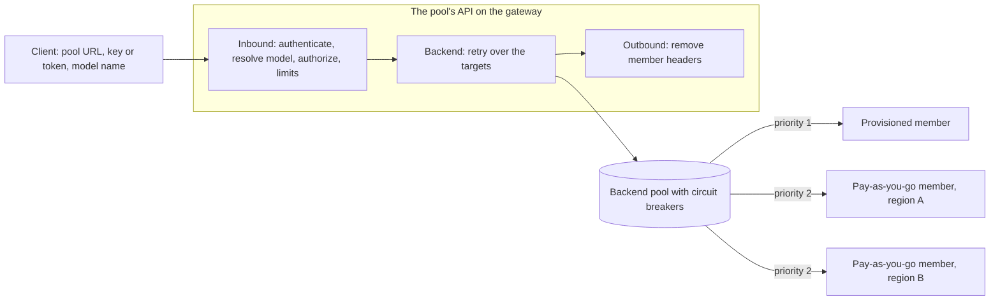

# ADR 0024: Serve each model from a pool of deployments behind one governed endpoint

**Status:** Proposed

Phase 1 is implemented: administrators create, publish, unpublish, and recover breaker, linear,
and preferential pools of Azure deployments reached with Microsoft Entra ID, and the console lists
and shows them. Callers reach a phase 1 pool only through its own subscription. Phases 2 to 5,
which add per-model access, keys per cost center, budgets and usage, members reached with a key,
health, and a router, aren't built yet. The [README](../../README.md#model-pools) describes what
is.

For pools only, this record amends [ADR 0011](0011-governed-model-access.md), as
[ADR 0022](0022-cost-centers.md) amended it: a person or application gets one key per pool and
cost center, rather than one key per grant.

In everything else, pools follow these records unless this one says otherwise:

- [ADR 0009](0009-entitlement-subjects-resources-and-apim-binding.md)
- [ADR 0010](0010-publishing-models-into-apim.md)
- [ADR 0012](0012-format-aware-model-publishing.md)
- [ADR 0013](0013-runtime-readiness-by-data-actions.md)
- [ADR 0014](0014-environments.md)
- [ADR 0015](0015-end-user-usage-report.md)
- [ADR 0016](0016-agent-identities-and-security-group-grants.md)
- [ADR 0018](0018-key-authenticated-backends.md) and [ADR 0021](0021-keys-mosaic-keeps.md)
- [ADR 0019](0019-usage-telemetry.md)
- [ADR 0020](0020-price-list.md)
- [ADR 0022](0022-cost-centers.md)
- [ADR 0023](0023-budgets-and-notifications.md)

**Revised 2026-10-01** after cost centers, budgets, measured usage, the price list, and
key-authenticated endpoints were merged. What changed in this record:

- Keys are per pool and cost center, and created on request, never by an apply.
- The pool policy selects a grant by cost center, checks budgets, and writes ADR 0019's traces.
- Cost center limits and pooled quotas can name a pool model.
- A pool's calls are priced per member, not per API.
- Endpoints reached with a key can be members, through ADR 0018's named values.
- Pools are unpublished through a reviewed plan.

## Context

ADR 0010 publishes one deployment, on one model endpoint, as one API Management API. That is the
only way MOSAIC exposes a model today. It falls short as soon as an organization runs the same
model in more than one place.

Take Claude Opus deployed on three Foundry accounts, in East US, North Central US, and West US:

- **Users see infrastructure.** Each deployment is its own publication, so the catalog lists
  three Opus entries with three URLs and three keys. A user picks a region they don't care about.
  To get any resilience, they ask for access three times.
- **Nothing balances or fails over.** When East US answers 429, the caller gets the 429. The
  other two deployments may be idle at the time.
- **Provisioned capacity can't come first.** A provisioned throughput (PTU) deployment is paid for
  whether it's used or not. It should take traffic first, with pay-as-you-go deployments taking
  the overflow.
  - MOSAIC doesn't record which deployments are provisioned.
  - Azure's own spillover (`spilloverDeploymentName`) overflows only to a standard deployment in
    the same account.
- **Access follows deployments, not models.** People ask for "Opus", not for "Opus in West US".
  Approving the same model three times is noise, and it multiplies keys.

API Management already has the runtime pieces
([API Management backends](https://learn.microsoft.com/azure/api-management/backends)):

- A backend of `type: Pool` spreads requests over up to 30 single backends. It balances them
  round-robin, by weight, or by priority.
- A single backend can carry a circuit breaker. It trips on chosen status codes, including 429.
- With `acceptRetryAfter`, a tripped breaker stays open for as long as the model service's
  `Retry-After` says.
- All of this is in the `2024-05-01` contract MOSAIC writes against.

These pieces have limits:

- A backend has at most one breaker rule.
- Breakers aren't available on the Consumption tier.
- Each gateway instance keeps its own breaker and balancing state. On a gateway with several
  units or regions, both are approximate.
- An open breaker makes API Management answer 503, and so does a pool with no available member.
  API Management doesn't then try another member by itself. A policy `<retry>` that forwards the
  buffered request again is what reaches a healthy member. Microsoft's
  [AI gateway lab](https://github.com/Azure-Samples/AI-Gateway/tree/main/labs/backend-pool-load-balancing)
  uses that pattern.

API Management's
[unified model API](https://learn.microsoft.com/azure/api-management/unified-model-api) goes
further:

- One OpenAI-compatible endpoint that translates requests to OpenAI or Anthropic backends.
- Model aliases.
- Failover across providers.

It's still in preview. Mixing vendors behind one model name isn't wanted yet.

## Decision

### What users and administrators see

| Term | Meaning | Seen by |
| --- | --- | --- |
| **Pool** | One API on one gateway that serves one vendor's models through one API shape. It has a name, such as "Anthropic", and takes its gateway's environment, such as Production. It has one base URL and one plan and apply lifecycle. | Administrators |
| **Pool model** | A model the pool offers, under the name clients send, such as `claude-opus-4-5`. People request it, are approved for it, and are limited on it. | Administrators; users see it as "Claude Opus 4.5", with its environment |
| **Member** | One deployment on one registered model endpoint that serves a pool model. | Administrators only |
| **Pool type** | How a pool model spreads requests over its members: breaker, preferential, or linear. | Administrators |
| **Capacity type** | Whether a deployment is provisioned (PTU), pay-as-you-go, or batch, read from its SKU. | Administrators; users see a badge if the pool shows it |

**A model pool isn't a pooled quota.** ADR 0022 gives a cost center a *pooled quota*: a monthly
limit that every grant under it on one model shares, and that its text and code call a pool. That
has nothing to do with this record.

- The code names this record's pools `ModelPool` and `model_pool`, never a bare `pool`.
- The console says **Pools** only for model pools. Cost center pages keep saying *pooled quota*.

**Users see models; administrators see pools.**

- The admin console gets a top-level **Pools** section, between Models and MCPs.
- The portal never shows the word "pool", nor a pool's endpoints, regions, or members.
- A user sees "Claude Opus 4.5" and "Claude Sonnet 4.5" as two models, each with the portal's
  environment badge, such as Production. They request each one, and are approved for each one,
  separately.
- The connection details of both show the same endpoint. Under one cost center, they also show
  the same key.

**A pool serves one vendor through one API shape, on one gateway.**

- Claude pools with Claude, never with GPT, Llama, or Grok.
- The vendor is the deployments' model format.
- Every member must be assessed (ADR 0012) to the pool's shape.

**A pool takes its gateway's environment.** It has no environment of its own, for the reasons
ADR 0014 gives for imported model APIs: a pool is served by exactly one gateway, and a second
label would drift. Its pool models, and the grants on them, take the same environment. Each
member's endpoint must be one the gateway may front; see *Environments* below.

**A pool is desired state, like a publication.** Saving one writes only to Cosmos. API Management
changes only through a reviewed plan and an explicit apply, on a gateway in `manage` mode
(ADR 0010).

**Publications stay.** A publication keeps exposing one deployment exactly as it does today. The
catalog lists models from both publications and pools. A publication isn't converted into a pool
in place, because that would change every caller's URL and key.

### Pool types

Each pool model has an ordered list of **targets**. A target is one API Management backend:
either a single member's backend, or a backend pool over several members.

A request goes to the first target. After a cascading failure, the policy sends it again:

- to the same target, if it's a backend pool. Its balancing skips any member whose breaker is
  open;
- otherwise, to the next target.

Administrators choose a type, and MOSAIC derives the targets from it.

| Type | Targets | Behavior |
| --- | --- | --- |
| **Breaker** | One backend pool over every member, all at the same priority, round-robin or weighted. Every member has a circuit breaker. | Requests spread across members. A member that answers 429 is taken out for its `Retry-After`, and the request is retried on another member. |
| **Preferential** | One backend pool with two priority groups: provisioned members at priority 1, pay-as-you-go members at priority 2. Every member has a circuit breaker. | Provisioned capacity takes all traffic while any provisioned member's breaker is closed. A provisioned member that answers 429 is skipped for its `Retry-After`, and the overflow spreads over the pay-as-you-go members. Traffic returns to provisioned capacity when the breaker closes. |
| **Linear** | One target per member, in the order the administrator sets. No circuit breakers. | Every request starts at the first member and moves down the list on each cascading failure. Nothing is taken out, so the next request starts at the top again. |

**Breaker and preferential pools use API Management's own balancing, priority groups, and
breakers.** Priority groups are API Management's documented way to prefer some backends and fall
back to others.

**Linear pools need the policy to choose each attempt's member.** A native pool moves to a lower
priority only when every higher-priority member's breaker is open. It can't express "always start
at the top" without taking members out of rotation.

Choosing the member per attempt has a second benefit. The policy can rewrite the model name for
that member, so linear members can use different deployment names. Later, the same mechanism
carries different Bedrock model IDs.

**429 is a trip condition, and retries are immediate.** Circuit breaker rules match any status
range, including 429. MOSAIC offers two breaker presets:

- **Throttling** (default): trip on one 429. Stay open for the response's `Retry-After`, or for
  10 seconds when it sends none.
- **Throttling and errors**: trip on three 429 or 5xx responses within a minute. Stay open for
  the `Retry-After`, or for 30 seconds.

These numbers are starting points. Load testing tunes them before phase 1 ships.

A cascading failure is a 429 or a 503 by default, and the errors preset adds 500, 502, and 504.
503 is included for two reasons:

- API Management answers 503 for an open breaker or an exhausted pool.
- Model services answer 503 when they're overloaded.

Retries follow these rules:

- **They happen immediately** (`interval="0"`, `first-fast-retry="true"`). Waiting out
  `Retry-After` is the breaker's job, not the caller's.
- **They forward with `buffer-request-body="true"`**, so the body can be sent again.
- **They use `buffer-response="false"`**, so streamed responses aren't held back. A retry is
  decided on the status code, before any of the response reaches the caller.
- **They're capped.**
  - By default, a breaker or preferential pool retries up to three times.
  - By default, a linear pool tries each member once.
  - No request makes more than 10 attempts, so a linear pool model has at most 10 members.
- **They don't multiply limits.** Call and token limits count the caller's request once. A
  throttled attempt consumes no tokens.

When every attempt fails, the caller gets the last status, and a 429 keeps its `Retry-After`. The
response body is generic and names no member.

**Azure's own spillover is shown, not fought.** A provisioned deployment with
`spilloverDeploymentName` set overflows to a standard deployment in the same account. That happens
before the gateway sees a 429, so a pool's overflow starts only after Azure's spillover has also
failed.

- Inventory reads the property, and the console shows it on the member.
- The console explains the interaction. An administrator who wants the pool to decide where
  overflow goes turns Azure's spillover off.

A client can also ask for spillover on a single request, with an `x-ms-spillover-deployment`
header. The header names a standard deployment in the same account, possibly one the
administrator never put behind the API.

- Pools remove that header.
- Publications don't remove it today. That's a follow-up.

### Capacity type and processing scope

Inventory already records each deployment's SKU (`ObservedModelDeployment.sku_name`). Two
attributes are derived from it:

| SKU | Capacity type | Processing scope |
| --- | --- | --- |
| `Standard` | Pay-as-you-go | Regional |
| `GlobalStandard` | Pay-as-you-go | Global |
| `DataZoneStandard` | Pay-as-you-go | Data zone |
| `ProvisionedManaged` | Provisioned | Regional |
| `GlobalProvisionedManaged` | Provisioned | Global |
| `DataZoneProvisionedManaged` | Provisioned | Data zone |
| `GlobalBatch` | Batch | Global |
| `DataZoneBatch` | Batch | Data zone |
| Anything else | Unknown | Unknown |

- **Where administrators see them.** The Models page shows both attributes on every deployment,
  and a pool shows them on every member.
- **Batch deployments can't be members**, because they don't answer synchronous calls.
- **Preferential placement.** A preferential pool places members by capacity type. A member whose
  capacity type is unknown can't join the provisioned group.
- **Mixed geographies.** Members of one pool model with different processing scopes raise a plan
  warning, because requests may be processed in different geographies.
- **What users see.** When the pool shows capacity, each of its pool models carries one of these
  badges:
  - "Provisioned"
  - "Pay-as-you-go"
  - "Provisioned, with pay-as-you-go overflow"

  Pools show the badge by default, and an administrator can hide it.

### Members, and what a pool refuses

- **Same model.** Every member of a pool model has the same model name and format. A version
  mismatch is a warning the administrator must acknowledge.
- **Deployment names, for body-routed shapes.** The Foundry Models and Anthropic Messages shapes
  name the deployment in the request body.
  - API Management picks a pool member only after the body is final, so members that share a
    backend pool must share a deployment name.
  - A member that is a target on its own can use a different name, because the policy rewrites
    the name for its attempt.
- **Deployment names, for the Azure OpenAI shape.** This shape names the deployment in the route
  instead.
  - Each member backend's URL ends in its own `/openai/deployments/{deployment}`.
  - The pool rewrites the route to the part after that.
  - So these members' deployment names may differ anywhere.
  - This depends on a behavior listed under *Verify on a real gateway*. If it doesn't hold,
    the rule for body-routed shapes applies to this shape too.
- **Public model name.** When the members share a deployment name, the public name defaults to
  it. Otherwise, or to set an alias, the administrator chooses it. Clients send this name, so it
  can't change once it's published. A rename is a new pool model, and grants don't move to it.
- **Readiness.** ADR 0013's verdict is shown for each member. *Cannot invoke* blocks apply. *Not
  confirmed* is a warning.
- **Authentication.** Members that share a backend pool must authenticate the same way, because
  the policy doesn't know which of them API Management will pick.
  - Until phase 3, every member is an Azure deployment on an endpoint registered by resource ID.
    The gateway reaches it with its managed identity, as it reaches a publication's.
  - From phase 3, a member on an endpoint reached with a key (ADR 0018, ADR 0021) is a target on
    its own, and the policy sets that member's key for its attempt. See *Members reached with a
    key*.
- **Live deployment.** A member's deployment must appear in the endpoint's latest inventory, and
  its provisioning must have succeeded.
- **Environment.** The gateway's environment must permit the member's endpoint. See
  *Environments* below.
- **Size.** A backend pool holds at most 30 members, which is API Management's limit.
- **Draining.** A drained member stays in the pool's definition, and leaves routing at the next
  apply.
- **Stateless operations only.** A pool model gets the operations its capability supports within
  its shape (ADR 0012), except stateful ones.
  - The Responses API is excluded. A stored response lives in one account, so a call that
    continues or retrieves it could land on a member that doesn't have it.
  - Governed access then narrows the operations exactly as ADR 0011 and ADR 0012 narrow a
    publication's. For Anthropic, that leaves `messages`.
- **Gateway tier.**
  - Breaker and preferential pools need circuit breakers, so a Consumption-tier gateway offers
    linear pools only.
  - On classic tiers, an Anthropic pool can't be token-limited, as ADR 0012 already says.
- **Shared deployments.** A deployment can be a member of several pools. Its capacity is then
  shared, and the plan warns about it. Each pool has its own member backends, so their breakers
  are independent.
- **Ownership guards.**
  - An endpoint can't be removed while a pool may own gateway state for one of its deployments.
    The same rule already applies to publications.
  - A pool model with applied grants can't be removed until those grants are revoked, and the
    revocation is applied.
- **Import.** A pool's API isn't offered for import as a model API. Access to a pool is granted
  per pool model, never to its API as a whole.

### Environments

A publication pairs its gateway with one endpoint. A pool pairs its gateway with every member's
endpoint, so ADR 0014's rules apply to each of those pairings:

- **Every member is judged.** `permits()` judges the gateway against each member's endpoint.
  - A *blocked* member is refused at plan time, and apply re-checks it under the pool's lock.
  - A *warning* is listed in the plan.
  - A drained member isn't judged, because it isn't written.
- **Plans pin every verdict.** A pool's plan digest includes the compatibility fingerprint of
  each member it writes. Apply rejects the plan if any of them has changed.
- **No change may leave an applied member blocked.** ADR 0014 refuses a re-classification or rule
  change that would leave an applied publication blocked. It also refuses one that would block a
  member whose backend a pool may own, and names the pool and the member.
  - Members that haven't been applied may be left behind. They fail at plan time.
  - To move an applied member's endpoint to an environment the gateway can't front, drain the
    member and apply first.
- **Locks.** Pool locks sit beside publication locks, last in ADR 0014's order.
  - Creating a pool, or adding a member, holds the tenant `environments` scope, the gateway's
    scope, and each new member's `endpoint:{id}` scope, as creating a publication does.
  - A re-classification locks every pool it could newly block.
- **Grants and requests.** Grants on a pool model take the gateway's environment.
  - ADR 0014's acknowledgement for grants that move into or out of a production-class
    environment covers them.
  - An access request records the environment.
  - Portal requests accept a pool model only if the caller's catalog shows it.
- **One environment per pool.** A pool doesn't relate the same model across environments. A
  Production pool and a Test pool of one model are two pools, on two gateways. Relating them is
  left to environment chains, which ADR 0014 defers.

### What a pool writes to API Management

A pool owns these resources:

- **Member backends.** One single backend for each member. In breaker and preferential pools, each
  one has a circuit breaker.
- **Backend pools.** One for each target that balances several members.
- **Named values for key members** (from phase 3). One Key Vault-backed secret named value for each
  member reached with a key, `<member backend>-key`, as ADR 0018 gives each publication.
- **`mosaic-*` policy fragments**, one for each section of the policy:
  - Inbound: authentication, model resolution, authorization, limits, request hygiene, and the
    target list.
  - Backend: the retry and forward.
  - Outbound: response hygiene.

  API Management might not accept `forward-request` in a fragment. If so, MOSAIC renders the
  backend section into the API policy instead. MOSAIC owns a pool's API outright, so the policy
  ownership boundary in [ADR 0004](0004-gateway-onboarding-and-policy-abstraction.md) still holds.
- **The API, its curated operations, and the API policy.**
- **A product, the product/API link, and the bootstrap subscription.**
- **The keys people asked for.** Each is an API-scoped subscription on the pool's API. A plan never
  creates one; see *Access*.

As ADR 0010 requires, everything is created after what it names:

1. For a governed pool, ADR 0023's `mosaic-blocked-cost-centers` named value: *create* when the
   gateway lacks it, *no change* when it has it. It's the gateway's, not the pool's, so unpublish,
   rollback, and recovery never delete it.
2. Key members' named values. Each is read back after it's written, and the step fails if API
   Management couldn't read the secret, as ADR 0018 requires.
3. Member backends
4. Backend pools
5. Fragments
6. The API
7. Operations
8. The API policy
9. The product
10. The product/API link
11. The bootstrap subscription
12. Suspending, activating, and deleting existing keys, in ADR 0011's order

Deletes run after every create and update, in reverse. Removing a member updates its backend pool
first, and only then deletes the member's backend. A key member's named value is deleted last,
after the fragment that names it.

Plans, runs, ownership, rollback, and recovery follow ADR 0010 and ADR 0011, unchanged. A plan
resolves anything derived from observed state that shapes a written resource, so apply writes what
was reviewed. For example, a member's priority comes from its capacity type.

The policy resolves the requested model from the body's `model`. For the Azure OpenAI shape, it
resolves the model from the route instead.

On the way in, after authorization, the policy removes what a caller sent that could authenticate
to or steer the backend:

- the caller's key, token, and `x-mosaic-cost-center` header, as the governed policy already does
  (ADR 0011, ADR 0022)
- `x-api-key`, as ADR 0012 already does
- `x-ms-spillover-deployment`

On the way out, it removes headers that identify a member:

- Region and deployment headers, such as `x-ms-region` and `x-ms-deployment-name`
- Spillover headers, such as `x-ms-spillover-from-deployment` and `x-ms-spillover-error`
- The member's own rate-limit headers, such as `x-ratelimit-*` and `anthropic-ratelimit-*`. They
  describe one member, not the pool.

`Retry-After` and `retry-after-ms` are kept.

Token metrics carry Pool and Model dimensions, instead of Publication and Deployment.

### Unpublishing a pool

A pool is unpublished the way ADR 0010's 2026-09-30 amendment unpublishes a publication:

- **It has a plan.** `POST /api/v1/model-pools/{id}/unpublish-plan` returns a delete step for every
  resource the pool created, in the order unpublish removes them, and the access the gateway
  applied last. The review lists who loses access, model by model.
- **It runs only that plan.** `POST /api/v1/model-pools/{id}/unpublish` requires the plan. Without
  one it refuses with `409` and `planRequired`; with one whose digest no longer matches, `409` and
  `stalePlan`.
- **An unpublished pool says so.** It records `unpublishedAt`, and the console shows it as
  **Unpublished**. The next successful apply clears it.
- **Its models leave the catalog.** As ADR 0009 now requires, the catalog lists a pool model only
  while its pool holds its API in API Management. A request for one refuses with `409` and
  `notPublished`, and so do its grants' connection and key routes.

### Records

- **`ModelPool`** is a desired-state entity, alongside `Publication`. It holds:
  - the gateway, name, summary, visibility, vendor, API shape, and pool type;
  - resilience settings: the breaker preset, the cascade statuses, and retries;
  - whether users see capacity;
  - API and resource names;
  - the pool model safeguard;
  - its models;
  - the same plan, run, resource-ownership, access-state, and `unpublishedAt` fields a
    publication has.

  Its ID is deterministic on the gateway and API name. It stores no environment; plans read the
  gateway's and each endpoint's.
- **`PoolModel`** holds its public name, display name, model name and format, expected version,
  whether the catalog shows it, and its members. Its ID is deterministic on the pool and the
  public name.
- **`PoolMember`** holds:
  - the endpoint and deployment (from phase 3, a Bedrock endpoint and model ID instead);
  - its order, weight, and whether it's drained;
  - a deterministic backend name.

  Region, capacity type, and processing scope aren't stored as intent. The plan reads them from
  inventory.
- **`ObservedModelDeployment`** carries the derived capacity type and processing scope, and the
  deployment's `spilloverDeploymentName`. The two derived attributes are worked out whenever a
  deployment is read, so they're right even for a deployment synced before they existed. Azure
  spillover appears at the endpoint's next sync.

### Access: granted per model and cost center, with one key per pool and cost center

- **Entitlements name a pool model.** A new resource kind, `poolModel`, carries the pool model's
  ID, with the pool's ID as its scope.
  - ADR 0009's rules are unchanged, and ADR 0022's cost center is part of the grant's identity.
    The same model under two cost centers is two grants, each with its own limits, counters, and
    usage.
  - Approving a request creates the requester's direct grant under the request's cost center.
    Approval is refused if they already hold one for that model under that cost center.
  - A grant takes effect at the pool's next apply.
  - Security-group grants on a pool model work as they do on a publication (ADR 0016). They're
    token-only, so they have no key, and their limits count per member. MOSAIC-local groups stay
    informational.
  - Precedence and the overlap report work per pool model and cost center, as ADR 0022 says.
- **One key per subject, pool, and cost center.** A pool accepts keys, Entra tokens, both, or
  neither, as ADR 0011 allows a governed publication to.
  - A key is an API-scoped subscription on the pool's API. Its name is deterministic on the
    tenant, subject, pool, and cost center, and its display name ends with the cost center's code.
  - It serves every model the subject holds directly in the pool under that cost center. A person
    who holds Opus and Sonnet under one cost center has one key for both.
  - **It's created on request, never by an apply**, as ADR 0022 requires. A person creates,
    rotates, or deletes it from any of their applied direct grants in the pool. An administrator
    does the same for any direct grant, such as an application's or an agent's. The policy already
    recognizes the name, so nothing is applied again.
  - **An apply suspends, activates, and deletes.** It suspends the pool's existing keys while it
    replaces the policy. It activates a key again when at least one of the key's grants is enabled
    and applied, the pool accepts keys, and the cost center allows them. It deletes a key once
    every grant the key served has been revoked by ADR 0022's recheck, or removed.
  - **Each change holds the pool's lock.** It's audited as
    `credential.{created|rotated|deleted}.{requested|succeeded|denied|failed}`, naming the pool
    and the cost center.
  - **The key is shared.** Rotating or deleting it from one model's grant changes it for every
    model it serves. The portal names those models, and asks before it deletes a key that other
    models still use.
  - **It's only a bearer credential.** The policy accepts it only for a model the subject holds an
    enabled grant for, under the key's cost center.

  For pools only, this replaces ADR 0011's one subscription per grant.
- **Authorization is caller, cost center, then model.** The pool's policy reuses the governed
  policy's steps, and resolves the model before it chooses a grant:
  1. Authenticate the caller. A key maps through its subscription to a subject and a cost center.
     A token gives the caller's `oid` and, for security-group grants, its `groups` claim. If both
     are sent, both must be valid and name the same subject, as ADR 0011 requires.
  2. Read `x-mosaic-cost-center` once, by ADR 0022's rules.
  3. Resolve the model.
  4. Choose the caller's grant for that model, in ADR 0022's order:
     - With the header, only grants under that cost center are considered.
     - Without it, the direct grant under the caller's default cost center comes first, then
       their other direct grants, oldest first, then security-group grants by ADR 0016's
       precedence.
     - A key considers only its own cost center.

     The policy then sets `mosaic-cost-center` and `mosaic-cost-center-id`.
  5. Check the cost center's budget (ADR 0023).
  6. Guard the operation, write the attribution trace, and count limits.
  7. Remove the caller's credentials and the header, and route the request.

  Refusals use ADR 0019's denial reasons, so Analytics shows them as it shows a publication's:
  - An unknown model and a model the caller holds no grant for get the same 403. A key doesn't
    reveal what else the pool serves. The trace tells administrators which it was: `model` or
    `no-grant`.
  - A cost center is judged only for a model the caller holds. A header naming a cost center the
    caller holds no grant for that model under gets `cost-center`. A key sent with a header naming
    another cost center gets `cost-center-mismatch`.
  - A blocked cost center gets `budget`, and a damaged block list gets `budget-list`.
- **Limits stay per grant, and a cost center can limit a pool model.**
  - Each grant counts on its own counter, identified from the tenant, pool, and grant, as ADR 0011
    requires. A security-group grant counts per member, as ADR 0016 requires. A person who holds
    Opus and Sonnet has two limits behind one key.
  - A grant that sets no limits takes its cost center's per-person defaults for the pool model, as
    ADR 0022 does for a model API. So cost center limits accept `poolModel` resources.
  - A cost center's pooled quota on a pool model is counted per cost center and pool model. Every
    grant under the cost center on that model draws on it.
  - The pool model's safeguard counts last.
  - Responses carry ADR 0022's remaining-quota headers.
- **Revocation is per model.** Revoking the Opus grant ends Opus at the next apply, and the key
  keeps working for Sonnet.
  - ADR 0022's recheck revokes pool model grants as it revokes others. Revoking one needs its
    pool's lock, as revoking a publication's grant needs the publication's lock.
  - Until a recheck finishes, a pool's plans leave out the grants it covers, with a warning that
    says why.
- **The portal stays model-first.**
  - A new catalog entry kind, `poolModel`, carries the model's display name, the gateway's
    environment, the API style, and the capacity badge. The portal shows the environment with
    the badge it already uses.
  - A grant or access request for a pool model is named by the model's display name, through
    ADR 0009's `resourceDisplayName`. A request names a cost center, as ADR 0022 requires.
  - The existing `/api/v1/me/entitlements/{id}/connection` and `/api/v1/me/entitlements/{id}/keys`
    routes serve pool model grants too.
  - The connection gives the pool's base URL, the model name to send, and code samples. When the
    person holds the model under more than one cost center, it shows the cost center header too.
  - The key panel says which models share the key.
- **Usage is attributed by grant, through the trace.** ADR 0019 reads usage from the gateway's
  logs, and every governed call carries `mosaic-attribution v=1 g=<grant key>`.
  - A pool model grant's key is its counter identity. Its binding records that as its attribution
    key, so the rollup links a pool's calls to grants as it links a publication's.
  - The pool's API is one MOSAIC governs, so the rollup sets its diagnostic and turns on LLM logs,
    as it does for a publication's API.
  - The pool's rolled-up API, and its grants' attribution records, are of a new `pool` kind.
  - The usage report keeps one row per grant. A person who holds Opus and Sonnet in one pool sees
    two rows.
- **Calls are priced per member.** ADR 0020 prices an API's calls at the one deployment it
  fronts. A pool's API fronts many, so the rollup prices each call at the member that served it.
  - It identifies the member from the backend's host in `ApiManagementGatewayLogs` and the
    deployment name in `ApiManagementGatewayLlmLog`. It maps them to a deployment through the
    pool's members, which it remembers as it remembers APIs.
  - Provisioned members' reservations are shared by token share, as ADR 0020 shares a
    publication's.
  - A call MOSAIC can't map to a member stays unpriced. Reports count it with the calls they leave
    out, never as $0.
  - A cost center's spend, and the budgets that compare it, include its grants' pool calls.
- **Before phase 2**, a pool is reachable only through its bootstrap subscription, like a
  publication without governed access. As ADR 0010 says, the operator retrieves that key from
  Azure. The pool isn't in the portal catalog, and its calls aren't rolled up. Phase 2 opts pools
  into governed access the same way ADR 0011 opted publications in, which suspends the bootstrap
  subscription.

### Administrator console

- **Pools list.** For each pool:
  - name and environment, vendor and API style, and type;
  - how many models and members it has;
  - its mix of provisioned and pay-as-you-go capacity;
  - status and readiness;
  - from phase 2, its grants.
- **Pool detail.**
  - The base URL, and Plan, Apply, and Unpublish.
  - Each model, with a diagram of its targets and a table of its members.
  - For each member: order or priority, endpoint, region, deployment, capacity type and size,
    processing scope, version, readiness, Azure spillover, and a drain toggle.
  - Resilience and access settings, and run history.
- **Create wizard.**
  1. Basics: gateway, vendor and API style, name, path, and visibility. The gateway's environment
     is shown, and becomes the pool's.
  2. Type: three cards, each with a small diagram. A type the gateway can't run is shown with the
     reason.
  3. Models: members are preselected from every endpoint that deploys the model and that the
     gateway may front. Endpoints the gateway can't front are listed with ADR 0014's reason.
     Warnings are shown.
  4. Order and weights. Suggested weights come from each deployment's capacity.
  5. Resilience preset.
  6. Limits and access.
  7. The reviewed plan.
- **Models page.**
  - Capacity type and processing scope on every deployment, and which pools use it.
  - A warning when users would see one model twice on one gateway:
    - a deployment that is published on its own and is in a pool the catalog shows;
    - two pools the catalog shows that offer the same public model name.
  - A *Suggested pools* callout, when the same model is deployed on two or more endpoints that can
    reach the same gateway, and that the gateway may front.
- **Endpoint detail.** A "Used by pools" list.
- **Entitlements and access requests** (from phase 2). Pool models appear by display name, with
  their environment and cost center, like any other resource. A direct grant's key actions say
  which other models share the key.
- **Cost centers** (from phase 2). Per-person defaults and pooled quotas can name a pool model.
- **Analytics** (from phase 2). A pool's API appears as any API does, its grants as any grants
  do, and its members as the deployments its calls were priced at.
- **Dashboard.** A pools tile that lists degraded members, such as *cannot invoke* or a missing
  deployment.

### Members reached with a key (phase 3)

Phase 1 members are reached with the gateway's managed identity. Phase 3 adds members that are
reached with a key, in two steps.

**Azure endpoints registered with a key.** ADR 0018 and ADR 0021 already publish a deployment on
such an endpoint. For a publication, API Management reads the key through a Key Vault-backed named
value, which the publication owns and the policy sets after authorization. Pools reuse that
mechanism, unchanged, for each such member:

- The pool owns one named value per key member, `<member backend>-key`, created as a plan step,
  read back, and deleted last. Errors that name the secret are redacted.
- A deployment declared on such an endpoint has no SKU. Its capacity type comes from the pricing
  facts the administrator sets for it (ADR 0020), so it can still be placed in a preferential
  pool.
- A key member is a target on its own, and its attempt sets its key after removing every caller
  credential, as ADR 0018 requires.

**AWS Bedrock.** Amazon Bedrock serves Claude through the Anthropic Messages API
([Amazon Bedrock documentation](https://docs.aws.amazon.com/bedrock/latest/userguide/inference-messages-api.html)):

- The route is `https://bedrock-runtime.{region}.amazonaws.com/anthropic/v1/messages`. The
  `bedrock-mantle` endpoint serves the same API.
- A Bedrock API key goes in `x-api-key`, with an `anthropic-version` header.
- The request's `model` is a Bedrock model ID or inference profile, such as
  `us.anthropic.claude-sonnet-5`, not an Azure deployment name.

So a Claude pool can take Bedrock members, like this:

- **Bedrock endpoints.** MOSAIC can't discover AWS.
  [ADR 0006](0006-model-endpoint-onboarding.md) already registers endpoints by URL, with a Key
  Vault secret URI, for the `openAiCompatible` provider. Phase 3 adds an `awsBedrock` provider on
  the same path. The administrator supplies:
  - the region;
  - the base URL;
  - the model IDs it serves, and their capacity type.

  Readiness is always *not confirmed*, because MOSAIC can't read AWS IAM.
- **The key stays in Key Vault**, behind a named value the pool owns, exactly as for an Azure key
  member. The gateway's system-assigned identity needs Key Vault Secrets User on the vault.
  MOSAIC never reads the key.
- **Routing.** A Bedrock member is always a target on its own, because its model ID and
  authentication differ from Azure members'.
  - The inbound policy acquires the gateway's managed identity token once, into a variable.
  - Each attempt sets its member's authentication: that token for a managed-identity target, or
    the member's named value in its key header for a key member.
  - Each attempt also sets its member's model name.
  - In breaker and preferential pools, targets reached with a key follow the managed-identity
    targets. In a linear pool, they can go anywhere.
  - A target after a backend pool is tried once that pool has no member left.
- **Disclosure.** The plan warns that prompts may be processed outside Azure.
- **Pricing.** A Bedrock member is priced as any other provider's deployment is, by a price an
  administrator adds (ADR 0020). Until then its calls stay unpriced.

If backend credentials prove to work (see *Verify on a real gateway*), key members can share
a backend pool with each other, each carrying its own key on its backend. That doesn't put the
key anywhere new: ADR 0018 already notes that anyone who can edit policies can read any named
value. The pool would still own those backends, so no other API routes to them.

Still open for phase 3:

- Which kind of Bedrock key is supplied, and how it's rotated.
- Streaming and feature parity between Bedrock and Foundry.
- Token metering of Bedrock responses on v2 tiers.
- Whether users must be told a model can be served outside Azure.

### Phases

1. **Pools on Azure members reached with the gateway's identity:**
   - capacity type and processing scope (already implemented);
   - the pool definition and the three pool types;
   - environment checks on every member;
   - plan, apply, and the reviewed unpublish;
   - the admin console.

   A pool is reachable only through its bootstrap subscription.
2. **Per-model access, cost, and budgets:**
   - `poolModel` entitlements and access requests, under a cost center;
   - one key per subject, pool, and cost center, created on request;
   - cost center limits and pooled quotas on pool models, and rechecks that cover pool grants;
   - the budget check and ADR 0019's traces in the pool's policy;
   - the model-first portal and the entitlements picker;
   - pool calls in the rollup, attributed by grant and priced per member, so Analytics, the usage
     report, and budgets include them.
3. **Members reached with a key:** first Azure endpoints registered with a key, then AWS Bedrock.
4. **Health and analytics:**
   - a per-attempt metric that names the member;
   - a pool health view: throttle rate, breaker trips, and overflow share;
   - dashboard health;
   - drift, shown on re-plan;
   - a helper that creates a pool from existing publications.
5. **Later:** a model router pool type, on API Management's unified model API, once that's
   generally available.

### Verify on a real gateway

These behaviors decide details above. Each must be confirmed on a real gateway before the phase
that depends on it ships.

Phase 1:

- `retry` and `forward-request` inside a policy fragment.
- Whether a single backend with an open breaker answers 503 without calling the backend.
- How an exhausted backend pool's 503 can be told apart from a member's 503.
- Whether `retry` sees connection failures and timeouts, or only responses.
- `set-body` and `set-header` for each attempt, inside `retry` in the backend section.
- `rewrite-uri` with deployment-path backend URLs for the Azure OpenAI shape, including the query
  string.
- Streaming through `retry` with `buffer-response="false"`.
- Whether API Management refuses to delete a backend that a pool still references.
- Whether `credentials.managedIdentity` on a member backend could replace the policy's
  authentication. The `2024-05-01` contract accepts it, but its published specification omits it.

Phase 2:

- Policy size with many subjects, models, and cost centers, against API Management's limit.
- Whether `ApiManagementGatewayLogs.BackendUrl` names the member that served the final attempt
  when the backend is a pool. If it doesn't, the outbound policy traces the member's host itself.
- What `ApiManagementGatewayLlmLog`'s `ModelName` and `DeploymentName` carry when the policy
  rewrites the model for a member.
- That a call through two `llm-token-limit` policies, the grant's and the cost center's pooled
  quota on a pool model, counts against both. ADR 0022 lists the same check for publications.

Phase 3:

- `credentials.header` naming a Key Vault-backed named value, for key members. If it and
  `credentials.managedIdentity` both work, members that authenticate differently could share one
  backend pool.
- Whether an endpoint that gets both a bearer token and a key refuses the call. If it does, the
  policy must never send both.

## Alternatives considered

- **Build on the unified model API.** It's in preview, and mixing vendors isn't wanted yet. It's
  the likely basis of a later model router pool type.
- **Native backend pools only.** They can't express a linear order without taking members out.
  They also can't route to members with different deployment names, or to Bedrock.
- **Policy-only routing for every type.** It gives up API Management's own balancing and breakers,
  and puts more logic into every request.
- **One grant per pool, with a list of allowed models.** Users ask for models, and each model
  needs its own approval and limits.
- **One subscription per model grant.** Keys are now created only on request, so this would mint
  fewer keys than it once would have. But a person who uses Opus and Sonnet through one endpoint
  would still switch keys to switch models.
- **One key per subject and pool, across cost centers.** A key charges its own grant's cost
  center (ADR 0022). A key spanning cost centers would need the header on every call, and one cost
  center's keys switch couldn't turn it off.
- **A `ModelApi` record per pool model.** A `ModelApi` stands for one API Management API, and
  every pool model shares one API.
- **Fold publications into pools.** Every existing caller's URL and key would change.
- **One member backend per endpoint, shared by its models.** A 429 from one deployment would take
  every model on that endpoint out of rotation.
- **Member backends shared across pools, so a deployment's breaker state is shared.** Ownership,
  plans, and rollback would then span pools. Instead, each pool owns its own member backends.
- **A label or environment of the pool's own.** A pool is served by exactly one gateway, so its
  own label would drift from the gateway's environment. ADR 0014 rejects a second label on
  imported model APIs for the same reason.

## Consequences

- People request, and are approved for, models, not deployments or regions. Every model they hold
  in a pool uses one endpoint. Every direct grant among them under one cost center uses one key.
- Administrators can spread a model over deployments in several regions, fail over on throttling,
  and put provisioned capacity first, without writing policy.
- Resilience costs latency:
  - Each cascading failure adds another round trip.
  - In a linear pool, a saturated first member adds one to every request.
- Balancing and breakers are approximate on gateways with several units or regions, because each
  gateway instance keeps its own state.
- Balancing Foundry Models or Anthropic Messages deployments requires them to share a deployment
  name. Some may have to be redeployed under a new name.
- Stateful APIs, including the Responses API, can't be pooled.
- A pool writes more API Management resources than a publication: a backend for each member and
  for each backend pool, and more policy. The plan lists all of them.
- For pools, ADR 0011's one key per grant becomes one key per subject, pool, and cost center.
  Rotating or deleting it affects every model the subject holds in that pool under that cost
  center.
- A capacity badge tells users something about the organization's capacity purchases. Pools show
  it by default, and an administrator can hide it.
- A pool is in its gateway's environment. Serving a model in two environments takes two pools, on
  two gateways.
- An endpoint can't be re-classified into an environment its gateway can't front while an applied
  pool member uses it. Draining the member and applying frees the endpoint.
- Pricing a pool's calls depends on the gateway's logs naming the member that served each call.
  Calls MOSAIC can't map stay unpriced, so a cost center's spend, and the budget that compares it,
  can run low until they're mapped. Reports say how many calls they left out.
- "Pool" now means two things in MOSAIC: a model pool, and a cost center's pooled quota. The code
  and the console keep the names apart.

Known limitations:

- **Breaker state is per pool, not per deployment.** Two pools that share a deployment don't
  share trips.
- **One vendor per pool.** GPT deployments on Azure OpenAI accounts and on AI Services accounts
  can't share a pool yet, because ADR 0012 gives them different shapes. Letting a pool use the
  Azure OpenAI shape for AI Services members is a follow-up.
- **No region-aware routing** on gateways deployed to several regions.
- **A caller in more than 200 groups needs a direct grant**, because the token then carries no
  `groups` claim (ADR 0016).
- **The `x-ms-spillover-deployment` gap is closed for pools only.** It's still open for
  publications.
- **Members reached with a key aren't balanced** unless backend credentials prove to work. Until
  then each is a target on its own, tried in order after the balanced targets.
