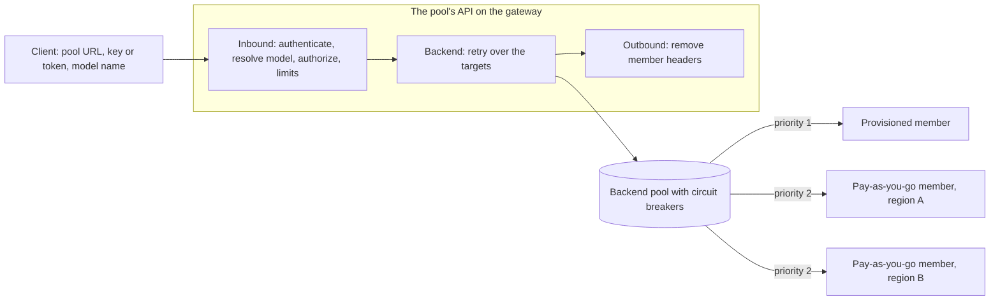

# ADR 0024: Serve each model from a pool of deployments behind one governed endpoint

**Status:** Proposed

Only one piece of phase 1 is implemented. Inventory reads each deployment's capacity type,
processing scope, and Azure spillover, and the Models page shows them. Nothing else in this record
is built yet.

For pools only, this record amends [ADR 0011](0011-governed-model-access.md): each person or
application gets one key per pool, rather than one key per grant.

In everything else, pools follow these records unless this one says otherwise:

- [ADR 0009](0009-entitlement-subjects-resources-and-apim-binding.md)
- [ADR 0010](0010-publishing-models-into-apim.md)
- [ADR 0012](0012-format-aware-model-publishing.md)
- [ADR 0013](0013-runtime-readiness-by-data-actions.md)
- [ADR 0014](0014-environments.md)
- [ADR 0015](0015-end-user-usage-report.md)
- [ADR 0016](0016-agent-identities-and-security-group-grants.md)

## Context

ADR 0010 publishes one deployment, on one model endpoint, as one API Management API. That is the
only way MOSAIC exposes a model today. It falls short as soon as an organization runs the same
model in more than one place.

Take Claude Opus deployed on three Foundry accounts, in East US, North Central US, and West US:

- **Users see infrastructure.** Each deployment is its own publication, so the catalog lists
  three Opus entries with three URLs and three keys. A user picks a region they don't care about.
  To get any resilience, they ask for access three times.
- **Nothing balances or fails over.** When East US answers 429, the caller gets the 429. The
  other two deployments may be idle at the time.
- **Provisioned capacity can't come first.** A provisioned throughput (PTU) deployment is paid for
  whether it's used or not. It should take traffic first, with pay-as-you-go deployments taking
  the overflow.
  - MOSAIC doesn't record which deployments are provisioned.
  - Azure's own spillover (`spilloverDeploymentName`) overflows only to a standard deployment in
    the same account.
- **Access follows deployments, not models.** People ask for "Opus", not for "Opus in West US".
  Approving the same model three times is noise, and it multiplies keys.

API Management already has the runtime pieces
([API Management backends](https://learn.microsoft.com/azure/api-management/backends)):

- A backend of `type: Pool` spreads requests over up to 30 single backends. It balances them
  round-robin, by weight, or by priority.
- A single backend can carry a circuit breaker. It trips on chosen status codes, including 429.
- With `acceptRetryAfter`, a tripped breaker stays open for as long as the model service's
  `Retry-After` says.
- All of this is in the `2024-05-01` contract MOSAIC writes against.

These pieces have limits:

- A backend has at most one breaker rule.
- Breakers aren't available on the Consumption tier.
- Each gateway instance keeps its own breaker and balancing state. On a gateway with several
  units or regions, both are approximate.
- An open breaker makes API Management answer 503, and so does a pool with no available member.
  API Management doesn't then try another member by itself. A policy `<retry>` that forwards the
  buffered request again is what reaches a healthy member. Microsoft's
  [AI gateway lab](https://github.com/Azure-Samples/AI-Gateway/tree/main/labs/backend-pool-load-balancing)
  uses that pattern.

API Management's
[unified model API](https://learn.microsoft.com/azure/api-management/unified-model-api) goes
further:

- One OpenAI-compatible endpoint that translates requests to OpenAI or Anthropic backends.
- Model aliases.
- Failover across providers.

It's still in preview. Mixing vendors behind one model name isn't wanted yet.

## Decision

### What users and administrators see

| Term | Meaning | Seen by |
| --- | --- | --- |
| **Pool** | One API on one gateway that serves one vendor's models through one API shape. It has a name, such as "Anthropic", and takes its gateway's environment, such as Production. It has one base URL and one plan and apply lifecycle. | Administrators |
| **Pool model** | A model the pool offers, under the name clients send, such as `claude-opus-4-5`. People request it, are approved for it, and are limited on it. | Administrators; users see it as "Claude Opus 4.5", with its environment |
| **Member** | One deployment on one registered model endpoint that serves a pool model. | Administrators only |
| **Pool type** | How a pool model spreads requests over its members: breaker, preferential, or linear. | Administrators |
| **Capacity type** | Whether a deployment is provisioned (PTU), pay-as-you-go, or batch, read from its SKU. | Administrators; users see a badge if the pool shows it |

**Users see models; administrators see pools.**

- The admin console gets a top-level **Pools** section, between Models and MCPs.
- The portal never shows the word "pool", nor a pool's endpoints, regions, or members.
- A user sees "Claude Opus 4.5" and "Claude Sonnet 4.5" as two models, each with the portal's
  environment badge, such as Production. They request each one, and are approved for each one,
  separately.
- The connection details of both show the same endpoint and the same key.

**A pool serves one vendor through one API shape, on one gateway.**

- Claude pools with Claude, never with GPT, Llama, or Grok.
- The vendor is the deployments' model format.
- Every member must be assessed (ADR 0012) to the pool's shape.

**A pool takes its gateway's environment.** It has no environment of its own, for the reasons
ADR 0014 gives for imported model APIs: a pool is served by exactly one gateway, and a second
label would drift. Its pool models, and the grants on them, take the same environment. Each
member's endpoint must be one the gateway may front; see *Environments* below.

**A pool is desired state, like a publication.** Saving one writes only to Cosmos. API Management
changes only through a reviewed plan and an explicit apply, on a gateway in `manage` mode
(ADR 0010).

**Publications stay.** A publication keeps exposing one deployment exactly as it does today. The
catalog lists models from both publications and pools. A publication isn't converted into a pool
in place, because that would change every caller's URL and key.

### Pool types

Each pool model has an ordered list of **targets**. A target is one API Management backend:
either a single member's backend, or a backend pool over several members.

A request goes to the first target. After a cascading failure, the policy sends it again:

- to the same target, if it's a backend pool. Its balancing skips any member whose breaker is
  open;
- otherwise, to the next target.

Administrators choose a type, and MOSAIC derives the targets from it.

| Type | Targets | Behavior |
| --- | --- | --- |
| **Breaker** | One backend pool over every member, all at the same priority, round-robin or weighted. Every member has a circuit breaker. | Requests spread across members. A member that answers 429 is taken out for its `Retry-After`, and the request is retried on another member. |
| **Preferential** | One backend pool with two priority groups: provisioned members at priority 1, pay-as-you-go members at priority 2. Every member has a circuit breaker. | Provisioned capacity takes all traffic while any provisioned member's breaker is closed. A provisioned member that answers 429 is skipped for its `Retry-After`, and the overflow spreads over the pay-as-you-go members. Traffic returns to provisioned capacity when the breaker closes. |
| **Linear** | One target per member, in the order the administrator sets. No circuit breakers. | Every request starts at the first member and moves down the list on each cascading failure. Nothing is taken out, so the next request starts at the top again. |

**Breaker and preferential pools use API Management's own balancing, priority groups, and
breakers.** Priority groups are API Management's documented way to prefer some backends and fall
back to others.

**Linear pools need the policy to choose each attempt's member.** A native pool moves to a lower
priority only when every higher-priority member's breaker is open. It can't express "always start
at the top" without taking members out of rotation.

Choosing the member per attempt has a second benefit. The policy can rewrite the model name for
that member, so linear members can use different deployment names. Later, the same mechanism
carries different Bedrock model IDs.

**429 is a trip condition, and retries are immediate.** Circuit breaker rules match any status
range, including 429. MOSAIC offers two breaker presets:

- **Throttling** (default): trip on one 429. Stay open for the response's `Retry-After`, or for
  10 seconds when it sends none.
- **Throttling and errors**: trip on three 429 or 5xx responses within a minute. Stay open for
  the `Retry-After`, or for 30 seconds.

These numbers are starting points. Load testing tunes them before phase 1 ships.

A cascading failure is a 429 or a 503 by default, and the errors preset adds 500, 502, and 504.
503 is included for two reasons:

- API Management answers 503 for an open breaker or an exhausted pool.
- Model services answer 503 when they're overloaded.

Retries follow these rules:

- **They happen immediately** (`interval="0"`, `first-fast-retry="true"`). Waiting out
  `Retry-After` is the breaker's job, not the caller's.
- **They forward with `buffer-request-body="true"`**, so the body can be sent again.
- **They use `buffer-response="false"`**, so streamed responses aren't held back. A retry is
  decided on the status code, before any of the response reaches the caller.
- **They're capped.**
  - By default, a breaker or preferential pool retries up to three times.
  - By default, a linear pool tries each member once.
  - No request makes more than 10 attempts, so a linear pool model has at most 10 members.
- **They don't multiply limits.** Call and token limits count the caller's request once. A
  throttled attempt consumes no tokens.

When every attempt fails, the caller gets the last status, and a 429 keeps its `Retry-After`. The
response body is generic and names no member.

**Azure's own spillover is shown, not fought.** A provisioned deployment with
`spilloverDeploymentName` set overflows to a standard deployment in the same account. That happens
before the gateway sees a 429, so a pool's overflow starts only after Azure's spillover has also
failed.

- Inventory reads the property, and the console shows it on the member.
- The console explains the interaction. An administrator who wants the pool to decide where
  overflow goes turns Azure's spillover off.

A client can also ask for spillover on a single request, with an `x-ms-spillover-deployment`
header. The header names a standard deployment in the same account, possibly one the
administrator never put behind the API.

- Pools remove that header.
- Publications don't remove it today. That's a follow-up.

### Capacity type and processing scope

Inventory already records each deployment's SKU (`ObservedModelDeployment.sku_name`). Two
attributes are derived from it:

| SKU | Capacity type | Processing scope |
| --- | --- | --- |
| `Standard` | Pay-as-you-go | Regional |
| `GlobalStandard` | Pay-as-you-go | Global |
| `DataZoneStandard` | Pay-as-you-go | Data zone |
| `ProvisionedManaged` | Provisioned | Regional |
| `GlobalProvisionedManaged` | Provisioned | Global |
| `DataZoneProvisionedManaged` | Provisioned | Data zone |
| `GlobalBatch` | Batch | Global |
| `DataZoneBatch` | Batch | Data zone |
| Anything else | Unknown | Unknown |

- **Where administrators see them.** The Models page shows both attributes on every deployment,
  and a pool shows them on every member.
- **Batch deployments can't be members**, because they don't answer synchronous calls.
- **Preferential placement.** A preferential pool places members by capacity type. A member whose
  capacity type is unknown can't join the provisioned group.
- **Mixed geographies.** Members of one pool model with different processing scopes raise a plan
  warning, because requests may be processed in different geographies.
- **What users see.** When the pool shows capacity, each of its pool models carries one of these
  badges:
  - "Provisioned"
  - "Pay-as-you-go"
  - "Provisioned, with pay-as-you-go overflow"

  Pools show the badge by default, and an administrator can hide it.

### Members, and what a pool refuses

- **Same model.** Every member of a pool model has the same model name and format. A version
  mismatch is a warning the administrator must acknowledge.
- **Deployment names, for body-routed shapes.** The Foundry Models and Anthropic Messages shapes
  name the deployment in the request body.
  - API Management picks a pool member only after the body is final, so members that share a
    backend pool must share a deployment name.
  - A member that is a target on its own can use a different name, because the policy rewrites
    the name for its attempt.
- **Deployment names, for the Azure OpenAI shape.** This shape names the deployment in the route
  instead.
  - Each member backend's URL ends in its own `/openai/deployments/{deployment}`.
  - The pool rewrites the route to the part after that.
  - So these members' deployment names may differ anywhere.
  - This depends on a behavior listed under *Verify before phase 1 is built*. If it doesn't hold,
    the rule for body-routed shapes applies to this shape too.
- **Public model name.** When the members share a deployment name, the public name defaults to
  it. Otherwise, or to set an alias, the administrator chooses it. Clients send this name, so it
  can't change once it's published. A rename is a new pool model, and grants don't move to it.
- **Readiness.** ADR 0013's verdict is shown for each member. *Cannot invoke* blocks apply. *Not
  confirmed* is a warning.
- **Live deployment.** A member's deployment must appear in the endpoint's latest inventory, and
  its provisioning must have succeeded.
- **Environment.** The gateway's environment must permit the member's endpoint. See
  *Environments* below.
- **Size.** A backend pool holds at most 30 members, which is API Management's limit.
- **Draining.** A drained member stays in the pool's definition, and leaves routing at the next
  apply.
- **Stateless operations only.** A pool model gets the operations its capability supports within
  its shape (ADR 0012), except stateful ones.
  - The Responses API is excluded. A stored response lives in one account, so a call that
    continues or retrieves it could land on a member that doesn't have it.
  - Governed access then narrows the operations exactly as ADR 0011 and ADR 0012 narrow a
    publication's. For Anthropic, that leaves `messages`.
- **Gateway tier.**
  - Breaker and preferential pools need circuit breakers, so a Consumption-tier gateway offers
    linear pools only.
  - On classic tiers, an Anthropic pool can't be token-limited, as ADR 0012 already says.
- **Shared deployments.** A deployment can be a member of several pools. Its capacity is then
  shared, and the plan warns about it. Each pool has its own member backends, so their breakers
  are independent.
- **Ownership guards.**
  - An endpoint can't be removed while a pool may own gateway state for one of its deployments.
    The same rule already applies to publications.
  - A pool model with applied grants can't be removed until those grants are revoked, and the
    revocation is applied.
- **Import.** A pool's API isn't offered for import as a model API. Access to a pool is granted
  per pool model, never to its API as a whole.

### Environments

A publication pairs its gateway with one endpoint. A pool pairs its gateway with every member's
endpoint, so ADR 0014's rules apply to each of those pairings:

- **Every member is judged.** `permits()` judges the gateway against each member's endpoint.
  - A *blocked* member is refused at plan time, and apply re-checks it under the pool's lock.
  - A *warning* is listed in the plan.
  - A drained member isn't judged, because it isn't written.
- **Plans pin every verdict.** A pool's plan digest includes the compatibility fingerprint of
  each member it writes. Apply rejects the plan if any of them has changed.
- **No change may leave an applied member blocked.** ADR 0014 refuses a re-classification or rule
  change that would leave an applied publication blocked. It also refuses one that would block a
  member whose backend a pool may own, and names the pool and the member.
  - Members that haven't been applied may be left behind. They fail at plan time.
  - To move an applied member's endpoint to an environment the gateway can't front, drain the
    member and apply first.
- **Locks.** Pool locks sit beside publication locks, last in ADR 0014's order.
  - Creating a pool, or adding a member, holds the tenant `environments` scope, the gateway's
    scope, and each new member's `endpoint:{id}` scope, as creating a publication does.
  - A re-classification locks every pool it could newly block.
- **Grants and requests.** Grants on a pool model take the gateway's environment.
  - ADR 0014's acknowledgement for grants that move into or out of a production-class
    environment covers them.
  - An access request records the environment.
  - Portal requests accept a pool model only if the caller's catalog shows it.
- **One environment per pool.** A pool doesn't relate the same model across environments. A
  Production pool and a Test pool of one model are two pools, on two gateways. Relating them is
  left to environment chains, which ADR 0014 defers.

### What a pool writes to API Management

A pool owns these resources:

- **Member backends.** One single backend for each member. In breaker and preferential pools, each
  one has a circuit breaker.
- **Backend pools.** One for each target that balances several members.
- **`mosaic-*` policy fragments**, one for each section of the policy:
  - Inbound: authentication, model resolution, authorization, limits, request hygiene, and the
    target list.
  - Backend: the retry and forward.
  - Outbound: response hygiene.

  API Management might not accept `forward-request` in a fragment. If so, MOSAIC renders the
  backend section into the API policy instead. MOSAIC owns a pool's API outright, so the policy
  ownership boundary in [ADR 0004](0004-gateway-onboarding-and-policy-abstraction.md) still holds.
- **The API, its curated operations, and the API policy.**
- **A product, the product/API link, and subscriptions.**

As ADR 0010 requires, everything is created after what it names:

1. Member backends
2. Backend pools
3. Fragments
4. The API
5. Operations
6. The API policy
7. The product
8. The product/API link
9. Subscriptions

Deletes run after every create and update, in reverse. Removing a member updates its backend pool
first, and only then deletes the member's backend.

Plans, runs, ownership, rollback, and recovery follow ADR 0010 and ADR 0011, unchanged. A plan
resolves anything derived from observed state that shapes a written resource, so apply writes what
was reviewed. For example, a member's priority comes from its capacity type.

The policy resolves the requested model from the body's `model`. For the Azure OpenAI shape, it
resolves the model from the route instead.

On the way in, the policy removes caller headers that could steer the backend:

- `x-api-key`, as ADR 0012 already does
- `x-ms-spillover-deployment`

On the way out, it removes headers that identify a member:

- Region and deployment headers, such as `x-ms-region` and `x-ms-deployment-name`
- Spillover headers, such as `x-ms-spillover-from-deployment` and `x-ms-spillover-error`
- The member's own rate-limit headers, such as `x-ratelimit-*` and `anthropic-ratelimit-*`. They
  describe one member, not the pool.

`Retry-After` and `retry-after-ms` are kept.

Token metrics carry Pool and Model dimensions, instead of Publication and Deployment.

### Records

- **`ModelPool`** is a desired-state entity, alongside `Publication`. It holds:
  - the gateway, name, summary, visibility, vendor, API shape, and pool type;
  - resilience settings: the breaker preset, the cascade statuses, and retries;
  - whether users see capacity;
  - API and resource names;
  - the pool model safeguard;
  - its models;
  - the same plan, run, resource-ownership, and access-state fields a publication has.

  Its ID is deterministic on the gateway and API name. It stores no environment; plans read the
  gateway's and each endpoint's.
- **`PoolModel`** holds its public name, display name, model name and format, expected version,
  whether the catalog shows it, and its members. Its ID is deterministic on the pool and the
  public name.
- **`PoolMember`** holds:
  - the endpoint and deployment (from phase 3, an external model ID instead);
  - its order, weight, and whether it's drained;
  - a deterministic backend name.

  Region, capacity type, and processing scope aren't stored as intent. The plan reads them from
  inventory.
- **`ObservedModelDeployment`** carries the derived capacity type and processing scope, and the
  deployment's `spilloverDeploymentName`. The two derived attributes are worked out whenever a
  deployment is read, so they're right even for a deployment synced before they existed. Azure
  spillover appears at the endpoint's next sync.

### Access: granted per model, with one key per pool

- **Entitlements name a pool model.** A new resource kind, `poolModel`, carries the pool model's
  ID, with the pool's ID as its scope.
  - ADR 0009's rules are unchanged. Approving a request creates the requester's direct grant, and
    approval is refused if they already hold one for that model.
  - A grant takes effect at the pool's next apply.
  - Security-group grants on a pool model work as they do on a publication (ADR 0016). They're
    token-only, so they create no subscription and no key, and their limits count per member.
    MOSAIC-local groups stay informational.
- **One credential per subject and pool.** A pool accepts keys, Entra tokens, both, or neither,
  as ADR 0011 allows a governed publication to. When it accepts keys, each user or application
  with a direct grant in the pool gets one API-scoped subscription on the pool's API.
  - At the apply that includes their first direct grant, it's prepared suspended, then activated
    once the policy that recognizes it is installed. That's ADR 0011's order.
  - It's active while any of their direct grants in the pool is enabled and applied.
  - It's suspended when their last direct grant is revoked.

  For pools only, this replaces ADR 0011's one subscription per grant. A key is still only a
  bearer credential: the policy accepts it only for a model the subject holds an enabled grant
  for.
- **Authorization is caller, then model.** The policy takes these steps in order:
  1. Authenticate the caller. A key maps through its subscription to a subject. A token gives the
     caller's `oid` and, for security-group grants, its `groups` claim. If both are sent, both
     must be valid and name the same subject. ADR 0011 requires the same of a grant.
  2. Resolve the model.
  3. Find the caller's grant for that model. An enabled direct grant wins. Otherwise the most
     generous security-group grant that the token's `groups` claim matches wins, by ADR 0016's
     precedence.
  4. Apply that grant's limits, then the pool model's safeguard.
  5. Route the request.

  An unknown model and a model the caller holds no grant for get the same 403. A key doesn't
  reveal what else the pool serves.
- **Limits stay per grant.** Counters identify the grant, as ADR 0011 requires. A security-group
  grant counts per member, as ADR 0016 requires. A person who holds Opus and Sonnet has two
  budgets behind one key.
- **Revocation is per model.** Revoking the Opus grant ends Opus at the next apply, and the key
  keeps working for Sonnet.
- **The key is shared.** It's the same for every model the subject holds in the pool, so
  regenerating it in API Management changes it for all of them. MOSAIC doesn't regenerate keys
  today. The portal's connection details say which models share the key.
- **The portal stays model-first.**
  - A new catalog entry kind, `poolModel`, carries the model's display name, the gateway's
    environment, the API style, and the capacity badge. The portal shows the environment with
    the badge it already uses.
  - A grant or access request for a pool model is named by the model's display name, through
    ADR 0009's `resourceDisplayName`.
  - The existing `/api/v1/me/entitlements/{id}/connection` and
    `/api/v1/me/entitlements/{id}/keys/reveal` routes serve pool model grants too.
  - The connection gives the pool's base URL, the model name to send, and code samples.
  - A reveal returns the subject's pool key, under ADR 0011's disclosure rules.
- **Usage is attributed by key and model.** ADR 0015 attributes measured usage through the
  subscription that realizes each grant, which ADR 0009's binding records. A pool subscription
  realizes every grant its subject holds in the pool, so pool usage is attributed by
  subscription and model instead.
  - Each direct grant's binding records the shared subscription, so the grant is `bound` as usual.
    Security-group grants have no subscription, so ADR 0015 reports them as it does on a
    publication.
  - `ApiManagementGatewayLlmLog` records a `ModelName` and a `DeploymentName` for each request.
    It joins to `ApiManagementGatewayLogs`, which names the subscription, on `CorrelationId`.
  - Whether either field carries the pool model's public name, after the policy rewrites the
    model for a member, must be verified. If neither does, the policy records the public name
    itself.
  - The usage report keeps one row per grant, so a person who holds Opus and Sonnet in one pool
    sees two rows. Both are priced, because their models are known.
- **Before phase 2**, a pool is reachable only through its bootstrap subscription, like a
  publication without governed access. As ADR 0010 says, the operator retrieves that key from
  Azure. The pool isn't in the portal catalog. Phase 2 opts pools into governed access the same
  way ADR 0011 opted publications in, which suspends the bootstrap subscription.

### Administrator console

- **Pools list.** For each pool:
  - name and environment, vendor and API style, and type;
  - how many models and members it has;
  - its mix of provisioned and pay-as-you-go capacity;
  - status and readiness;
  - from phase 2, its grants.
- **Pool detail.**
  - The base URL, and Plan, Apply, and Unpublish.
  - Each model, with a diagram of its targets and a table of its members.
  - For each member: order or priority, endpoint, region, deployment, capacity type and size,
    processing scope, version, readiness, Azure spillover, and a drain toggle.
  - Resilience and access settings, and run history.
- **Create wizard.**
  1. Basics: gateway, vendor and API style, name, path, and visibility. The gateway's environment
     is shown, and becomes the pool's.
  2. Type: three cards, each with a small diagram. A type the gateway can't run is shown with the
     reason.
  3. Models: members are preselected from every endpoint that deploys the model and that the
     gateway may front. Endpoints the gateway can't front are listed with ADR 0014's reason.
     Warnings are shown.
  4. Order and weights. Suggested weights come from each deployment's capacity.
  5. Resilience preset.
  6. Limits and access.
  7. The reviewed plan.
- **Models page.**
  - Capacity type and processing scope on every deployment, and which pools use it.
  - A warning when users would see one model twice on one gateway:
    - a deployment that is published on its own and is in a pool the catalog shows;
    - two pools the catalog shows that offer the same public model name.
  - A *Suggested pools* callout, when the same model is deployed on two or more endpoints that can
    reach the same gateway, and that the gateway may front.
- **Endpoint detail.** A "Used by pools" list.
- **Entitlements and access requests** (from phase 2). Pool models appear by display name, with
  their environment, like any other resource.
- **Dashboard.** A pools tile that lists degraded members, such as *cannot invoke* or a missing
  deployment.

### AWS Bedrock members (phase 3)

Amazon Bedrock serves Claude through the Anthropic Messages API
([Amazon Bedrock documentation](https://docs.aws.amazon.com/bedrock/latest/userguide/inference-messages-api.html)):

- The route is `https://bedrock-runtime.{region}.amazonaws.com/anthropic/v1/messages`. The
  `bedrock-mantle` endpoint serves the same API.
- A Bedrock API key goes in `x-api-key`, with an `anthropic-version` header.
- The request's `model` is a Bedrock model ID or inference profile, such as
  `us.anthropic.claude-sonnet-5`, not an Azure deployment name.

So a Claude pool can take Bedrock members, like this:

- **Bedrock endpoints.** MOSAIC can't discover AWS.
  [ADR 0006](0006-model-endpoint-onboarding.md) already registers endpoints by URL, with a Key
  Vault secret URI, for the `openAiCompatible` provider. Phase 3 adds an `awsBedrock` provider on
  the same path. The administrator supplies:
  - the region;
  - the base URL;
  - the model IDs it serves, and their capacity type.

  Readiness is always *not confirmed*, because MOSAIC can't read AWS IAM.
- **The key stays in Key Vault.**
  - MOSAIC records the secret's URI as a credential reference, as it already does.
  - MOSAIC creates an API Management named value that references the secret. Inventory already
    reads named values, but MOSAIC has never written one, so a named value is a new resource kind
    for a plan. It's created before anything that references it.
  - The gateway's identity needs Key Vault Secrets User on the vault.
  - MOSAIC doesn't read the key. There's nothing to discover, and API Management reads it through
    the named value.
- **Routing.** A Bedrock member is always a target on its own, because its model ID and
  authentication differ from Azure members'.
  - The inbound policy acquires the gateway's managed identity token once, into a variable.
  - Each attempt sets its member's authentication: that token for Azure, or the named value in
    `x-api-key` for Bedrock.
  - Each attempt also sets its member's model name.
  - In breaker and preferential pools, Bedrock targets follow the Azure targets. In a linear pool,
    they can go anywhere.
  - A target after a backend pool is tried once that pool has no member left.
- **Disclosure.** The plan warns that prompts may be processed outside Azure.

Still open for phase 3:

- Which kind of Bedrock key is supplied, and how it's rotated.
- Streaming and feature parity between Bedrock and Foundry.
- Token metering of Bedrock responses on v2 tiers.
- Whether users must be told a model can be served outside Azure.

### Phases

1. **Pools on Azure members:**
   - capacity type and processing scope (already implemented);
   - the pool definition and the three pool types;
   - environment checks on every member;
   - plan and apply;
   - the admin console.

   A pool is reachable only through its bootstrap subscription.
2. **Per-model access:**
   - `poolModel` entitlements and access requests;
   - one key per subject and pool;
   - the model-first portal;
   - the entitlements picker;
   - pool model grants in the usage report.
3. **AWS Bedrock members:** Bedrock endpoints, named values backed by Key Vault, and Bedrock
   targets.
4. **Health and analytics:**
   - a per-attempt metric that names the member;
   - a pool health view: throttle rate, breaker trips, and overflow share;
   - dashboard health;
   - drift, shown on re-plan;
   - a helper that creates a pool from existing publications;
   - measured usage by subscription and model, once ADR 0015's Log Analytics source exists.
5. **Later:** a model router pool type, on API Management's unified model API, once that's
   generally available.

### Verify before phase 1 is built

These behaviors decide details above. They must be confirmed on a real gateway:

- `retry` and `forward-request` inside a policy fragment.
- Whether a single backend with an open breaker answers 503 without calling the backend.
- How an exhausted backend pool's 503 can be told apart from a member's 503.
- Whether `retry` sees connection failures and timeouts, or only responses.
- `set-body` and `set-header` for each attempt, inside `retry` in the backend section.
- `rewrite-uri` with deployment-path backend URLs for the Azure OpenAI shape, including the query
  string.
- Streaming through `retry` with `buffer-response="false"`.
- Whether a backend's own credentials could replace the policy's authentication: a managed
  identity for Azure members, or, for Bedrock members, a header that references the named value.
- Policy size with many subjects and models, against API Management's policy size limit.
- Whether API Management refuses to delete a backend that a pool still references.
- Whether gateway logs identify the member that served a request.
- Whether `ApiManagementGatewayLlmLog`'s `ModelName` or `DeploymentName` carries the pool model's
  public name when the policy rewrites the model for a member.

## Alternatives considered

- **Build on the unified model API.** It's in preview, and mixing vendors isn't wanted yet. It's
  the likely basis of a later model router pool type.
- **Native backend pools only.** They can't express a linear order without taking members out.
  They also can't route to members with different deployment names, or to Bedrock.
- **Policy-only routing for every type.** It gives up API Management's own balancing and breakers,
  and puts more logic into every request.
- **One grant per pool, with a list of allowed models.** Users ask for models, and each model
  needs its own approval and limits.
- **One subscription per model grant.** A user with two models would hold two keys for one
  endpoint.
- **A `ModelApi` record per pool model.** A `ModelApi` stands for one API Management API, and
  every pool model shares one API.
- **Fold publications into pools.** Every existing caller's URL and key would change.
- **One member backend per endpoint, shared by its models.** A 429 from one deployment would take
  every model on that endpoint out of rotation.
- **Member backends shared across pools, so a deployment's breaker state is shared.** Ownership,
  plans, and rollback would then span pools. Instead, each pool owns its own member backends.
- **A label or environment of the pool's own.** A pool is served by exactly one gateway, so its
  own label would drift from the gateway's environment. ADR 0014 rejects a second label on
  imported model APIs for the same reason.

## Consequences

- People request, and are approved for, models, not deployments or regions. Every model they hold
  in a pool uses one endpoint, and every direct grant among them uses one key.
- Administrators can spread a model over deployments in several regions, fail over on throttling,
  and put provisioned capacity first, without writing policy.
- Resilience costs latency:
  - Each cascading failure adds another round trip.
  - In a linear pool, a saturated first member adds one to every request.
- Balancing and breakers are approximate on gateways with several units or regions, because each
  gateway instance keeps its own state.
- Balancing Foundry Models or Anthropic Messages deployments requires them to share a deployment
  name. Some may have to be redeployed under a new name.
- Stateful APIs, including the Responses API, can't be pooled.
- A pool writes more API Management resources than a publication: a backend for each member and
  for each backend pool, and more policy. The plan lists all of them.
- For pools, ADR 0011's one key per grant becomes one key per subject and pool. Regenerating it
  affects every model the subject holds in that pool.
- A capacity badge tells users something about the organization's capacity purchases. Pools show
  it by default, and an administrator can hide it.
- A pool is in its gateway's environment. Serving a model in two environments takes two pools, on
  two gateways.
- An endpoint can't be re-classified into an environment its gateway can't front while an applied
  pool member uses it. Draining the member and applying frees the endpoint.
- Measured usage for pools needs the model as well as the subscription, because one pool key
  serves several grants.

Known limitations:

- **Breaker state is per pool, not per deployment.** Two pools that share a deployment don't
  share trips.
- **One vendor per pool.** GPT deployments on Azure OpenAI accounts and on AI Services accounts
  can't share a pool yet, because ADR 0012 gives them different shapes. Letting a pool use the
  Azure OpenAI shape for AI Services members is a follow-up.
- **No region-aware routing** on gateways deployed to several regions.
- **A caller in more than 200 groups needs a direct grant**, because the token then carries no
  `groups` claim (ADR 0016).
- **The `x-ms-spillover-deployment` gap is closed for pools only.** It's still open for
  publications.
