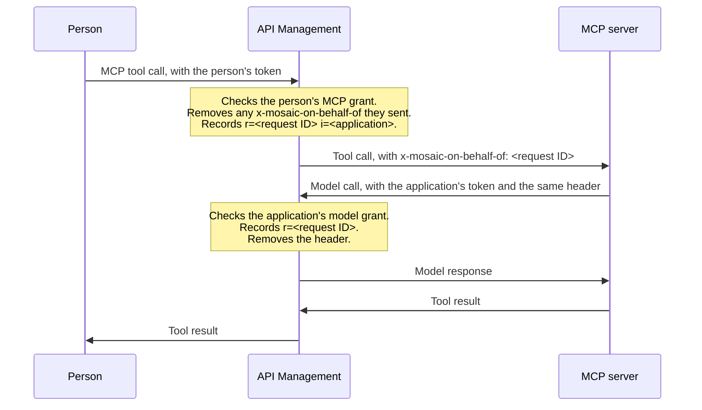

# MCP servers that call models through MOSAIC

This guide is for administrators who publish MCP servers through MOSAIC, and for the people who
build those servers. It covers how a published MCP server's tools call governed models through
MOSAIC, so that each model call is recorded for the person whose tool call it served. The person
needs no grant on the model. [ADR 0025](adr/0025-mcp-model-calls-on-a-persons-behalf.md) records
the design.

## How it works

The MCP server calls models as its own application, on its own model grant. That grant decides
whether a model call is allowed, what limits apply, and which cost center pays. The person who
called the MCP server decides none of that. MOSAIC only records them, so usage can be reported by
person.



The header carries the MCP call's request ID, never the person's identity. When MOSAIC reads the
gateway's logs, it matches the model call's `r=` to the MCP call's, and records the model call
for that MCP call's caller. It does this only when:
- the MCP server names the application that made the model call;
- the model call happened while the MCP call ran.

## Name the application the server calls models as

An administrator names the application once, on the published MCP server:

```http
PUT /api/v1/mcp-publications/{id}/model-caller
Content-Type: application/json

{ "principalId": "<MOSAIC principal ID>" }
```

- **Only an application.** The principal must be one MOSAIC records as a service principal, a
  managed identity or an agent identity. It needs a GUID object ID, the one in the application's
  tokens. A person, an agent user or a group can't call models for an MCP server.
- **One per server.** An MCP publication has at most one. An application can serve several.
- **Audited.** Each change is audited as `mcpPublication.modelCallerChanged`, with the previous and
  new principal. `DELETE` on the same route clears it.
- **Applied with the next plan.** Like any change to a publication, it discards the saved plan.
  Plan and apply the MCP server again. The plan's review shows that the server receives each call's
  reference, and names the application. The applied access snapshot's `modelCaller` shows what's
  live.
- **The application needs its own model grant.** Grant the application `Models.Invoke.Application`
  on the models its tools call, on the same gateway, and apply them. The plan warns when MOSAIC
  can't find an enabled direct grant for the application on a model this gateway publishes. It
  warns too when MOSAIC can no longer name the principal as an application. Then the server
  receives no reference until that's fixed, and its own access is unaffected.
- **Can't be deleted while named.** MOSAIC refuses to delete a principal an MCP server calls models
  as, or to change it to a kind that isn't an application. Clear it on the server first.

Models need no setting of their own. Every governed model records a reference from an application
token. Re-apply a model once after upgrading, so that its policy reads and removes the header.

## Pass the reference on

A server whose model caller is named receives `x-mosaic-on-behalf-of` on each MCP request the
gateway forwards. For each such request:
- **Copy the value**, exactly as received, onto every model call the server makes while serving
  that request.
- **Call the model through the same MOSAIC gateway**, as the server's own application. Use an Entra
  token for `api://<model-runtime-client-id>/.default`, with the `Models.Invoke.Application` app
  role. MOSAIC ignores the header on a call made with a key, or with a person's token.
- **Treat the value as opaque.** Don't parse it, store it, change it, or send it on another request.
  It grants nothing, and it's valid only while its MCP call runs.

This example uses the MCP Python SDK over streamable HTTP and `httpx`. Other SDKs expose the same
header on the HTTP request a tool call arrives on.

```python
import httpx
from azure.identity.aio import DefaultAzureCredential
from mcp.server.fastmcp import Context, FastMCP

ON_BEHALF = "x-mosaic-on-behalf-of"
MODEL_URL = (
    "https://<gateway-host>/<model-api-path>/openai/deployments/<deployment>/chat/completions"
)
credential = DefaultAzureCredential()  # the server's own application or managed identity
mcp = FastMCP("Contoso Support Tools")


@mcp.tool()
async def summarize_ticket(ticket: str, ctx: Context) -> str:
    request = ctx.request_context.request  # the MCP request this tool call arrived on
    token = (await credential.get_token("api://<model-runtime-client-id>/.default")).token
    headers = {"Authorization": f"Bearer {token}"}
    if request is not None and (reference := request.headers.get(ON_BEHALF)):
        headers[ON_BEHALF] = reference
    async with httpx.AsyncClient() as client:
        response = await client.post(
            MODEL_URL,
            params={"api-version": "2024-10-21"},
            headers=headers,
            json={"messages": [{"role": "user", "content": f"Summarize: {ticket}"}]},
        )
    response.raise_for_status()
    return str(response.json()["choices"][0]["message"]["content"])
```

Create the credential once, so it can reuse its tokens across tool calls, and close it when the
server stops with `await credential.close()`. An `azure.identity.aio` credential keeps its HTTP
connections open until it's closed.

The gateway removes the header before the call reaches the model.

## What MOSAIC records

The gateway's traces record the reference beside the grant that admitted each call:
- An MCP call to a server with a model caller records
  `mosaic-attribution v=1 g=<grant> m=<member> a=<client> r=<request ID> i=<object ID>`. `i` is
  the application's object ID.
- A governed model call records `mosaic-attribution v=1 g=<grant> m=<member> a=<client> r=<reference>`.
  `r` is empty unless an application's token brought one GUID in the header, and `!` when it
  brought anything else.
- Application Insights repeats them as the properties `mosaic-mcp-call` and
  `mosaic-model-caller`, with `-` for a value the call doesn't have.

The person's identity never travels in the header. MOSAIC already knows who made the MCP call:
it's the validated member, or the grant's subject, of the MCP call's trace.

When MOSAIC rolls up the gateway's logs, it matches each model call's `r=` to its MCP call and
records the model call for that MCP call's caller. It keeps the call the application's own in every
other figure, and counts a reference it couldn't use by its reason. See
[Usage analytics](usage-analytics.md#callers).

## Limits

- **The same gateway.** MOSAIC reads each gateway's logs on their own, so a model call through
  another gateway can't be matched to its MCP call.
- **One hop.** Every MCP server MOSAIC publishes removes a reference a caller sends. A tool that
  calls another MCP server, which then calls a model, doesn't pass the first caller on.
- **While the MCP call runs.** A model call made after its MCP call ended, plus a few minutes'
  allowance, isn't matched.
- **The application's own calls.** Model calls without a reference, or whose reference can't be
  matched, stay the application's own use, charged to its grant's cost center as before.

## Troubleshooting

| What the model call's trace shows | Cause and fix |
| --- | --- |
| `r=` is empty | The server didn't send the header, or called with a key or a person's token. Forward the header and use the application's Entra token. |
| `r=!` | The server sent something other than the one value it received. Copy the header's value exactly. The rollup counts it as **malformed**. |
| `r=<GUID>`, but the MCP call's trace has no `i=` | The MCP server has no model caller, or its publication hasn't been applied since one was named. Name it, then plan and apply. The rollup counts it as **missing**, as it does a model call through another gateway. |
| `r=<GUID>`, counted as **caller** | The model call was made by an application other than the one the MCP server names. Call the model as that application, or name the one the server uses. |
| `r=<GUID>`, counted as **late** | The model call was made after its MCP call ended. Make model calls while the tool call is still running. |
