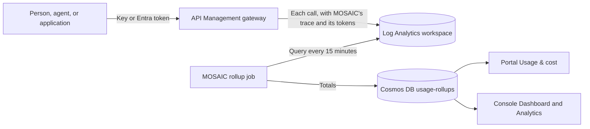

# Usage analytics

This guide is for administrators who run MOSAIC. It explains how MOSAIC measures the use of the
model APIs and MCP servers it governs, how to set up a gateway so that its use can be measured, how
current the figures are, and what each one means. The README's
[Usage and analytics](../README.md#usage-and-analytics) section lists the views and routes, and
[ADR 0019](adr/0019-usage-telemetry.md) records the design. [Pricing](pricing.md) explains how
MOSAIC turns the usage into cost.

## How MOSAIC measures usage

MOSAIC never sits in the traffic path. It reads what API Management logs about each call.



1. The policy MOSAIC applies to a model API or MCP server checks each call against the caller's
   grants. When it lets a call through, it adds a trace that names the grant it matched, the member
   for a security-group grant, and the calling client application:
   `mosaic-attribution v=1 g=<grant> m=<object ID> a=<client ID>`. When it refuses a call, the
   trace names the reason: `mosaic-deny v=1 r=<reason>`.
2. The API's `azuremonitor` diagnostic logs the call, traces included, at Information. For a model
   API, its LLM logs add the call's prompt, completion, and total tokens, and its model and
   deployment.
3. The gateway's diagnostic setting sends both to a Log Analytics workspace, into the
   `ApiManagementGatewayLogs` and `ApiManagementGatewayLlmLog` tables.
4. Every 15 minutes, a job in MOSAIC's API queries each gateway's logs. It totals the calls by hour,
   grant, caller, client application, API, model, and deployment, and writes the totals to the
   `usage-rollups` container.
5. The portal, the Dashboard, and Analytics read only those totals. They never query Log Analytics,
   so they load quickly and keep history after the workspace deletes its logs.

MOSAIC counts only the APIs it governs: the model APIs and MCP servers it has a record of, whether
it published them or adopted them, and its model pools once a pool's API is in API Management. It
ignores other APIs on the same gateway, and doesn't read the logs of a gateway where it governs
nothing.

API Management, not the caller, picks which of a [model pool](../README.md#model-pools)'s
deployments serves a call, so MOSAIC finds the deployment in the gateway's log. It tries the
backend that served the call, then the host and deployment that backend called, and then the host
or the deployment alone, when only one of the pool's deployments has it. It reports the call under
the deployment it finds. A call it can't place counts toward the pool and its model, on no
deployment, and has no price.

## Set up a gateway

| What MOSAIC needs | Why | Who sets it up |
| --- | --- | --- |
| A diagnostic setting that sends the gateway's `GatewayLogs` and `GatewayLlmLogs` categories to a Log Analytics workspace, as resource-specific tables | The job reads calls from the first table and tokens from the second | `azd provision`, for the gateway it deploys. The gateway's owner, for any other |
| Monitoring Reader on the API Management service for MOSAIC's managed identity | It lets the job query the gateway's logs, and no other resource's | `azd provision`, for the gateway it deploys. The gateway's owner, for any other |
| The `azuremonitor` logger on the service | API diagnostics send their logs through it | `azd provision`, **Enable API diagnostics**, or the gateway's owner |
| An `azuremonitor` diagnostic on each governed API that logs at Information, samples every call, and has LLM logs on for a model API | Every call is then logged with MOSAIC's trace and its tokens | MOSAIC's rollup job, for the APIs MOSAIC publishes on a gateway it manages. The API's owner, for any other |

MOSAIC never creates or changes a diagnostic setting. The setting decides where a gateway's logs go
and what they cost, and that's the gateway owner's decision.

### A new deployment

`azd up` sets up the gateway it deploys. Its diagnostic setting, `to-log-analytics`, sends all of
the gateway's logs and metrics to the deployment's workspace as resource-specific tables. The API's
managed identity holds Monitoring Reader on the gateway, and the `azuremonitor` logger and the
`usage-rollups` container exist. When MOSAIC publishes an API, the rollup job's next run sets the
API's diagnostic.

A new workspace can take up to two hours to receive its first logs. After that, logs arrive within
minutes, and the next rollup picks them up.

The deployment's workspace keeps logs for 30 days. That doesn't limit history. Once the job has
read a day, MOSAIC keeps its figures for 400 days, and each month's figures for good.

### An existing deployment

A deployment made before MOSAIC measured usage needs three steps:

1. Run `azd provision`, or `azd up`. It adds the `usage-rollups` container, the `azuremonitor`
   logger, Monitoring Reader on the gateway, and the API's new settings. Deploying the new API alone
   isn't enough: until the container exists, the API's `/readyz` probe reports that it isn't ready.
2. Re-apply each publication. A publication applied before gateway tagging existed tags no calls
   until it's applied again, and one applied before this release doesn't record client
   applications or refusals.
3. Open each gateway's page and read the **Telemetry** section on its **Overview** tab. On a
   gateway in manage mode, choose **Enable API diagnostics** to set the diagnostic on the APIs
   MOSAIC published earlier. The rollup job does the same by itself within one interval once the
   logger exists, so the button only makes it sooner.

A gateway's first rollup reads back up to 90 days, so it counts the earlier calls the workspace still
holds. Calls without MOSAIC's trace are linked by their APIM subscription where a grant records it,
and otherwise reported as unattributed.

### Other gateways

For a gateway MOSAIC didn't deploy, the **Telemetry** section shows the command that fixes each
missing piece, filled in for that gateway. Run the commands in Bash or Azure Cloud Shell, because
PowerShell can strip the quotes inside their JSON.

To let MOSAIC read the gateway's logs, give its managed identity Monitoring Reader on the service:

```bash
az role assignment create \
  --assignee-object-id <mosaic-api-principal-id> \
  --assignee-principal-type ServicePrincipal \
  --role "Monitoring Reader" \
  --scope <api-management-resource-id>
```

To send the gateway's logs to a workspace:

```bash
az monitor diagnostic-settings create \
  --name mosaic-gateway-logs \
  --resource <api-management-resource-id> \
  --workspace <log-analytics-workspace-resource-id> \
  --export-to-resource-specific true \
  --logs '[{"category":"GatewayLogs","enabled":true},{"category":"GatewayLlmLogs","enabled":true}]'
```

When the gateway already has a setting that sends its logs to a workspace, the command MOSAIC shows
updates that setting instead. It keeps the setting's name, workspace, other categories, and
metrics, and adds what's missing. Azure refuses a second setting that sends a category to the same
workspace.

On a gateway MOSAIC can't change, its owner creates the logger:

```bash
az rest --method put \
  --url "<api-management-resource-id>/loggers/azuremonitor?api-version=2022-08-01" \
  --body '{"properties":{"loggerType":"azureMonitor","isBuffered":true}}'
```

MOSAIC doesn't change APIs it adopted. For each one, its owner opens the API in the Azure portal
under **APIs** > **APIs**, or opens **All APIs** to cover every API without a diagnostic of its own.
Then, under **Settings** > **Diagnostic Logs** > **Azure Monitor**, the owner sets:
- verbosity to **Information**, and sampling to 100%;
- no headers, and no request or response body;
- for a model API, **Log LLM messages** on, with **Log prompts** and **Log completions** off.

Keep bodies out of the logs. When a log entry passes 32 KB, API Management drops all of its body and
trace content, and the call loses MOSAIC's trace. An adopted API's calls without a trace can still be
linked by the grant's APIM subscription, if the caller used a key MOSAIC recorded.

A gateway MOSAIC only observes is measured only as well as its owner's diagnostics allow.

### If the workspace requires workspace permissions

MOSAIC queries each gateway's logs in the gateway's own resource context. That's why Monitoring
Reader on the gateway is enough, and why MOSAIC can't read other resources' logs. It works only when
the workspace's access control mode is **Use resource or workspace permissions**. The workspace's
**Overview** page shows the mode, and its **Properties** page changes it. A workspace created before
March 2019 may still be set to **Require workspace permissions**. Either change the mode, or give
MOSAIC's identity Log Analytics Reader on the workspace. That role can read the whole workspace,
although MOSAIC's queries still ask only for the gateway's logs.

Resource-context queries also need the gateway's tables on the Analytics table plan. The Basic and
Auxiliary plans don't support them.

### If the logs go to AzureDiagnostics

A diagnostic setting whose destination table is **Azure diagnostics** writes to the legacy
`AzureDiagnostics` table, which MOSAIC doesn't read. Change it to **Resource specific**. New rows go
to `ApiManagementGatewayLogs` and `ApiManagementGatewayLlmLog`, while older rows stay where they
were, so MOSAIC can't backfill days before the switch. Update any alerts and workbooks that read the
old table.

## The Telemetry section

Each gateway's page has a **Telemetry** card on its **Overview** tab. It says whether the gateway is
ready for usage analytics and which workspace its logs go to, and runs these checks in order:

| Check | What it looks at | What it reports |
| --- | --- | --- |
| Azure Monitor logger | Whether the service has the `azuremonitor` logger | An error when it's missing. **Enable API diagnostics** creates it on a gateway in manage mode. Otherwise, the gateway's owner must. |
| Logs sent to Log Analytics | The service's diagnostic settings | An error, with the command that fixes it, when no setting sends logs to a workspace, a category is missing, or the logs go to `AzureDiagnostics`. Without `GatewayLlmLogs`, MOSAIC can count calls but not tokens. |
| MOSAIC can read the logs | A query of the last 24 hours | An error, with the Monitoring Reader command, when access is denied. A warning when no calls were logged, or when calls carry no MOSAIC trace. Otherwise, how many calls were logged and how many were attributed. |
| API diagnostics | Each governed API's `azuremonitor` diagnostic | A warning when some governed APIs don't log every call, and an error when none do. |
| Usage rollups | The job's work on this gateway | An error when the last rollup failed, and a warning when rollups are behind. |

A check that MOSAIC can't run, for example because it can't read the service's settings, is
**Unknown**, with the command that grants the access it needs where there is one.

**API diagnostics readiness** lists each governed API, whether MOSAIC published it, and what its
diagnostic lacks:

| Gap | Fix |
| --- | --- |
| No Azure Monitor diagnostic found | Add an `azuremonitor` diagnostic, or one for All APIs |
| Doesn't send to the azuremonitor logger | Point the diagnostic at the `azuremonitor` logger |
| Verbosity below Information | Set verbosity to Information, so MOSAIC's traces are logged |
| Sampling below 100% | Sample every call, so none goes uncounted |
| LLM logs off | Turn on LLM logs for the model API, so its tokens are counted |

An API that inherits the diagnostic for All APIs is marked **(All APIs setting)**.

The card's actions:
- **Enable API diagnostics** needs a gateway in manage mode. It creates the logger if it's missing,
  and writes the diagnostic on each API MOSAIC published that lacks one. It's audited as
  `gateway.telemetryEnabled`. When the rollup job writes a missing diagnostic by itself, the audit
  event is `gateway.telemetryInstrumented`, by `system:usage-rollup`.
- **Refresh now** rolls the gateway up straight away, at most once a minute.
- **Backfill** re-reads the chosen number of days, from 1 to 730, and is audited as
  `gateway.telemetryBackfillRequested`.

The diagnostic MOSAIC writes logs every call at Information through the `azuremonitor` logger. It
logs no client IP address, no headers, and no body. On a model API, it turns on LLM logs without
prompts or completions. If the gateway refuses LLM logging, MOSAIC writes the diagnostic without it
and says so.

The **Rollups** grid shows when the gateway was last rolled up, how far its figures reach, how far
behind they are, how a backfill is going, and the last error. The **Gateway health** table on the
Analytics **Overview** tab shows the same for every gateway, with **Refresh now** on each. The
Dashboard's **Telemetry health** panel shows each gateway's status.

## How current the figures are

Figures trail calls by the workspace's ingestion delay, usually a few minutes, plus up to one rollup
interval. Each gateway, and the estate as a whole, has one of these statuses. The estate's is its
slowest gateway's:

| Status | Meaning |
| --- | --- |
| Current | The last rollup succeeded within twice the rollup interval plus 30 minutes, which is an hour at the default interval |
| Delayed | The last success is older than that, or not every gateway has been rolled up yet |
| Failing | The last rollup failed, and nothing has succeeded since |
| Waiting for data | MOSAIC hasn't rolled the gateway up yet |
| No governed APIs | MOSAIC governs nothing on the gateway, so it has nothing to read |

The portal says how current a person's figures are. When the rollups are delayed or failing, it
says the figures may be out of date. When MOSAIC's data starts after the chosen period began, it
says from which date the data is complete.

The gateway enforces limits as calls arrive, so someone can reach a limit before a view shows it.
For the live figure, callers read the gateway's response headers. A throttled call returns
`Retry-After`, and a governed policy reports what's left of the limits that applied:
`x-mosaic-remaining-tokens`, `x-mosaic-remaining-quota-tokens`, `x-mosaic-remaining-calls`, and
`x-mosaic-cost-center-remaining-quota-tokens` for a [cost center's](cost-centers.md) pooled quota.

## History, backfill, and retention

Each rollup reads today and yesterday again, because late logs can still arrive. A gateway's first
rollup reads back `MOSAIC_USAGE_ROLLUP_BACKFILL_MAX_DAYS`, 90 days by default. After downtime, the
job catches up the days it missed, as far back as the same limit. **Backfill** reads from 1 to 730
days, 7 days at a time, newest first, and runs its slices back to back until it's done. Asking for
one while the first rollup, a catch-up, or an earlier backfill is still reading extends that one,
so it never cuts history short. When the API runs more than one instance, a lease makes sure only
one reads a gateway at a time.

A re-read never lowers a day's figures. If a day before yesterday comes back with fewer calls than
MOSAIC holds, because the workspace has since deleted some of its logs, MOSAIC keeps what it has.
Otherwise the re-read replaces the day. Monthly totals are never lowered either. This makes a
backfill safe to run at any time, and useful after a fix. For example, once a grant's subscription
is recorded, a backfill links the calls its key made before, which the **Unattributed** tab listed
under **Unknown key**. Calls linked by their trace don't need a backfill.

If a query fails, MOSAIC stops that gateway's cycle, records the error, and tries again at the next
interval.

| Kept | For how long |
| --- | --- |
| Daily totals, by hour | `MOSAIC_USAGE_ROLLUP_RETENTION_DAYS`, 400 days by default, from 62 to 3,650 |
| Monthly totals, by caller, grant, and API | Until deleted |
| Which grant or subscription each link belongs to, and each gateway's rollup state | Until deleted |

Figures for a grant that's since been removed are kept, and the grant shows as **Removed**.

The time range decides how the figures are grouped. All times are UTC.
- **Last 24 hours** is shown by the hour. Its breakdowns, and its counts of active callers, cover
  the whole UTC days the 24 hours touch, because MOSAIC keeps only totals by the hour.
- **Last 7, 30, or 90 days** is shown by the day, and **Last 12 months** by the month.
- **Custom** dates up to 92 days apart are shown by the day. A longer range, up to 1,830 days, is
  shown by whole calendar month.
- Days older than daily retention exist only in the monthly totals. A range that reaches past it
  says so, and suggests **Last 12 months**.

## What the figures mean

### Calls

Every call to a governed API counts as a request, including calls the gateway refused. Each call has
one outcome:

| Outcome | Which calls |
| --- | --- |
| OK | Status 200 to 399 |
| Throttled | Status 429, from a rate or token limit at the gateway, or a model deployment's own 429 that the gateway passed on |
| Quota refused | Status 403 from a quota or token-quota policy |
| Denied | Refused by MOSAIC's policy, which names the reason, or status 401 without MOSAIC's trace |
| Client error | Any other 4xx status |
| Server error | Anything else, such as a 5xx status |

**Errors**, and the error rate, count client and server errors only. Throttled, quota-refused, and
denied calls are counted separately, so limits doing their job don't raise the error rate.

A model deployment's own 429 reaches the caller as a 429 from the gateway, so it counts as
throttled too. The Reliability tab and the **Deployments** table show it apart: **Gateway
throttled** is the 429s the gateway's limits returned, and **Backend 429s** is the deployment's.
The Limits tab's **Throttled** counts only the gateway's. The portal, and the other CSV exports,
count every 429 as throttled. The APIs and deployments exports have a **Backend throttled** column
to tell them apart.

**Denials by reason** use these labels. The first twelve come from MOSAIC's policy:

| Label | The call was refused because |
| --- | --- |
| No key or token | it brought neither a subscription key nor an Entra token, or, for an MCP server, no token |
| Keys are turned off | it brought a key, and the publication has keys turned off |
| Entra sign-in is turned off | it brought a token, and the publication has Entra sign-in turned off |
| Malformed key | its key wasn't in the form MOSAIC's keys take |
| Unknown key | its key matched no grant |
| Malformed token | its `Authorization` header wasn't a single bearer token |
| Too many groups in the token | the caller is in too many groups for the token to list them, so the gateway can't check group grants |
| No grant for this caller | its token was valid, but no grant covers the caller |
| Key and token name different grants | it brought a key and a token, and they matched different grants |
| Operation not allowed | the operation isn't one governed access allows |
| Model not allowed | the request didn't name the publication's model deployment |
| Access is turned off | the publication has both keys and Entra sign-in turned off |
| Not signed in | the gateway answered 401 without MOSAIC's trace, and not from a token check |
| Invalid or expired token | the gateway answered 401 without MOSAIC's trace, from a token check, for example because the token had expired |
| Unknown | the refusal named a reason MOSAIC doesn't recognize |

**Tokens** come from the LLM log: prompt, completion, and total tokens, counted once per call even
when a streamed call spans several rows. MCP servers use no tokens. A call cut off mid-stream may
have no token count, or a low one.

**Latency** is the gateway's total time for a call, sorted into buckets: under 100, 250, and 500
milliseconds, under 1, 2, 5, 10, 30, and 60 seconds, and longer. P50, P95, and P99 are estimated
from the buckets, which is why they're shown with ≈. Denied calls aren't timed.

**Peak minute** is the most tokens in any one minute. It's exact for each grant's limit counter
and for a deployment on one gateway. Elsewhere it's a lower bound. A deployment reached through
more than one gateway reports its busiest minute on any one of them.

**Capacity** and **Utilization** show only for Azure OpenAI deployments of the Standard, Global
Standard, and Data Zone Standard types, whose capacity is set in thousands of tokens a minute.
Utilization is the peak minute against that capacity. Other models share a regional rate limit
instead.

### Callers

MOSAIC links each admitted call to a grant in this order:
1. The call's `mosaic-attribution` trace names the grant, and for a security-group grant, the
   member who called.
2. Otherwise, the call used an APIM subscription that a grant's binding records.
3. Otherwise, the call is unattributed. The **Unattributed** tab gives one of three reasons:
   **No subscription key**, when the call had neither a trace nor a key; **Unknown key**, when no
   grant records the key's subscription; or **Shared key**, when the call used a model
   publication's or model pool's own subscription, which belongs to no one caller. To see who uses
   a shared key, grant access per caller instead.

The caller is the security-group member when the trace names one, and otherwise the grant's
subject. **Consumers** sorts callers into people, who are users and agent users; applications, which
are service principals, managed identities, and agent identities; and Entra security groups. A
caller MOSAIC has no record of is named by a Microsoft Graph lookup, at most 200 a request, and the
names are cached for an hour. A caller MOSAIC can't name shows as **Unknown caller** or
**Unknown application**.

**Client applications** are the apps callers signed in with. MOSAIC names each from the applications
it has a record of, and recognizes Azure CLI, Azure PowerShell, and Visual Studio Code. Any other
shows as **Unknown application**, with its client ID. Calls made with only a key show as
**Calls without a token**.

The subject filter narrows people, applications, groups, and grants. Totals, models, and APIs still
count every caller.

The resource filter takes a model API, a model pool, or an MCP server. A model pool is listed once
its API is in API Management.

Environments are current, not historical. Analytics filters by each gateway's environment, and the
portal groups by each resource's, so re-classifying one moves its history with it.

### Limits

The Limits tab, and the portal, compare each grant's use with its limits:
- A quota is read within its own window: an hourly quota from today's hours, a daily or weekly
  quota from its days, and a monthly quota from its months. **Partial window** means MOSAIC's
  figures start after the window began.
- A token rate limit is compared with the grant's peak minute. A request rate limit is compared
  only when its renewal period is 60 seconds.
- MCP servers have no token figures, so only their request limits are compared.

**Near limit** means at least 80% used. **Reached** means the gateway throttled the grant's calls,
or refused them for quota, in the range, or that use is at a limit. **Unknown** means MOSAIC can't
tell how close the grant is.

### Access hygiene

Access hygiene always covers the last 30 days, whatever range is chosen.
- **Unused grants** had no calls. MOSAIC judges a grant only when its gateway's figures cover the
  whole 30 days and are at most a day old, and the grant is older than the 30 days. **Last used**
  looks back 12 months.
- **Unused keys** belong to grants whose calls all came with a token, while keys are turned on.
  Consider turning keys off.
- **Untracked grants** are grants MOSAIC can't measure: grants to MOSAIC groups, because the gateway
  enforces Entra security groups, not MOSAIC groups; grants not yet applied to the gateway; and
  grants that nothing links calls to.

### Exports

Each tab exports its tables as CSV, with the same filters. A file holds at most 10,000 rows, where
the console shows at most 500. The file starts with a UTF-8 byte order mark, so spreadsheets read
its characters correctly. A cell that starts with `=`, `+`, `-`, or `@` gets a leading apostrophe,
so a spreadsheet doesn't run it as a formula. The file is named for the table and its first and
last day, such as `mosaic-people-20260901-20260930.csv`. Tables that show cost export a
**Cost (USD)** column, empty where MOSAIC has no price, and the Cost tab also exports a chargeback
by month.

### Cost centers

Every grant is charged to a [cost center](cost-centers.md), and the attribution registry records
each grant's cost center, so the rollups need nothing new: a cost center's figures are its grants'
figures. Every tab takes a **Cost center** filter. Filtered, a tab counts only calls through the
cost center's grants, with totals, APIs, models, and deployments rebuilt from them. Refusals,
unattributed calls, client applications, reserved capacity nobody called, and figures by the hour
belong to no grant, so the filter leaves them out and the tab says so. Overview ranks cost centers,
Consumers lists each cost center with its grants, callers, and cost, and the Cost tab shows cost by
cost center. Grant, limit, and hygiene rows name their cost center. The policy refuses a call whose
`x-mosaic-cost-center` header names no grant of the caller's, or a key with another cost center's
header, with the denial reasons `cost-center` and `cost-center-mismatch`. A call charged to a cost
center whose [budget](budgets-and-alerts.md) blocks its calls is refused with `budget`, and every
governed call on a gateway whose list of blocked cost centers MOSAIC didn't write with
`budget-list`.

### Cost

Usage is priced from MOSAIC's price list, at list price, by the day, each time a report is read.
The Cost tab shows the total, the trend, cost by model, deployment, caller, and API, spend this
month, and a month-end forecast. Usage MOSAIC can't price shows **No price**, never $0, and each
report counts what it left out. [Pricing](pricing.md) explains where prices come from, how each
deployment finds its price, provisioned throughput, and the chargeback export.

## Privacy and cost

MOSAIC's traces put Entra object IDs and client application IDs in the gateway's workspace. The
rollups hold them too, in the daily and monthly totals and in the record of which grant each
belongs to. These are personal data. Daily totals expire with retention, but monthly totals keep
per-caller figures until deleted. MOSAIC has no tool yet to erase one person's figures. Apply your
retention and access rules to both the `usage-rollups` container and the workspace.

Only administrators see the whole estate. The portal shows each person only their own usage. For a
security-group grant, it counts only the person's own calls.

The workspace bills ingestion by the gigabyte. Each governed call adds one row to the gateway log,
and a model call adds at least one row to the LLM log. Logging no headers or bodies keeps the rows
small. The bootstrap gateway's Application Insights diagnostic logs at Information too, so each
governed call also adds a trace there. To stop them, set that diagnostic's verbosity to Error.
What the calls themselves cost is in the Cost tab, described in [Pricing](pricing.md).

The rollups store totals, not calls. Their size grows with the number of callers and APIs, not with
traffic.

## Settings

The README's settings table lists each setting and its default. Among them, `MOSAIC_USAGE_SOURCE`
decides where figures come from:
- `rollups` reads the rollups. Run locally, the job queries Log Analytics with your Azure CLI
  sign-in, which needs the same access as MOSAIC's identity.
- `simulated` makes the portal's figures up from the caller's real grants, and labels them
  **Sample figures**. Analytics shows no figures. An Azure deployment refuses this mode.
- `auto`, the default, means `rollups` in Azure, and `simulated` elsewhere.

The rollup job runs only when the source is `rollups` and `MOSAIC_USAGE_ROLLUP_ENABLED` is `true`.
With the job off, the views still read the rollups that exist, and **Refresh now** and **Backfill**
report that this deployment doesn't roll up gateway telemetry.

## Check a deployment

1. Call a published model API with a grant that allows it.
2. Wait a few minutes for the call to reach the workspace. A new workspace can take up to two hours.
3. On the gateway's page, choose **Refresh now** in the **Telemetry** section, and check that every
   row is **OK**.
4. Open **Analytics**. The call appears under the grant's caller, with its tokens.

To look at the logs yourself, open the gateway in the Azure portal and choose **Logs**. Queries
there run in the gateway's resource context, as MOSAIC's do. This one counts the calls in the last
hour that carry MOSAIC's traces:

```kusto
ApiManagementGatewayLogs
| where TimeGenerated > ago(1h)
| extend traces = tostring(TraceRecords)
| summarize calls = count(),
    attributed = countif(traces contains "mosaic-attribution"),
    denied = countif(traces contains "mosaic-deny")
    by ApiId
```

This one totals each model deployment's tokens, one row per call, as MOSAIC does:

```kusto
ApiManagementGatewayLlmLog
| where TimeGenerated > ago(1h)
| summarize tokens = max(TotalTokens) by CorrelationId, ModelName, DeploymentName
| summarize calls = count(), tokens = sum(tokens) by ModelName, DeploymentName
```

MOSAIC's tests run its queries against a local double, not Log Analytics. ADR 0019's
[Live verification still required](adr/0019-usage-telemetry.md#live-verification-still-required)
lists what to confirm on a real gateway.
